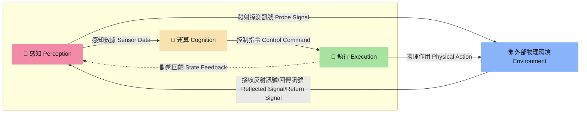
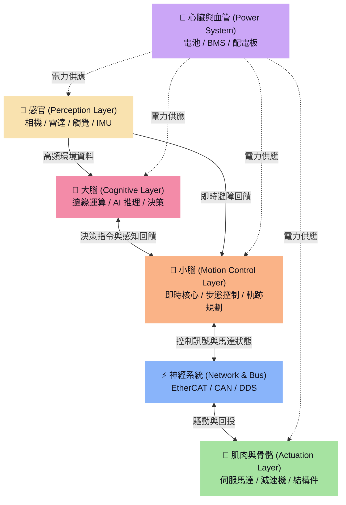

# 解構機器人 The Robot Anatomy

隨著具身智能（Embodied AI）爆發式成長，我們正在見證機器人從單一任務的「自動化機器」，演進為具備感知、思考、運動能力的「仿生實體」，當前市場主要有三種主流型態，分別是：
1. **人型 (雙足)**：環境適應力最強（能上樓梯、跨越障礙），但控制演算法門檻極高，且硬體功耗及成本目前仍居高不下。
2. **狗型 (四足)**：在崎嶇地形（如戶外碎石地、工廠管道區）表現極佳，是目前工業巡檢及戶外探勘的熱門選擇。
3. **輪型**：開發技術與商業落地最為成熟的型態，但其移動範圍深受地形條件限制（無法克服高低落差）。

這三種機器人皆是由上千或上萬個零組件所組成，結構相當複雜，但我們可從系統工程的角度，將所有零組件初步歸納成三大項目「感知」、「運算」與「執行」，相關界定內容與性能指標請參閱《Bot & Build：人機協作到共生的實踐指南》，而本文則依此為基礎走進開發世界。簡單來說，這三大零組件群是彼此分工、相互協作的關係，以此構成一個完整的閉環系統：首先透過感知零組件蒐集內外資訊；接著由運算平台（實務上常因應邊緣運算需求採分佈式架構）進行即時決策；最後透過執行機構完成動作，並透過感知回饋數據形成閉迴路調整。




作為系列文章的第一篇，我們將以此三大核心模組為基石，並以人類的生理構造為隱喻，進一步解構現代智慧機器人的硬體架構，梳理出從大腦到肌肉的完整六大分層，盤點國際主流大廠與台灣關鍵供應鏈名單，最後聚焦於讓機器人能看、能聽、能觸摸的「感知」智慧硬體。


---

## 1. 機器人硬體架構與人體生理分層對照

要設計一台具備高度適應力的機器人，不能只把它當成一堆馬達和鐵板的組合。我們必須像解構人體構造一樣，將機器人的硬體分為以下六大系統：



### 1.1 大腦（Cerebrum - 認知決策層）
*   **生理角色**：負責思考、視覺理解、自然語言處理、高階路徑規劃。
*   **硬體載體**：高效能邊緣運算主機（Edge IPC）、GPU/NPU 加速卡、AI 晶片。
*   **核心運作**：執行 VLM（視覺語言模型）、LLM、3D 重建（NeRF / 3DGS）及強化學習推理。

### 1.2 小腦（Cerebellum - 運動控制層）
*   **生理角色**：維持身體平衡、協調四肢動作、精準控制關節角度。
*   **硬體載體**：嵌入式即時控制器（MCU/DSP/FPGA）、運行即時作業系統（RTOS）的控制板。
*   **核心運作**：計算逆向運動學（IK）、步態演算法、力矩控制，要求極低的控制延遲（通常為 1kHz 以上的閉迴路控制）。

### 1.3 感官（Sensory - 感知層）
*   **生理角色**：眼睛、耳朵、皮膚與內耳平衡器官。
*   **硬體載體**：3D 深度相機、光學雷達（LiDAR）、六軸慣性測量單元（IMU）、觸覺感測器、六軸力/力矩感測器（F/T Sensor）。
*   **核心運作**：將物理世界的訊號數字化，提供「大腦」做環境語意地圖建立，提供「小腦」做即時避障與接觸力平衡。

### 1.4 肌肉與骨骼（Muscles & Skeleton - 動力執行層）
*   **生理角色**：肌肉提供力量，骨骼決定活動範圍。
*   **硬體載體**：高功率密度無框伺服馬達（Frameless Motor）、諧波減速機（Harmonic Reducer）、行星減速機、滾珠絲槓、輕量化高強度碳纖維/鋁合金骨架。
*   **核心運作**：將電能高效轉化為機械能，透過高減速比實現人形機器人站立與負重所需的超大扭矩。

### 1.5 神經系統（Nervous System - 通訊傳輸）
*   **生理角色**：傳遞大腦訊號至全身，並回傳痛覺與位置感。
*   **硬體載體**：高頻寬工業網路匯流排（EtherCAT, CAN FD, RS-485）及車載乙太網路。
*   **核心運作**：確保多軸馬達在微秒級（μs）時間內達到同步通訊，避免步態失調。

### 1.6 心臟與血管（Heart & Blood Vessels - 動力分配）
*   **生理角色**：提供全身運作的能量。
*   **硬體載體**：高能量密度鋰電池組、智慧電池管理系統（BMS）、直流配電模組（PD Board）。

---

## 2. 機器人產業鏈：國際巨頭與台灣關鍵玩家

台灣在半導體、資通訊（ICT）與精密機械領域擁有全球領先的群聚優勢，這使得台灣在機器人供應鏈中，特別是「大腦運作（IPC）」與「肌肉（精密傳動）」方面扮演了不可或缺的角色。

| 生理分層 | 關鍵零組件 | 國際主流產品 / 領導廠商 | 台灣關鍵供應鏈 / 廠商 |
| :--- | :--- | :--- | :--- |
| **大腦** (認知) | 運算晶片 / 工業電腦 | NVIDIA (Jetson/Thor), Intel, AMD | 研華 (Advantech), 凌華 (ADLINK), 研揚 (AAEON), 創博 (NexCOBOT) |
| **小腦** (控制) | 運動控制板 / 晶片 | Beckhoff, Texas Instruments, STMicroelectronics | 台達電 (Delta), 研華, 固緯, 新漢 |
| **感官** (感知) | 3D 相機 / ToF / 雷達 | Intel RealSense, Ouster, RoboSense, Velodyne | 立普思 (LIPS), 原相 (PixArt), 佳世達, 鈺創 (Etron) |
| **感官** (回授) | 力矩 / 角度感測器 | ATI Industrial Automation, Renishaw | 鴻海 (Foxconn), 上銀 (HIWIN), 宇聯 |
| **肌肉** (驅動) | 馬達驅動器 | Kollmorgen, Elmo Motion Control, Maxon | 台達電, 東元 (TECO), 祥儀, 盟立 |
| **肌肉** (動力) | 無框伺服馬達 | Maxon Motor, Kollmorgen | 台達電, 東元, 上銀, 富田電機 |
| **肌肉** (傳動) | 精密減速機 | Harmonic Drive (日), Nabtesco (日) | 台灣精銳 (Apex Dynamics), 上銀, 盟立, 大銀微系統 |

---

## 3. 焦點深入：「感知（Perception）」區塊的智慧硬體

在具身智能時代，機器人不再只是盲目重複軌跡的機械手臂，它們需要適應非結構化的動態環境。這讓「感知」硬體成為熱門的技術焦點。

### 3.1 3D 視覺相機：機器人的雙眼
機器人主要依賴 3D 視覺來重建環境點雲（Point Cloud）、識別物體並估計其位姿（Pose Estimation）。主要技術可分為：
*   **主動式立體視覺 (Active Stereo Vision)**：如 *Intel RealSense D435i/D455*。利用紅外線投影輔助，在無紋理的牆面或暗處仍能獲得優質的深度資料。
*   **飛行時間法 (ToF - Time of Flight)**：如 *Azure Kinect* (已停產，現由其技術合作夥伴承接) 或台灣*立普思 (LIPS)* 的工業級 ToF 相機。測量光線反射時間，適合動態避障與長距離測量。
*   **結構光 (Structured Light)**：精度極高，常用於工業檢測或精準夾取。

### 3.2 慣性測量單元 (IMU)：小腦平衡的基石
*   沒有 IMU 的機器人就像閉著眼睛單腳站立的人。
*   高頻（常為 200Hz - 1000Hz）的 6 軸或 9 軸 IMU（如 *Xsens*, *InvenSense*）能即時回傳加速度與角速度，供運動控制演算法即時修正重力補償與防跌倒補償。

### 3.3 觸覺與力覺感測器：靈巧手的最後一塊拼圖
*   當機器人要拿起一顆雞蛋或使用工具時，單靠視覺是不夠的，必須知道「用了多少力」。
*   **關節力矩感測器**與手腕處的**六軸力/力矩感測器 (F/T Sensor)** 能即時感知外界碰撞，確保人機協作安全（觸碰即停）。
*   **陣列式觸覺皮膚**（如 *SynTouch*, *GelSight* 技術）則是目前仿人靈巧手研究的最前線，能感知滑動、粗糙度與微小形變。

---

## 4. 視覺化插圖與圖表規劃建議

為了讓這篇文章在您的網站上更具視覺衝擊力，建議後續加入以下圖表，我們可以直接利用 CSS、SVG 或精美的 3D 渲染圖呈現：

### 圖一：人體與人形機器人硬體結構對照圖 (Human-Robot Anatomy Mapping)
*   **畫面構想**：左側為人體解剖示意圖，右側為人形機器人（如 Optimus 類型）的骨架透視圖。
*   **標註重點**：
    *   大腦 $\rightarrow$ 頭部（IPC 運算單元）
    *   小腦 $\rightarrow$ 胸腔/骨盆腔（運動控制器）
    *   眼睛 $\rightarrow$ 頭部相機與 LiDAR
    *   神經 $\rightarrow$ 脊椎與全身骨幹的 EtherCAT 排線
    *   關節肌肉 $\rightarrow$ 肩、肘、髖、膝關節的「無框馬達 + 諧波減速機 + 驅動器」三合一關節模組 (Actuator)

### 圖二：機器人感知資料流拓撲圖 (Perception Data Flow)
*   **畫面構想**：展示感測器端如何將物理量轉化為 ROS2 訊息，流向運算單元的過程。
*   ```mermaid
    flowchart LR
        subgraph "物理世界 Sensors"
            A[環境光源/物體] -->|3D 光學學訊號| B(3D ToF 相機)
            C[地心引力/運動] -->|角速度與加速度| D(6軸 IMU)
            E[接觸反作用力] -->|應變規訊號| F(F/T 力覺感測器)
        end

        subgraph "資料處理與轉譯 Edge Driver"
            B -->|USB 3.0 / GigE| G(SDK / 點雲濾波)
            D -->|SPI / UART| H(Kalman Filter)
            F -->|EtherCAT / CAN| I(力矩補償計算)
        end

        subgraph "ROS2 生態系 (DDS)"
            G -->|/camera/depth/color/points| J((大腦: MoveIt / VLM))
            H -->|/imu/data_raw| K((小腦: 步態估算器))
            I -->|/joint_states| K
        end
        
        style J fill:#f38ba8,stroke:#333,stroke-width:2px,color:#11111b
        style K fill:#fab387,stroke:#333,stroke-width:2px,color:#11111b
    ```

---

*下一篇預告：**「動態控制與關節技術」** — 我們將深入探討機械關節的黃金組合：無框馬達、諧波減速機與雙編碼器閉迴路控制。*
