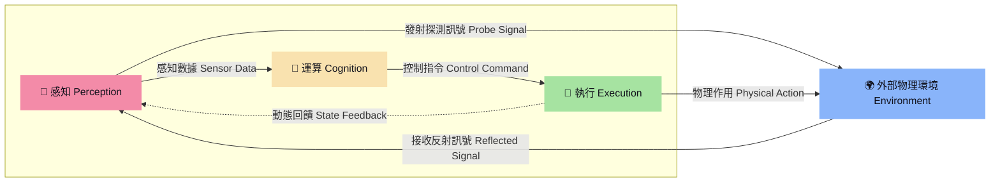

# 解構機器人 (The Robot Anatomy)

隨著具身智能（Embodied AI）爆發式成長，我們正在見證機器人從執行單一任務的「自動化機器」，即將演進為具備感知、思考、運動能力的「仿生實體」，而當前市場存在的三種實體型態，分別是：
1. **人型 (雙足)**：環境適應力最強（能上樓梯、跨越障礙），但控制演算法門檻極高，且硬體功耗及成本目前仍居高不下。
2. **狗型 (四足)**：在崎嶇地形（如戶外碎石地、工廠管道區）表現極佳，是目前工業巡檢及戶外探勘的熱門選擇。
3. **輪型**：開發技術與商業落地最為成熟的型態，但其移動範圍深受地形條件限制（無法克服高低落差）。

這三種智慧機器人皆是由上千或上萬個零組件所組成，結構相當複雜，但我們可從系統工程的角度，將所有零組件初步歸納成三大項目「感知（Perception）、運算（Cognition）與執行（Execution）」，相關界定內容與性能指標請參閱《Bot & Build：人機協作到共生的實踐指南》，本文則依此為基礎走進開發世界。

延伸來看，這三大零組件群是彼此分工、相互協作的關係，以此構成一個完整的閉環系統：首先透過感知類零組件蒐集環境資訊，接著由運算類零組件進行即時決策，最後藉由執行類零組件完成指令動作，並同時回饋數據形成閉迴路，持續進行感知（P）、運算（C）和執行（E）的循環與調整。

這一閉環系統與人體的生理運作模式如出一轍；這也是為何當前的具身智能（Embodied AI）研究，多以人體器官來隱喻機器人的架構設計：

| 機器人系統 | 人體對應 | 功能 |
| :--- | :--- | :--- |
| **感知** (Perception) | 五官（眼口鼻舌耳）、皮膚 | 環境資訊偵測與自身狀態觀測 |
| **運算** (Cognition) | 大腦、小腦、神經 | 數據融合、路徑規劃與行為決策 |
| **執行** (Execution) | 骨骼、肌肉、關節 | 動力輸出與物理世界實體交互 |

---

## 1. 機器人硬體架構與三大模組配置對照表

在深入探討感知、運算與執行系統前，我們可以透過以下硬體配置表，一覽目前三大主流型態機器人（人形、機器狗、AMR）在各大模組上的標配與選配現況：

> **符號說明**：● 標配  |  ◉ 部分機型具備  |  ○ 無 / 少見

| 模組類別 | 零組件名稱 | 功能與說明 | 人形 | 機器狗 | AMR |
| :--- | :--- | :--- | :---: | :---: | :---: |
| **運算模組** | 處理器 (CPU/GPU/SoC) | 負責運行作業系統與核心運算。 | ● | ● | ● |
| | 邊緣運算平台 (IPC/SBC) | 處理高層決策任務，如導航、路徑規劃與任務排程。 | ● | ● | ● |
| | 控制器 (DSP/MCU) | 將大腦的高層指令轉化為流暢、精準的物理關節動作。 | ● | ● | ● |
| **感知模組** *(外部感測)* | RGB 相機 | 視覺感知基礎，通常人形配備在頭部或胸前。 | ● | ● | ● |
| | 深度相機 (RGB-D) | 主流有雙目/多目視覺、結構光與 ToF。人形多以雙目/多目為主。 | ● | ● | ● |
| | 魚眼 / 廣角相機 | 提供大範圍視野，多見於人形機器人。 | ◉ | ○ | ○ |
| | 電容式 MEMS 麥克風 | 聽覺感知主流，用於人機語音互動。 | ◉ | ○ | ◉ |
| | 壓力感測 (電子皮膚) | 陣列式感測，分布於指尖/掌心/腳底，用於力控抓取或感知材質。 | ◉ | ○ | ○ |
| | 2D 光達 (LiDAR) | 單線雷射雷達，用於室內平面建圖與二維導航。 | ○ | ○ | ● |
| | 3D 光達 (LiDAR) | 多線雷射雷達，提供高精度三維環境點雲（AMR 多用於室外）。 | ◉ | ◉ | ● |
| | 超音波 / 紅外線 | 用於近距離防撞與邊緣防跌落（防墜落）。 | ◉ | ◉ | ● |
| | 雷達 (RADAR) / 毫米波 | 戶外長距離或惡劣氣候下的環境偵測。 | ◉ | ◉ | ◉ |
| **感知模組** *(內部感測)* | 一維力感測器 | 測量單一維度力/扭矩，適用於關節（尤其是線性關節）。 | ◉ | ◉ | ◉ |
| | 三維力感測器 | 測量三維空間隨機變化的力/扭矩，適用於關節。 | ◉ | ● | ○ |
| | 六維力感測器 | 測量 X/Y/Z 三軸受力與扭矩，用於精準力控與步態平衡。 | ● | ○ | ○ |
| | GNSS / RTK | 戶外高精度定位，人形與機器狗較少配備。 | ○ | ◉ | ● |
| | 慣性測量單元 (IMU) | 包含陀螺儀與加速度計，提供姿態與角加速度數據。 | ● | ● | ● |
| | 編碼器 (Encoder) | 測量馬達轉角（雙編碼器設計通常位於馬達端與減速器端）。 | ● | ● | ● |
| **執行模組** *(減速器)* | 行星減速器 | 體積適中、抗衝擊力強，適合高負載部位，但精度較低。 | ● (下身) | ● | ● |
| | 諧波減速器 (HD) | 體積極小、精度極高，但抗衝擊能力較弱。 | ● (上身) | ◉ | ○ |
| | 擺線減速器 (RV) | 負載大、剛性極高，用於承受重載的部位（如肩膀）。 | ◉ (肩部) | ◉ | ○ |
| **執行模組** *(馬達/驅動器)* | 無刷直流馬達 (BLDC) | 高效率、長壽命、低噪音，主要負責輪式移動平台的輪子。 | ● | ○ | ● |
| | 無框力矩馬達 | 體積小、扭矩密度高，適合整合進狹小的仿生關節中。 | ● | ● | ○ |
| | 空心杯馬達 | 轉子響應極快、低慣量、體積精巧，廣泛應用於靈巧手。 | ● | ○ | ○ |
| **執行模組** *(其他)* | 滾珠螺桿 / 行星滾柱螺桿 | 將旋轉運動轉為直線運動，常用於人形機器人的腿部或腰部。 | ● | ○ | ○ |
| | 靈巧手 (Dexterous Hand) | 模仿人類手部結構，主要配備於人形機器人。 | ● | ○ | ○ |
| | 夾爪 (Gripper) | 結構簡單的二指或多指夾爪，用於執行基本抓取。 | ◉ | ◉ | ◉ |
| **動力模組** | 電池組 | 整機電能來源，通常為鋰電池或磷酸鐵鋰電池組。 | ● | ● | ● |

---

## 2. 感知系統：機器人的感官極限

就像人類透過五官感受世界，機器人利用各類外部與內部感測器，構建對物理世界的認知。

### 2.1 外部感測：重建外部世界
- **3D 視覺相機 (雙眼)**：主要依賴 3D 視覺來重建環境點雲、識別物體並估計位姿。主流技術有**主動式立體視覺**（如 *Intel RealSense D435i/D455*，利用紅外線投影，在無紋理暗處表現優異）、**飛行時間法 (ToF)**（如 *Azure Kinect*、*立普思 LIPS*，適合動態避障）以及**結構光**（高精度，常用於工業抓取）。人形機器人目前以雙目或多目視覺為主。
- **雷射雷達 (LiDAR)**：單線 2D 光達是 AMR 室內建圖與導航的標配；而多線 3D 光達則能提供高密度的三維環境點雲，在室外 AMR、四足狗與人形機器人上廣泛應用。
- **觸覺與壓力感測 (電子皮膚)**：陣列式壓力感測器（如壓阻、電容、壓電式）被布置在靈巧手尖、手掌與腳底，這是人形機器人實現精準力控、抓取易碎物與維持步態平衡的關鍵。

### 2.2 內部感測：感知自身狀態
- **六維力感測器**：相較於一維與三維力感測，六維力感測器能同時測量 X/Y/Z 三軸受力與力矩，是人形機器人腳踝與手腕的標配，用以精確控制與地面的物理接觸。
- **IMU 與編碼器**：IMU 是機器人小腦平衡的基石，以高頻（200Hz - 1000Hz）回傳角速度與加速度；編碼器則實施監測馬達端與減速器端的轉角，確保關節定位精準。

---

## 3. 運算系統：機器人的決策中樞

運算系統是機器人的大腦與神經網絡，將感知數據轉化為行為決策。

- **處理器與邊緣平台 (CPU/GPU/SoC/IPC)**：人形機器人、機器狗與 AMR 皆標配強大的處理器。邊緣運算平台（如 NVIDIA Orin、Intel x86 工控機）負責運行 SLAM 定位、路徑規劃、避障與深度學習推理任務。
- **控制器 (MCU/DSP)**：主要負責低階的馬達控制與運動學逆解 (Inverse Kinematics)。它接收大腦發出的高層指令，以高頻（kHz 等級）控制驅動器，將其轉化為各關節馬達的精確物理動作，確保動作流暢。

---

## 4. 執行與動力系統：機器人的運動與能量來源

執行系統是機器人的骨骼與肌肉，動力系統則是心臟，兩者協同完成物理世界的交互。

### 4.1 精密減速器：骨骼關節的變速箱
- **行星減速器**：抗衝擊能力強，適合人形下肢與機器狗，但精度較低。
- **諧波減速器 (HD)**：體積極小、精度極高，是人形上身關節與機器狗的部分關節首選。
- **擺線減速器 (RV)**：承載大、剛性高，常用於人形肩膀等重載部位。

### 4.2 關節馬達：肌肉動力源
- **無框力矩馬達**：扭矩密度極高且體積小，能直接整合進狹小的防生關節中，是人形與機器狗關節的靈魂。
- **空心杯馬達**：低慣量、轉子響應速度極快且運行精準，是人形靈巧手手指運作的唯一標配。
- **行星滾柱螺桿**：將馬達旋轉轉為強大的直線推力，常用於人形的線性腿部執行器或腰部。

### 4.3 動力模組
- **電池組**：高能量密度的鋰電池組是所有自主移動機器人（人形、機器狗、AMR）的標配心臟，為感知、運算與執行機構提供穩定的電力。
