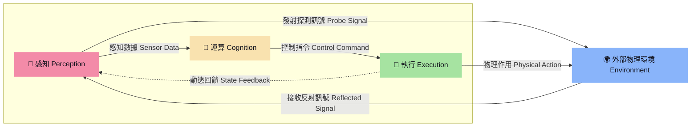

# 解構機器人 (The Robot Anatomy)

隨著具身智能（Embodied AI）爆發式成長，我們正在見證機器人從執行單一任務的「自動化機器」，即將演進為具備感知、思考、運動能力的「仿生實體」，而當前市場存在的三種實體型態，分別是：
1. **人型 (雙足)**：環境適應力最強（能上樓梯、跨越障礙），但控制演算法門檻極高，且硬體功耗及成本目前仍居高不下。
2. **狗型 (四足)**：在崎嶇地形（如戶外碎石地、工廠管道區）表現極佳，是目前工業巡檢及戶外探勘的熱門選擇。
3. **輪型**：開發技術與商業落地最為成熟的型態，但其移動範圍深受地形條件限制（無法克服高低落差）。

這三種智慧機器人皆是由上千或上萬個零組件所組成，結構相當複雜，但我們可從系統工程的角度，將所有零組件初步歸納成三大項目「感知（Perception）、運算（Cognition）與執行（Execution）」，相關界定內容與性能指標請參閱《Bot & Build：人機協作到共生的實踐指南》，本文則依此為基礎走進開發世界。

延伸來看，這三大零組件群是彼此分工、相互協作的關係，以此構成一個完整的閉環系統：首先透過感知類零組件蒐集環境資訊，接著由運算類零組件進行即時決策，最後藉由執行類零組件完成指令動作，並同時回饋數據形成閉迴路，持續進行感知（P）、運算（C）和執行（E）的循環與調整。

這一閉環系統與人體的生理運作模式如出一轍；這也是為何當前的具身智能（Embodied AI）研究，多以人體器官來隱喻機器人的架構設計：

| 機器人系統 | 人體對應 | 功能 |
| :--- | :--- | :--- |
| **感知** (Perception) | 五官（眼口鼻舌耳）、皮膚 | 環境資訊偵測與自身狀態觀測 |
| **運算** (Cognition) | 大腦、小腦、神經 | 數據融合、路徑規劃與行為決策 |
| **執行** (Execution) | 骨骼、肌肉、關節 | 動力輸出與物理世界實體交互 |

---

## 1. 感知：機器人的視線範圍

就像人類透過眼睛看見影像、耳朵接收聲音、皮膚感受壓力一樣，機器人也需要各式各樣的感測器來取得周遭環境資訊。

### 3.1 3D 視覺相機：機器人的雙眼
機器人主要依賴 3D 視覺來重建環境點雲（Point Cloud）、識別物體並估計其位姿（Pose Estimation）。主要技術可分為：
*   **主動式立體視覺 (Active Stereo Vision)**：如 *Intel RealSense D435i/D455*。利用紅外線投影輔助，在無紋理的牆面或暗處仍能獲得優質的深度資料。
*   **飛行時間法 (ToF - Time of Flight)**：如 *Azure Kinect* (已停產，現由其技術合作夥伴承接) 或台灣*立普思 (LIPS)* 的工業級 ToF 相機。測量光線反射時間，適合動態避障與長距離測量。
*   **結構光 (Structured Light)**：精度極高，常用於工業檢測或精準夾取。

### 3.2 慣性測量單元 (IMU)：小腦平衡的基石
*   沒有 IMU 的機器人就像閉著眼睛單腳站立的人。
*   高頻（常為 200Hz - 1000Hz）的 6 軸或 9 軸 IMU（如 *Xsens*, *InvenSense*）能即時回傳加速度與角速度，供運動控制演算法即時修正重力補償與防跌倒補償。

### 3.3 觸覺與力覺感測器：靈巧手的最後一塊拼圖
*   當機器人要拿起一顆雞蛋或使用工具時，單靠視覺是不夠的，必須知道「用了多少力」。
*   **關節力矩感測器**與手腕處的**六軸力/力矩感測器 (F/T Sensor)** 能即時感知外界碰撞，確保人機協作安全（觸碰即停）。
*   **陣列式觸覺皮膚**（如 *SynTouch*, *GelSight* 技術）則是目前仿人靈巧手研究的最前線，能感知滑動、粗糙度與微小形變。

---

## 2. 運算：機器人的聰明程度

---

## 3. 執行：機器人的靈敏程度

