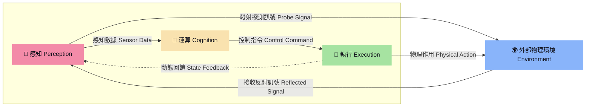

# 解構機器人 (The Robot Anatomy)

隨著具身智能（Embodied AI）爆發式成長，我們正在見證機器人從執行單一任務的「自動化機器」，即將演進為具備感知、思考、運動能力的「仿生實體」，而當前市場存在的三種實體型態，分別是：
1. **人型 (雙足)**：人型機器人 Humanoid Robot，環境適應力最強，能上樓梯、跨越障礙，但控制演算法門檻極高，且硬體功耗及成本目前仍居高不下。
2. **狗型 (四足)**：機器狗 Quadruped Robot，在崎嶇地形如戶外碎石地、工廠管道區等場所表現極佳，是目前工業巡檢及戶外探勘的熱門選擇。
3. **輪型**：自主移動機器人 Autonomous Mobile Robot (AMR)，開發技術與商業落地最為成熟的型態，但其移動範圍深受地形條件限制，像是仍然無法克服高低落差。

這三種智慧機器人皆是由上千或上萬個零組件所組成，結構相當複雜，但我們可從系統工程的角度，將所有零組件初步歸納成三大項目「感知（Perception）、運算（Cognition）與執行（Execution）」，相關界定內容與性能指標請參閱《Bot & Build：人機協作到共生的實踐指南》，本文則依此為基礎走進開發世界。

這三大零組件群是彼此分工、相互協作的關係，以此構成一個完整的閉環系統：首先透過感知類零組件蒐集環境資訊，接著由運算類零組件進行即時決策，最後藉由執行類零組件完成指令動作，並同時回饋數據形成閉迴路，持續進行感知（P）、運算（C）和執行（E）的循環與調整。而這一個閉環系統與人體的生理運作模式如出一轍，這也是為什麼當前產業研究，多以人體器官來對應說明智慧機器人的設計架構。

而在深入探討智慧機器人背後的開發世界前，我們可以透過以下硬體配置表，一覽目前主流三種實體型態（人型機器人、機器狗、AMR）在各個零組件項目上的採用趨勢：

> **符號說明**：● 主流選擇  |  ◉ 視需求選擇  |  ○ 罕見或不選用

| 模組類別 | 零組件名稱 | 功能與說明 | 人型機器人 | 機器狗 | AMR |
| :--- | :--- | :--- | :---: | :---: | :---: |
| **運算** | 邊緣運算平台 | 整合 CPU、GPU 或 SoC 等核心處理器，負責運行作業系統、演算法與 AI 模型，並進行即時行為決策。移動式應用普遍採用輕量化的單板電腦（SBC），固定式應用或工控場景則以工業電腦（IPC）為主。 | ● (大腦) | ● | ● |
| | 控制器 | 將邊緣運算平台指令轉化為精準的關節物理動作，由於需要處理大量高頻率的感測器回饋與馬達控制訊號，普遍採用數位訊號處理器（DSP）或微控制器（MCU）。 | ● (小腦) | ● | ● |
| **感知** | RGB 相機 | 由感光元件與鏡頭所組成，接收環境可見光並提供 2D 彩色影像輸出，主要用於物體識別與語意理解。 | ● (眼睛) | ● | ● |
| | 深度相機 (RGB-D) | 在 RGB 基礎上加入測距技術（如 ToF、結構光與三角測量），直接輸出像素點的物理距離並生成 3D 點雲，主要用於精準抓取與避障，在人型機器人應用上以雙目或多目視覺為主。 | ● (雙眼) | ● | ● |
| | 魚眼 / 廣角相機 | 提供大範圍視野，可視角通常大於 150 度，常用於彌補主視覺視野的不足（如盲區覆蓋）。 | ◉ (眼角餘光) | ○ | ○ |
| | 2D 光達 (LiDAR) | 單線雷射雷達，獲取水平單一高度的距離數據，用於障礙物偵測、定位與 2D 地圖建構（SLAM）。 | ○ (平面輔助眼) | ○ | ● |
| | 3D 光達 (LiDAR) | 多線雷射雷達，提供三維環境點雲資訊，可精準感知物體形狀、距離與高度。 | ◉ (立體輔助眼) | ◉ | ● (戶外用) |
| | 超音波 / 紅外線 | 近距離感測器，用於偵測鄰近障礙物以避免碰撞，或作為底部的防墜感測。 | ◉ (防撞輔助眼) | ◉ | ● |
| | 雷達 (RADAR) / 毫米波 | 利用無線電波偵測目標，不易受光線、煙霧、雨霧等環境影響。 | ◉ (全天候輔助眼) | ◉ | ◉ |
| | 電容式 MEMS | 擷取環境聲音與語音訊號，用於人機語音互動。 | ◉ (耳朵) | ○ | ◉ |
| | 壓力感測 (電子皮膚) | 陣列式壓力感測，技術分為壓阻式、電容式及壓電式三種，主要用於協作型機械手臂（Cobot）的人機安全與接觸偵測，隨著人型機器人發展，逐步延伸至靈巧手、手臂及足部等觸覺感知應用。 | ◉ (皮膚) | ○ | ○ |
| | 一維力感測器 | 量測單一軸向的受力，單位：牛頓 (N)，主要用於線性關節，亦可整合進靈巧手的指尖用於單點偵測。 | ◉ (肌腱) | ◉ | ◉ |
| | 三維力感測器 | 量測三軸受力（X、Y、Z），單位：牛頓 (N)，用於受力判斷及抓握控制。 | ◉ (手指或腳底) | ● | ○ |
| | 六維力感測器 | 同時量測三軸受力（Fx、Fy、Fz）與三軸扭矩（Mx、My、Mz），單位：牛頓·米（N·m），用於精準力控與步態平衡。 | ● (手腕或腳踝) | ○ | ○ |
| | GNSS / RTK | 提供戶外全球定位與公分級高精度定位，為戶外自主移動機器人提供地理絕對位置。 | ○ | ◉ | ● (戶外用) |
| | 慣性測量單元 (IMU) | 包含陀螺儀與加速度計，提供機器人的加速度、角速度及姿態數據，主要用於平衡控制與定位輔助。 | ● (內耳前庭) | ● | ● |
| | 編碼器 (Encoder) | 將馬達或關節的位置、方向與角度變化轉換為量測數據，協助精準控制，人型機器人多採雙編碼器設計，分別配置於馬達端與減速器端。 | ● (肌梭) | ● | ● |
| **執行** | 行星減速器 | 體積中等、抗衝擊力強，適合高負載部位，但精度較低。 | ● (下肢關節) | ● | ● |
| | 諧波減速器 (HD) | 體積極小、精度極高，但抗衝擊能力較弱。 | ● (上肢關節) | ◉ | ○ |
| | 擺線減速器 (RV) | 體積較大、大負載、剛性極高，用於承受重載的部位。 | ◉ (肩膀) | ◉ | ○ |
| | 無刷直流馬達 (BLDC) | 具高效率、低噪音及長壽命等優勢，為輪式AMR的主流驅動馬達。 | ● (肌肉) | ○ | ● |
| | 無框力矩馬達 | 中空無外框設計，也因體積小、扭矩密度高，適合整合進機構空間狹窄的仿生關節，為人型機器人與機器狗的主流驅動馬達。 | ● (肌肉) | ● | ○ |
| | 空心杯馬達 | 具低慣量、快速響應及高效率等特性，為靈巧手的主流驅動馬達。 | ● (手指肌肉) | ○ | ○ |
| | 行星滾珠螺桿 | 將旋轉運動轉為直線運動，提供極大的推力與承載力，常用於人型機器人的腿部或腰部。 | ● (肌腱) | ○ | ○ |
| | 末端執行器 | 靈巧手、夾爪、真空吸盤等模組化產品皆屬之，用於物體抓取、搬運與操作，其中靈巧手主要配備於人型機器人。 | ● (雙手) | ◉ | ◉ |

> 💡 **註**：電池組（通常為鋰電池或磷酸鐵鋰電池）為整機電能來源，因其屬於基礎動力系統，故未列入本次盤點項目，然其重要性不亞於其他零組件，是影響續航力與移動性的關鍵因素。

---

## 【感知】機器人的視線範圍

- **國際主流廠**：
  - **RGB相機**：Keyence(:jp:)、Cognex(:us:)
  - **深度相機**：Intel RealSense(:us:)、Orbbec(:cn:)、Stereolabs(:us:/:fr:)
  - **3D光達（LiDAR）**：SICK(:de:)、Hesai(:cn:)、Robosense(:cn:)
  - **超音波/紅外線**：FLIR System(:us:)、Raytron(:cn:)
  - **雷達(RADAR)/毫米波**：Bosch(:de:)、Continental(:de:)、Valeo(:fr:)
  - **電容式MEMS**：Goertek(:cn:)、Knowles(:us:)、AAC Technologies(:cn:)、Infineon Technologies(:de:)
  - **壓力感測（電子皮膚）**：Tekscan(:us:)、SynTouch(:us:)、Novasentis(:us:)、Hanwei Electronics(:cn:)、JDI(:jp:)
  - **一維力感測**：Sensata(:us:)、Futek(:us:)
  - **三維力感測 / 六維力感測器**：ATI Industrial Automation(:us:)、Sunrise Instruments(:cn:)
  - **GNSS／RTK**：u-blox(:switzerland:)、Trimble(:us:)
  - **慣性測量單元 (IMU)** ：ADI(:us:)、Bosch(:de:)
  - **編碼器（Encoder）**：Renishaw(:gb:)、Celera Motion(:us:)
- **台灣供應商**：

在具身智能時代，

---

## 【運算】機器人的聰明程度

- **國際主流廠**：
  - **邊緣運算平台**：NVIDIA(:us:)、Intel(:us:)、Qualcomm(:us:)、AMD(:us:)、Siemens(:de:)、Beckhoff(:de:)
  - **控制器**：STMicroelectronics(:switzerland:)、Texas Instruments(:us:)、Infineon Technologies(:de:)、NXP(:netherlands:)、Microchip(:us:)
- **台灣供應商**：

在具身智能時代，運算架構已從單純的「機載運算」演進為「機載-邊緣-雲端/HPC」的三層協同體系：
後台 HPC 與雲端運算平台（如 GPU 訓練叢集、並行物理模擬伺服器）屬於具身智能研發的「後台基礎設施」，受限於功耗與重量無法直接裝載於機器人本體，故未列入本「機載硬體配置表」，其協同機制請參閱 [3. 運算系統](#3-運算系統機器人的決策中樞)。

- **機載控制器 (MCU/DSP)**：主要負責低階的馬達伺服控制與運動學逆解 (Inverse Kinematics)。它接收大腦的高層指令，以高頻（kHz 等級）控制驅動器，將其轉化為各關節馬達的精確物理動作，確保動作流暢與即時避障。
- **機載邊緣運算平台 (CPU/GPU/SoC/IPC)**：人形機器人、機器狗與 AMR 皆標配強大的處理器。如 NVIDIA Jetson Orin、Intel x86 工控機，負責運行 SLAM 定位、視覺感知、路徑規劃及端側具身模型推理（VLA / LLM 輕量化部署）。
- **後台 HPC 與雲端平台 (GPU 叢集/Cloud Robotics)**：受限於體積、重量與功耗（SWaP），HPC 叢集無法直接裝載於機器人本體，但作為具身智能研發的「後方大腦」，主要負責：
  - **大規模物理模擬 (Massive Sim-to-Real)**：如利用 NVIDIA Isaac Gym 在數千個並行虛擬環境中，高速訓練機器人的運動與操作策略。
  - **具身大模型訓練**：進行視覺-語言-動作模型 (VLA) 的離線預訓練與微調。
  - **非即時高階決策**：雲端大腦負責長序列任務拆解（Task Planning）與場景語意理解。

#### 💡 具身智能技術世代與 HPC 算力需求對照

隨著具身智能演進，HPC 所扮演的算力支撐角色也從單純的「物理模擬」走向「世界模型生成」：

| 發展世代 | 核心演算法技術 | 機器人解決問題 | HPC 叢集的核心角色 |
| :--- | :--- | :--- | :--- |
| **第一代** | **強化學習 (Reinforcement Learning)** | 學會「如何移動」 （如：平衡、步態、關節力矩控制） | **大規模並行物理模擬 (Sim-to-Real)**：在 GPU 叢集上運行數千個並行模擬器（如 Isaac Gym），讓機器人在數小時內完成實體需花費數萬小時的行走與跌倒訓練。 |
| **第二代** | **視覺-語言-動作模型 (VLA)** | 學會「如何完成任務」 （如：語意理解、物件操作） | **多模態對齊預訓練**：訓練數十億至數百億參數的 VLA 骨幹網路，處理並學習海量「感知圖像 - 語言指令 - 動作軌跡」的對齊資料。 |
| **第三代** *(發展中)* | **世界模型 (World Model) + 分層/擴散策略 (Hierarchical/Diffusion Policy)** | 學會「如何思考與規劃」 （如：虛擬物理預測、軌跡生成） | **生成式物理預測與擴散計算**：訓練世界模型在虛擬空間中預測未來物理畫面（運算量大），並執行高維度動作空間的去噪擴散軌跡學習。 |

---

## 【執行】機器人的靈敏程度

執行系統是機器人的骨骼與肌肉，動力系統則是心臟，兩者協同完成物理世界的交互。

  - **無框力矩馬達**：
  - **空心杯馬達**：Faulhaber(:switzerland:)、Maxon(:switzerland:)
  - **行星滾珠螺桿**：BKL Automation(:de:)、KS Tools(:de:)
  - **末端執行器**：SICK、Cognex(:us:)

### 4.1 精密減速器：骨骼關節的變速箱
- **行星減速器**：抗衝擊能力強，適合人形下肢與機器狗，但精度較低。
- **諧波減速器 (HD)**：體積極小、精度極高，是人形上身關節與機器狗的部分關節首選。
- **擺線減速器 (RV)**：承載大、剛性高，常用於人形肩膀等重載部位。

### 4.2 關節馬達：肌肉動力源
- **無框力矩馬達**：扭矩密度極高且體積小，能直接整合進狹小的防生關節中，是人形與機器狗關節的靈魂。
- **空心杯馬達**：低慣量、轉子響應速度極快且運行精準，是人形靈巧手手指運作的唯一標配。
- **行星滾柱螺桿**：將馬達旋轉轉為強大的直線推力，常用於人形的線性腿部執行器或腰部。