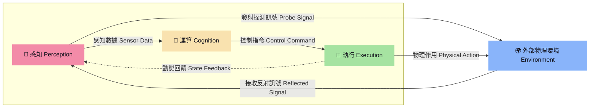
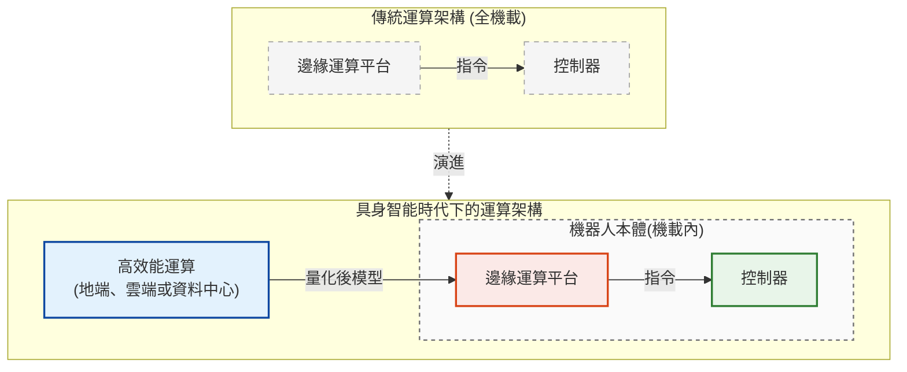

# 解構機器人 (The Robot Anatomy)

隨著實體人工智慧（Physical AI，又稱具身智能 Embodied AI）的爆發式成長，我們正在見證機器人從執行單一任務的「自動化機器」，即將演進為具備感知、思考、運動能力的「仿生實體」，而當前市場存在的三種實體型態，分別是：
1. **人型 (雙足)**：人型機器人 Humanoid Robot，環境適應力最強，能上樓梯、跨越障礙，但控制演算法門檻極高，且硬體功耗及成本目前仍居高不下。
2. **狗型 (四足)**：機器狗 Quadruped Robot，在崎嶇地形如戶外碎石地、工廠管道區等場所表現極佳，是目前工業巡檢及戶外探勘的熱門選擇。
3. **輪型**：自主移動機器人 Autonomous Mobile Robot (AMR)，開發技術與商業落地最為成熟的型態，但其移動範圍深受地形條件限制，像是仍然無法克服高低落差。

這三種型態的智慧機器人，皆是由上千或上萬個零組件所組成，但從系統工程角度來看，所有零組件都能歸納為三大核心：感知（Perception）、運算（Cognition）與執行（Execution），相關界定內容與性能指標可參閱《Bot & Build：人機協作到共生的實踐指南》，本文則以此為基礎，帶你深入開發細節。

三大零組件群是彼此分工、相互協作的關係，以此構成一個完整的閉環系統：感知類零組件負責蒐集環境資訊，接著由運算類零組件進行即時決策，最後透過執行類零組件完成指令動作，並同時回饋數據形成閉迴路，持續進行感知（P）、運算（C）和執行（E）的循環與調整。這一個閉環系統與人體生理機制非常相似，這也是為什麼當前產業研究，常以人體器官來對應說明智慧機器人的設計架構。

而在深入探討智慧機器人背後的開發世界前，我們可以透過以下硬體配置表，一覽目前主流三種實體型態（人型機器人、機器狗、AMR）在各個零組件項目上的採用趨勢：

> **符號說明**：● 主流選擇  |  ◉ 視需求選擇  |  ○ 罕見或不選用

| 模組類別 | 零組件名稱 | 功能與說明 | 人型機器人 | 機器狗 | AMR |
| :--- | :--- | :--- | :---: | :---: | :---: |
| **運算** | 邊緣運算平台 | 整合 CPU、GPU 或 SoC 等核心處理器，負責運行作業系統、演算法與 AI 模型，並進行即時行為決策。移動式應用普遍採用輕量化的單板電腦（SBC），固定式應用或工控場景則以工業電腦（IPC）為主。 | ● (大腦) | ● | ● |
| | 控制器 | 將邊緣運算平台指令轉化為精準的關節物理動作，由於需要處理大量高頻率的感測器回饋與馬達控制訊號，普遍採用數位訊號處理器（DSP）或微控制器（MCU）。 | ● (小腦) | ● | ● |
| **感知** | RGB 相機 | 由感光元件與鏡頭所組成，接收環境可見光並提供 2D 彩色影像輸出，主要用於物體識別與語意理解。 | ● (眼睛) | ● | ● |
| | 深度相機 (RGB-D) | 在 RGB 基礎上加入測距技術（如 ToF、結構光與三角測量），直接輸出像素點的物理距離並生成 3D 點雲，主要用於精準抓取與避障，在人型機器人應用上以雙目或多目視覺為主。 | ● (雙眼) | ● | ● |
| | 魚眼 / 廣角相機 | 提供大範圍視野，可視角通常大於 150 度，常用於彌補主視覺視野的不足（如盲區覆蓋）。 | ◉ (眼角餘光) | ○ | ○ |
| | 2D 光達 (LiDAR) | 單線雷射雷達，獲取水平單一高度的距離數據，用於障礙物偵測、定位與 2D 地圖建構（SLAM）。 | ○ (平面輔助眼) | ○ | ● |
| | 3D 光達 (LiDAR) | 多線雷射雷達，提供三維點雲資訊，可精準感知物體形狀、距離與高度。 | ◉ (立體輔助眼) | ◉ | ● (戶外用) |
| | 超音波 / 紅外線 | 近距離感測器，用於偵測鄰近障礙物以避免碰撞，或作為底部的防墜感測。 | ◉ (防撞輔助眼) | ◉ | ● |
| | 雷達 (RADAR) / 毫米波 | 利用無線電波偵測目標，不易受光線、煙霧、雨霧等環境影響。 | ◉ (全天候輔助眼) | ◉ | ◉ |
| | 電容式 MEMS | 擷取環境聲音與語音訊號，用於人機語音互動。 | ◉ (耳朵) | ○ | ◉ |
| | 壓力感測 (電子皮膚) | 陣列式壓力感測，技術分為壓阻式、電容式及壓電式三種，主要用於協作型機械手臂（Cobot）的人機安全與接觸偵測，隨著人型機器人發展，逐步延伸至靈巧手、手臂及足部等觸覺感知應用。 | ◉ (皮膚) | ○ | ○ |
| | 一維力感測器 | 量測單一軸向的受力，單位：牛頓 (N)，主要用於線性關節，亦可整合進靈巧手的指尖用於單點偵測。 | ◉ (肌腱) | ◉ | ◉ |
| | 三維力感測器 | 量測三軸受力（X、Y、Z），單位：牛頓 (N)，用於受力判斷及抓握控制。 | ◉ (手指或腳底) | ● | ○ |
| | 六維力感測器 | 同時量測三軸受力（Fx、Fy、Fz）與三軸扭矩（Mx、My、Mz），單位：牛頓·米（N·m），用於精準力控與步態平衡。 | ● (手腕或腳踝) | ○ | ○ |
| | GNSS / RTK | 提供戶外全球定位與公分級高精度定位，為戶外自主移動機器人提供地理絕對位置。 | ○ | ◉ | ● (戶外用) |
| | 慣性測量單元 (IMU) | 包含陀螺儀與加速度計，提供機器人的加速度、角速度及姿態數據，主要用於平衡控制與定位輔助。 | ● (內耳前庭) | ● | ● |
| | 編碼器 (Encoder) | 將馬達或關節的位置、方向與角度變化轉換為量測數據，協助精準控制，人型機器人多採雙編碼器設計，分別配置於馬達端與減速器端。 | ● (肌梭) | ● | ● |
| **執行** | 行星減速器 | 體積中等、抗衝擊力強，適合高負載部位，但精度較低。 | ● (下肢關節) | ● | ● |
| | 諧波減速器 (HD) | 體積極小、精度極高，但抗衝擊能力較弱。 | ● (上肢關節) | ◉ | ○ |
| | 擺線減速器 (RV) | 體積較大、大負載、剛性極高，用於承受重載的部位。 | ◉ (肩膀) | ◉ | ○ |
| | 無刷直流馬達 (BLDC) | 具高效率、低噪音及長壽命等優勢，為輪式AMR的主流驅動馬達。 | ● (肌肉) | ○ | ● |
| | 無框力矩馬達 | 中空無外框設計，也因體積小、扭矩密度高，適合整合進機構空間狹窄的仿生關節，為人型機器人與機器狗的主流驅動馬達。 | ● (肌肉) | ● | ○ |
| | 空心杯馬達 | 具低慣量、快速響應及高效率等特性，為靈巧手的主流驅動馬達。 | ● (手指肌肉) | ○ | ○ |
| | 行星滾柱螺桿 | 將旋轉運動轉為直線運動，提供極大的推力與承載力，常用於人型機器人的腿部或腰部。 | ● (肌腱) | ○ | ○ |
| | 末端執行器 | 靈巧手、夾爪、真空吸盤等模組化產品皆屬之，用於物體抓取、搬運與操作，其中靈巧手主要配備於人型機器人。 | ● (雙手) | ◉ | ◉ |

> 💡 **註**：機器人的動力來源為電池組，通常為鋰電池或鋰鐵電池，近年亦有固態電池的產品可供選擇，然其技術發展、供應鏈及安全議題具特殊性，故未列入本次盤點項目。

---

## 【感知】機器人的視線範圍

- **國際主流廠**：
  - **RGB相機**：Keyence(日/JP)、Cognex(美/US)
  - **深度相機**：Intel RealSense(美/US)、奧比中光(中/CN)、Stereolabs(美/US)
  - **3D光達（LiDAR）**：SICK(德/DE)、禾賽科技(中/CN)、速騰聚創(中/CN)
  - **超音波/紅外線**：Teledyne FLIR(美/US)、睿創微納(中/CN)
  - **雷達(RADAR)/毫米波**：Bosch(德/DE)、Continental(德/DE)、Valeo(法/FR)
  - **電容式MEMS**：歌爾股份(中/CN)、Knowles(美/US)、瑞聲科技(中/CN)、Infineon Technologies(德/DE)
  - **壓力感測（電子皮膚）**：Tekscan(美/US)、SynTouch(美/US)、Novasentis(美/US)、漢威科技(中/CN)、JDI(日/JP)
  - **一維力感測**：Sensata(美/US)、Futek(美/US)
  - **三維力感測 / 六維力感測器**：ATI Industrial Automation(美/US)、宇立儀器(中/CN)
  - **GNSS／RTK**：u-blox(瑞/CH)、Trimble(美/US)
  - **慣性測量單元 (IMU)** ：ADI(美/US)、Bosch(德/DE)
  - **編碼器（Encoder）**：Renishaw(英/UK)、Celera Motion(美/US)

- **台灣供應商**：

- **未來關鍵**：在 Physical AI 時代，最關鍵的技術特徵在於「身體性」與「即時環境互動能力」，無論載體是智慧機器人或虛擬代理，都必須與物理環境交互動作，然而真實世界充滿變數，這使得「感知」成為人工智慧技術演進中最大的挑戰，誰能高效且精準地將感測器資料做到對 AI 模型有意義的標記，誰就能掌握未來通用人工智慧（AGI）發展的主導權。也是基於此，本指引將重點聚焦於機器人感知系統，協助整機開發者釐清感測器與機器人主流開發框架整合時，需要留意與處理的關鍵技術議題。

---

## 【運算】機器人的聰明程度

- **國際主流廠**：
  - **邊緣運算平台**：NVIDIA (美/US)、Intel (美/US)、Qualcomm (美/US)、AMD (美/US)、Siemens (德/DE)、Beckhoff (德/DE)
  - **控制器**：STMicroelectronics (瑞/CH)、Texas Instruments (美/US)、Infineon Technologies (德/DE)、NXP (荷/NL)、Microchip (美/US)

- **台灣供應商**：

- **未來關鍵**：為了在算力需求與物理極限之間取得平衡，運算架構正逐漸從「控制器 - 邊緣運算平台」演進為「控制器 - 邊緣運算平台 - 高效能運算 (HPC)」三層協作體系。這源於智慧機器人（尤其是人形機器人與機器狗）對本體空間、重量配比、功耗與散熱等面向的極度要求，難以單靠機載邊緣運算平台運行參數龐大的AI模型與訓練技術——例如強化學習 (Reinforcement Learning，簡稱 RL)、視覺-語言-動作 (Vision-Language-Action，簡稱 VLA) 或世界模型 (World Model)；因此，獨立將大模型訓練與模擬 (Sim-to-Real) 交給HPC層處理，才能讓本體專注於即時控制，又同時滿足機器人訓練上的AI運算需求。

---

## 【執行】機器人的靈敏程度

- **國際主流廠**：
  - **減速機**：Harmonic Drive Systems(日/JP)、綠的諧波(中/CN)、Ｎidec Shimpo(日/JP)、Nabtesco(日/JP)、雙環傳動(中/CN)、Wittenstein(德/DE)、Neugart(德/DE)
  - **馬達**：Kollmorgen(美/US)、BEI Kimco(美/US)、Maxon(瑞/CH)、
  Nidec(日/JP)、YASKAWA(日/JP)、DYNAMIXEL(韓/KR)
  - **滾珠螺桿**：NSK(日/JP)、THK(日/JP)、Schaeffler(德/DE)
  - **末端執行器**：靈心巧手(中/CN)、Festo(德/DE)、SCHUNK(德/DE)、因時機器人(中/CN)
  
- **台灣供應商**：

- **未來關鍵**：將由「單項選配」走向「模組整合」，過往整機開發者需分別選擇馬達、減速器、驅動器、編碼器，不僅要考量各零組件間的適配性，還要花時間進行系統整合與控制調校，因此，為縮短開發時程和降低整合風險，而逐漸傾向直接採用一體式(All-in-One)產品；這股需求端的趨勢，促使供給端往模組化的整合型設計方向前進，加上智慧機器人領域對於執行類零組件的需求逐漸增加，目前已出現如 QDD 關節模組（Quasi-Direct Drive 準直驅；大扭矩馬達+低減速比減速機），以及結合電子皮膚的靈巧手模組等產品。

---

## 總觀察

在機器人零組件的三大核心中，「感知」與「運算」屬於**電子件** (electronic components)，包含各式感測器及邊緣運算平台；而「執行」則屬於**金屬件** (metal components)，涵蓋馬達、減速機、滾珠螺桿等產品。然而我們可以發現，現階段市場關注的多半是金屬件，尤其是供應給人型機器人各個部位(例如肩膀、手肘、腳踝、髖部等)的關節模組，原因在於一台人型機器人就需要數十組，在數量的牽動下，成為目前整機成本占比最高的零組件群。

然而，若從產業發展的長期角度來看，真正具有持續成長潛力的反而會是電子件，因為隨著 AI 模型、感測及控制技術日益成熟，未來智慧機器人勢必會像智慧型手機或筆記型電腦一樣，逐步形成通用化規格與模組化架構，並發展出可以跨品牌、跨機型共用的零組件生態，屆時，電子件就將形成規模經濟，其市場價值也可望隨著出貨量持續放大。

這樣的產業演進，其實台灣曾經歷過一次。

回到1980年代末，全球筆記型電腦市場仍由 IBM、Dell、Toshiba 等國際品牌主導，台灣幾乎沒有自己的全球品牌，當時，國內企業並未選擇與品牌廠正面競爭，而是專注於主機板、散熱模組、連接器、電源等的零組件的研發和製造，並逐步發展整機設計製造（ODM）能力。隨著 Intel 2003年推出 Centrino 行動運算技術平台，加速筆電設計的模組化，也讓筆電產業形成更明確的全球分工模式：品牌廠專注產品與行銷，製造則交由台灣負責，受惠於這股趨勢，到了2000年代中期，全球已有超過七成的筆電是由台灣企業代工生產。

如今的智慧機器人產業，與當年筆電市場有許多相似之處，雖然目前全球焦點仍集中在 Tesla、Figure AI、1X Technologies、宇樹科技與智元機器人等整機廠，但真正具長遠競爭力的開發模式，並非由整機廠包辦所有零組件開發，而是由產業共同形成通用的感知、運算和執行平台，再依應用需求搭配不同零組件模組，以此延伸發展個別品牌的產品差異；當產業演進至此，提供電子件的供應商將如同當年筆電產業中的 ODM 與零組件廠，因掌握核心技術而站穩全球供應鏈位置。