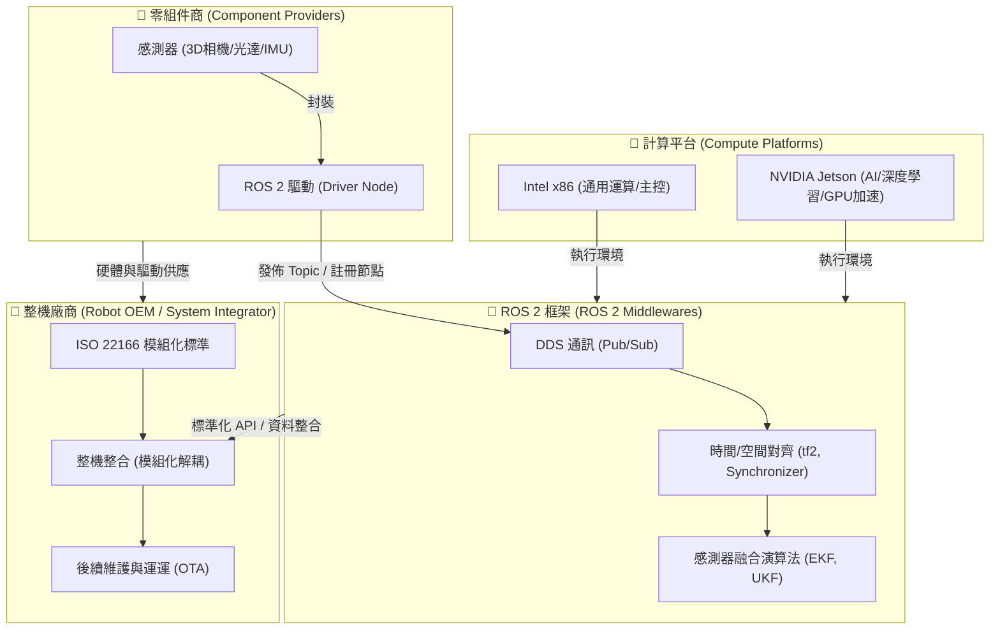

# 為什麼在機器人開發中使用 ROS 2 (Why use ROS 2 for robot development)

機器人開發並非單兵作戰，而是一個由**機載系統**、**開發框架**、**整機廠商**、**零組件商**與**運算平台**構建的共生世界。

---

## 1. ROS 2（Robot Operating System 2）

ROS 2 是目前智慧機器人系統開發中，最被廣泛使用的開源軟體框架，它並非是直接管理硬體的作業系統，而是一種能支援多種作業系統進行機器人開發的軟體框架，從整體架構來看，可分為「作業系統層（OS Layer）」、「中介層（Middleware Layer）」與「應用層（Application Layer）」三層。

首先，在作業系統層，因其支援廣泛，故能讓開發者基於自身熟悉的作業系統進行開發，例如 Linux（Ubuntu 發行版）、Windows、macOS 等；再來的中介層，則是採用 DDS（Data Distribution Service）標準，開發者必須依循 ROS 2 提供的標準化通訊機制，透過節點`Node`、主題`Topic`、發布`Publisher`/訂閱`Subscriber`、服務`Service`、動作`Action`等項目進行設定，讓框架中的任何資料都能以一致且可靠的方式進行交換。

最後的應用層，是開發者實際發展機器人功能的地方，可先透過 C++、Python 或其他程式語言，搭配相對應的官方函式庫（Client Library，C++ 為 `rclcpp`，Python 為 `rclpy`）開發各種 ROS 2 節點，讓不同感測器、演算法或相關套件能串接起來，快速完成機器人設定以因應各種複雜的應用場景。

這種模組化架構，契合開發者打造一台智慧機器人時，對於多種感測器的整合需求，畢竟每個單一感測器皆有其局限性，例如 3D 光達雖然能提供高精度的三維環境點雲資訊，卻難以辨識鏡子或玻璃等透明、反光物體，所以通常會搭配相機取得的影像資訊，提升環境感知可靠性；也正因如此，ROS 2 至今已然是機器人產業裡最為主流的開發框架。

---

## 2. 機器人感知系統（Robotic Perception System）

感知系統是智慧機器人自主行動的基礎，在實務開發上，要讓演算法正確讀懂環境，絕非直接套用程式碼即可，而是需要經歷一段從硬體選擇到視覺化工具檢視的六個步驟：

1.  **第一步：硬體選擇**
    根據智慧機器人的應用場景與任務需求，選擇合適的感測器種類與規格。例如，室內掃地機器人使用 2D 光達即可完成定位與避障，但若是戶外遞送機器人，則需要結合 3D 光達、深度相機，並搭配毫米波輔助偵測，以維持在雨霧、夜間等複雜環境下的能見度。

2.  **第二步：驅動測試**
    選定感測器後，首要動作是連接至開發電腦，確認作業系統可正確辨識裝置（例如於 `/dev` 目錄下出現對應裝置）後進行驅動測試。若該感測器已有現成的 ROS 2 驅動套件，即直| 感測器 | Topic 名稱 | Message | 說明 |
| :--- | :--- | :--- | :--- |
| 2D 光達 (LiDAR) | `/scan` | `sensor_msgs/msg/LaserScan` | 由 2D 光達提供的二維掃描資料，包含在同一平面內各個角度的障礙物距離量測值。 |
| 3D 光達 (LiDAR) | `/points_raw` 或 `/points2` | `sensor_msgs/msg/PointCloud2` | 由 3D 光達提供的三維點雲資料，包含空間中大量的 X, Y, Z 座標。 |
| RGB 相機 | `/camera/rgb/image_raw` | `sensor_msgs/msg/Image` | 由 RGB 相機提供的二維彩色影像，每個像素只包含顏色資訊。 |
| RGB-D 深度相機 | `/camera/depth/image_raw` | `sensor_msgs/msg/Image` | 由深度相機提供的彩色影像與深度影像，其中深度影像的每個像素，皆包含對應物體與相機之間的距離資訊。 |
| 雙目 / 多目視覺 | `/camera/left/image_raw` `/camera/right/image_raw` | `sensor_msgs/msg/Image` | 由雙目相機（兩顆一般相機組成的整合型產品）提供的左右視角影像。 |
| 慣性測量單元 (IMU) | `/imu/data_raw`  `/imu/data` | `sensor_msgs/msg/Imu` | 由 IMU 提供高頻率的加速度和角速度數據，`/imu/data_raw` 為原始量測資料；若驅動程式支援姿態融合，則會提供包含姿態資訊的 `/imu/data`。 |
| GNSS/RTK | `/gps/fix` | `sensor_msgs/msg/NavSatFix` | 由 GNSS 接收器提供經緯度與海拔等全球定位資訊，若搭配 RTK，可提升定位精度至公分等級。 |

#### 計算數據 (computed data) —— 需經計算才能得到

| 感測器 | Topic 名稱 | Message | 說明 |
| :--- | :--- | :--- | :--- |
| 輪式編碼器 (Encoder) | `/odom/wheel` | `nav_msgs/msg/Odometry` | 靠馬達轉動圈數推算的原始里程計數據。 |
| 輪式編碼器 + IMU | `/odometry/filtered` 或 `/odom` | `nav_msgs/msg/Odometry` | 融合編碼器里程計與 IMU 資料後的最佳估計位置與姿態。 |��動發布的 `sensor_msgs/msg/CameraInfo` ，取得相機出廠時的焦距（Focal Length）、主點（Principal Point）及鏡頭畸變（Distortion）等以 YAML 格式儲存的參數。除非遇到例如更換鏡頭或使用無出廠校正的相機產品等情形，才需進行內參校正，這時可利用 ROS 2 官方提供的 `camera_calibration` 套件進行處理。
    *   **外參（Extrinsics）**：描述相機座標系與機器人本體（或其他感測器）座標系之間的相對位置與姿態，是機器人感知系統中的必要資訊，這需要透過像是 `Kalibr` 或 ROS 2 `multisensor_calibration` 等工具，計算出平移（Translation）與旋轉（Rotation）參數，再將結果設定至 ROS 2 的 `tf2` 供後續使用。

5.  **第五步：資料前處理**
    在感測資料輸入進演算法之前，建議進行資料的前處理，以降低資料量、減少雜訊干擾，並提升後續演算法的效率和穩定性。開發者可依資料型態選擇對應的處理方法，例如去除離群點（Statistical Outlier Removal）、下採樣（Voxel Grid）及保留指定範圍的資料裁切（PassThrough Filter）等。
    實務上常見的做法，是針對三維點雲資料使用 PCL（C++）或 Open3D（Python）等開源函式庫進行前處理；影像資料則可透過 `cv_bridge` 將 ROS 2 的 `sensor_msgs/msg/Image` 轉換為 OpenCV 可處理格式，再利用其功能進行前處理。由於這些資料前處理工具，都已被普遍使用並擁有完整的開源資源，開發者只要依據機器人任務需求，確定欲採用的資料前處理方法為何，即可進一步搜尋或套用對應的程式碼完成實作。

6.  **第六步：視覺化工具檢視**
    完成各項設定後，可以使用 ROS 2 的三維視覺化工具 (主流如 RViz2) 進行視覺化檢查，但要留意 RViz2 適合顯示點雲、影像或坐標系等空間資料，若需觀察非空間的數值型資料（例如 IMU、GPS、電池電壓等會隨時間變化的數值），則需搭配像是 `rqt_plot` 的插件進行檢視。
    而透過視覺化工具，有助於開發者檢查各個感測器資料，除了確認資料能正常顯示、也檢視各感測器之間的座標轉換都正確，以及感測器安裝位置與量測結果是符合預期的；待所有細節皆確認無誤後，再將感測資料整合至其他演算法，測試機器人在實際環境中的任務功能，就算完成機器人感知系統運作正常且符合需求的最後驗證工作。

此外，建構感知系統包含兩大關鍵要素：**感測器資料**與**處理演算法**（後者將於第二章詳述）。在此我們首先聚焦於資料本身，並將其分為「原始數據」與「計算數據」兩種，整理實務上常見的感測數據及其在 ROS 2 中的 主題 `Topic` 與訊息 `Message` 格式，其中，訊息 `Message` 可能因不同零組件商而有不同的字母組合，但大部分都是遵循 ROS 2 的標準格式在提供：

#### 原始數據 (raw data) —— 感測器直接輸出

| 感測器 | Topic | Message  | 說明 |
| :--- | :--- | :--- | :--- |
| 2D 光達 (LiDAR) | `/scan` | `sensor_msgs/msg/LaserScan` | 由 2D 光達提供的二維掃描資料，包含在同一平面內各個角度的障礙物距離量測值。 |
| 3D 光達 (LiDAR) | `/points_raw` 或 `/points2` | `sensor_msgs/msg/PointCloud2` | 由 3D 光達提供的三維點雲資料，包含空間中大量的 X, Y, Z 座標。 |
| RGB 相機 | `/camera/rgb/image_raw` | `sensor_msgs/msg/Image` | 由 RGB 相機提供的二維彩色影像，每個像素只包含顏色資訊。 |
| RGB-D 深度相機 | `/camera/depth/image_raw` | `sensor_msgs/msg/Image` | 由深度相機提供的彩色影像與深度影像，其中深度影像的每個像素，皆包含對應物體與相機之間的距離資訊。 |
| 雙目 / 多目視覺 | `/camera/left/image_raw` `/camera/right/image_raw` | `sensor_msgs/msg/Image` | 由雙目相機（兩顆一般相機組成的整合型產品）提供的左右視角影像。 |
| 慣性測量單元 (IMU) | `/imu/data_raw`  `/imu/data` | `sensor_msgs/msg/Imu` | 由 IMU 提供高頻率的加速度和角速度數據，`/imu/data_raw` 為原始量測資料；若驅動程式支援姿態融合，則會提供包含姿態資訊的 `/imu/data`。 |
| GNSS/RTK | `/gps/fix` | `sensor_msgs/msg/NavSatFix` | 由 GNSS 接收器提供經緯度與海拔等全球定位資訊，若搭配 RTK，可提升定位精度至公分等級。 |

#### 計算數據 (computed data) —— 需經計算才能得到

| 感測器 | Topic | Message | 說明 |
| :--- | :--- | :--- | :--- |
| 編碼器 (Encoder) | `/odom/wheel` | `nav_msgs/msg/Odometry` | 由里程計演算法（例如 `ros2_control` 套件中的`diff_drive_controller` ）根據編碼器資料，計算得到機器人位姿（位置+姿態）與速度（線速度&角速度）的數值。 |
| 編碼器 + IMU 等組合 | `/odom` | `nav_msgs/msg/Odometry` | 由 `robot_localization` 融合 `/odom/wheel`、`/imu/data` 等感測器資料運算產生的里程計資訊，提供較準確的機器人位姿與速度數值，其座標原點通常為機器人啟動時建立的局部原點。 |
| 各感測器 | `/tf` | `tf2_msgs/msg/TFMessage` | 動態座標轉換資訊。記錄各座標系（如 `odom`、`base_link`、`laser`）之間的相對位置與姿態，用於不同感測器與機器人座標的轉換。 |
| SLAM 演算法/ Map Server | `/map` | `nav_msgs/msg/OccupancyGrid` | 靜態全局地圖。通常為二維佔據網格地圖（Occupancy Grid），記錄環境中牆壁與障礙物的分布，作為導航的全局環境資訊。 |
| Costmap2D | `/global_costmap/costmap` | `nav_msgs/msg/OccupancyGrid` | 全局代價地圖。根據 `/map` 建立導航代價資訊，並對障礙物進行膨脹處理，供全局規劃器規劃安全路徑。 |
| Costmap2D | `/local_costmap/costmap`  | `nav_msgs/msg/OccupancyGrid` | 局部代價地圖。結合 `/scan` 等即時感測器資料更新周圍障礙物資訊，供局部規劃器進行避障與即時路徑調整。 |
| 外部指令（如 RViz、Nav2 Goal） | `/goal_pose` | `geometry_msgs/msg/PoseStamped` | 導航目標。包含目標位置與最終姿態（朝向），發布此 Topic 即代表指定導航終點。 |
| 全局規劃器（Nav2 Planner Server） | `/plan` | `nav_msgs/msg/Path` | 全局規劃路徑。由機器人目前位置規劃至 `/goal_pose` 的路徑點序列，供導航系統作為整體行進路徑。 |

---

## 3. 整機廠商

過往，智慧機器人整機廠商的開發者最擔心的問題之一，就是某個零組件一旦停產或斷貨，就需要為了硬體更換，而重新檢查與調整整合系統的程式碼；造成這種情況的原因，在於傳統開發模式多採用「煙囪式系統架構（Information Silo Architecture）」，使軟體與硬體高度綁定，雖然架構看似穩定，卻降低系統彈性與擴充性，也讓整合型產品在升級與維護時面臨更高的成本，也因此，近年產業逐漸朝向「模組化設計」發展，並帶動越來越多開發者使用 ROS 2 進行機器人開發。

模組化設計的優勢，其中一個體現在整機產品的售後服務上，當客戶的機器人發生故障時，維運人員可以直接鎖定問題模組，進行熱插拔更換；若只是軟體問題，也能透過 OTA（Over-the-Air）僅更新或重新啟動特定 Driver Node，而不是讓整台機器人停機重開。停機時間縮短、維修成本降低，客戶體驗也大幅提升。

另從整機產品勢必接觸的 ISO 國際標準，其發展脈絡也可看出模組化設計的重要性， ISO 國際標準主要有四個標準類型，分別是詞彙、安全、性能和模組化，每個產品發展，往往先談安全，再講性能，接著才談模組化。近年在機器人領域，則更進一步探討「如何透過軟硬體介面模組化，讓整個產業生態有更多元的可能性」。

ISO 22166-1 是服務型機器人（Service Robots）模組化設計的重要國際標準，規範了軟體、硬體及物理介面的模組架構。有了共同的設計規範，不同廠商的模組更容易整合，產品開發也能從「重新打造一台機器人」，變成「快速組裝一台機器人」。

---

## 4. 零組件商

對於感測器、馬達等零組件製造商而言，硬體規格再強，若沒有良好的軟體接口支援，也很難在機器人市場立足。

* **Intel RealSense 與 ROS 的小故事**：
  在早期 RealSense（如 R200/F200 系列）剛推出時，Intel 雖然提供了不錯的 SDK，但對 Linux 及 ROS 的支援度極低，開發者必須使用社群自行開發的 Wrapper 才能將相機點雲導入 ROS。這導致許多開發者轉向使用相容性更好的 ASUS Xtion 或 Kinect。
  隨後，Intel 意識到機器人學術與工業界對 3D 感知的龐大需求，開始投入大量工程師專職開發與維護官方的 `realsense-ros` 驅動，確保 RealSense 可以完美、開箱即用地在 ROS/ROS 2 中運行。這個決定直接改寫了市場格局，使 RealSense 成為了全球機器人開發者案頭上的「標配」感測器。

* **啟示**：零組件商如果想要打入機器人市場，**提供高品質、開箱即用的 ROS 2 驅動 (Driver Node)** 是不可或缺的敲門磚。缺乏官方驅動的硬體，會大大增加整機廠商的整合研發成本，最終在方案評估階段就被直接淘汰。

---

## 5. 兩大系統：NVIDIA (Jetson) 與 Intel (x86)

目前機器人感知與主控系統的硬體平台，主要被兩大陣營所瓜分，兩者在架構與應用場景上互補：

| 平台陣營 | 代表晶片 / 生態 | 架構特點 | 優勢場景 |
| :--- | :--- | :--- | :--- |
| **NVIDIA 系統** | Jetson Nano / TX2 / Xavier / Orin | ARM CPU + NVIDIA GPU | **邊緣 AI 運算**：特別適合運行深度學習推論（如 YOLO 避障）、即時 3D 重建、VIO（視覺慣性里程計）以及需要大量並行運算的感測器融合。 |
| **Intel 系統** | Core i5/i7/i9 (工控機 IPC) | x86 CPU (多核心高時脈) | **通用與邏輯運算**：極強的單核效能與高時脈，非常適合運行複雜的行為決策樹 (Behavior Tree)、路徑規劃 (Nav2) 以及即時控制 (Real-time Linux 核心下的精準運動控制)。 |

在許多中大型工業級或商用機器人（如 AMR、配送機器人）中，整機廠商通常會採取**雙主機架構**以達到最優效能：
1. **感知與 AI 側**：使用 **NVIDIA Jetson** 作為感知前級，負責解析高頻點雲、相機影像並執行邊緣端 AI 識別。
2. **決策與控制側**：使用 **Intel x86 工控機** 作為大腦中樞，負責路徑規劃、高可靠度的狀態機管理，並下發控制指令給馬達執行器。兩者透過 ROS 2 的 DDS 進行高頻、低延遲的資料傳輸。
驅動節點，高層的導航與演算法代碼完全不需更換。
