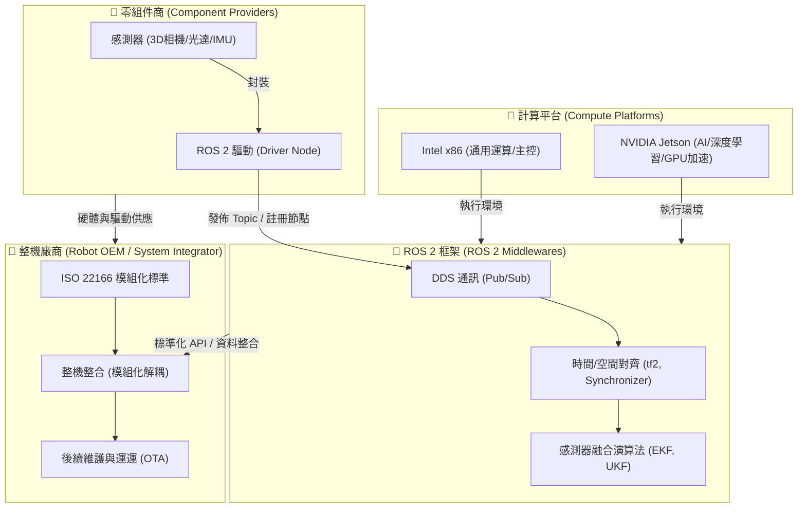

# 為什麼在機器人開發中使用 ROS 2 (Why use ROS 2 for robot development)

在現代機器人開發中，選擇一個具備高擴充性、即時性與活躍社群支援的開發框架，是決定專案成敗的關鍵。本章節將從機器人開發的全球生態系出發，透過關係圖、感知系統的建立、整機模組化標準、零組件驅動生態，以及兩大核心硬體系統的解析，深入探討為什麼 ROS 2 已成為當前機器人開發的唯一首選。

---

## 1. 機器人開發世界的關係圖與系統架構

機器人開發並非單兵作戰，而是一個由**零組件商**、**計算平台**、**開發框架**與**整機廠商**共同構建的複雜生態系。以下關係圖展示了這些角色如何在 ROS 2 的黏合下相互協作：

---

## 2. 📸 機器人感知系統：讓機器人「看見」物理世界

在傳統的機器人開發 SOP 中，系統通常被簡化為三個核心環節：**感知 (Perception)** $\rightarrow$ **運算 (Cognition)** $\rightarrow$ **執行 (Execution)**。而「感知系統」則是這條鏈條的最起點。

為了讓機器人在未知的物理環境中具備行動能力，我們必須為其建立起一組「看得到、聽得到、感覺得到」的感知系統：
- **感知系統的建立**：這不僅僅是把相機插上主機，而是要建立一個能即時處理「環境點雲重建」、「物體識別與語意分割」以及「自身位姿估計 (Localization)」的軟硬體整合系統。
- **邊緣端預處理**：高畫質 RGB-D 相機與高速光達會產生極為龐大的原始數據。感知系統需要透過 ROS 2 的節點設計，在邊緣端進行降採樣 (Voxel Grid Filter)、去噪點與濾波處理，再將乾淨的結構化數據傳遞給決策模組，避免網路帶寬被瞬間撐爆。

---

## 3. 📂 ROS 2 框架與多感測器融合 (Sensor Fusion) 演算法

在感知系統建立後，隨之而來面臨的挑戰是「單一感測器的局限性」：
- **相機 (Camera)**：能提供豐富的色彩與紋理資訊，但在暗處或無紋理牆面（如白牆）容易失效。
- **光達 (LiDAR)**：測距精準且不受光照影響，但在雨天、霧天或空曠無特徵環境中容易「迷失」。
- **慣性測量單元 (IMU)**：更新頻率極高且不受外部干擾，但隨時間會產生嚴重的積分漂移。

這正是為什麼目前機器人開發一致選擇 **ROS 2 框架** 的原因：
- **即時通訊中介軟體 (DDS)**：ROS 2 放棄了 ROS 1 的單一 Master 架構，改用工業級的 DDS (Data Distribution Service) 作為通訊底層，保證了數據傳輸的低延遲與高可靠性，這對安全至關重要的感測器融合至關重要。
- **多感測器融合演算法 (Sensor Fusion)**：在 ROS 2 生態中，開發者可以開箱即用如 `robot_localization` 等套件，其中整合了 **擴展卡爾曼濾波器 (EKF)** 與 **無跡卡爾曼濾波器 (UKF)**。
- **時空對齊的標準化**：ROS 2 的 `tf2` 座標變換樹能以極高效率處理多感測器之間的空間外參 (Extrinsics)；同時，ROS 2 的 Message Filters 提供了近似時間同步 (Approximate Time Synchronizer)，將不同頻率（例如 IMU 200Hz、相機 30Hz）的數據在時間軸上對齊，大幅降低了融合演算法的開發難度。

---

## 4. 🧑 整機廠商的模組化革命：ISO 22166 標準

對於整機廠商（System Integrators / OEMs）而言，傳統「煙囪式」的開發模式（將軟體與特定硬體高度綁定）是產品規模化的最大絆腳石。

- **模組化設計精神**：ROS 2 通過強大的 Topic/Service/Action 標準化接口，實現了「軟硬體解耦」。整機廠商在設計時，應將雷射雷達、底盤馬達、機械手臂抽象化為獨立的軟體模組。即使硬體供應商更換（例如從 A 牌光達換成 B 牌），也只需替換底層驅動節點，高層的導航與演算法代碼完全不需更換。
- **ISO 22166 標準的導入**：
  - **ISO 22166-1** 是針對服務型機器人（Service Robots）模組化設計的國際標準。它定義了機器人在軟體、硬體與物理接口上的模組化架構規範。
  - 遵循此標準的整機廠商，能夠大幅簡化**產品的迭代週期**。
  - **有助於售後維運**：當終端客戶的機器人出現故障，運維人員可以針對單一故障模組進行熱插拔更換，或者透過 OTA (Over-the-Air) 僅對特定驅動節點進行線上更新與重啟，避免了整機系統的停機風險。

---

## 5. 🧑 零組件商：Intel RealSense 的小故事與驅動的重要性

對於感測器、馬達等零組件製造商而言，硬體規格再強，若沒有良好的軟體接口支援，也很難在機器人市場立足。

* **Intel RealSense 與 ROS 的小故事**：
  在早期 RealSense（如 R200/F200 系列）剛推出時，Intel 雖然提供了不錯的 SDK，但對 Linux 及 ROS 的支援度極低，開發者必須使用社群自行開發的 Wrapper 才能將相機點雲導入 ROS。這導致許多開發者轉向使用相容性更好的 ASUS Xtion 或 Kinect。
  隨後，Intel 意識到機器人學術與工業界對 3D 感知的龐大需求，開始投入大量工程師專職開發與維護官方的 `realsense-ros` 驅動，確保 RealSense 可以完美、開箱即用地在 ROS/ROS 2 中運行。這個決定直接改寫了市場格局，使 RealSense 成為了全球機器人開發者案頭上的「標配」感測器。

* **啟示**：零組件商如果想要打入機器人市場，**提供高品質、開箱即用的 ROS 2 驅動 (Driver Node)** 是不可或缺的敲門磚。缺乏官方驅動的硬體，會大大增加整機廠商的整合研發成本，最終在方案評估階段就被直接淘汰。

---

## 6. 📂 兩大運算系統：NVIDIA (Jetson) 與 Intel (x86)

目前機器人感知與主控系統的硬體平台，主要被兩大陣營所瓜分，兩者在架構與應用場景上互補：

| 平台陣營 | 代表晶片 / 生態 | 架構特點 | 優勢場景 |
| :--- | :--- | :--- | :--- |
| **NVIDIA 系統** | Jetson Nano / TX2 / Xavier / Orin | ARM CPU + NVIDIA GPU | **邊緣 AI 運算**：特別適合運行深度學習推論（如 YOLO 避障）、即時 3D 重建、VIO（視覺慣性里程計）以及需要大量並行運算的感測器融合。 |
| **Intel 系統** | Core i5/i7/i9 (工控機 IPC) | x86 CPU (多核心高時脈) | **通用與邏輯運算**：極強的單核效能與高時脈，非常適合運行複雜的行為決策樹 (Behavior Tree)、路徑規劃 (Nav2) 以及即時控制 (Real-time Linux 核心下的精準運動控制)。 |

### 🛠️ 實戰工程建議：雙系統協同架構
在許多中大型工業級或商用機器人（如 AMR、配送機器人）中，整機廠商通常會採取**雙主機架構**以達到最優效能：
1. **感知與 AI 側**：使用 **NVIDIA Jetson** 作為感知前級，負責解析高頻點雲、相機影像並執行邊緣端 AI 識別。
2. **決策與控制側**：使用 **Intel x86 工控機** 作為大腦中樞，負責路徑規劃、高可靠度的狀態機管理，並下發控制指令給馬達執行器。兩者透過 ROS 2 的 DDS 進行高頻、低延遲的資料傳輸。
