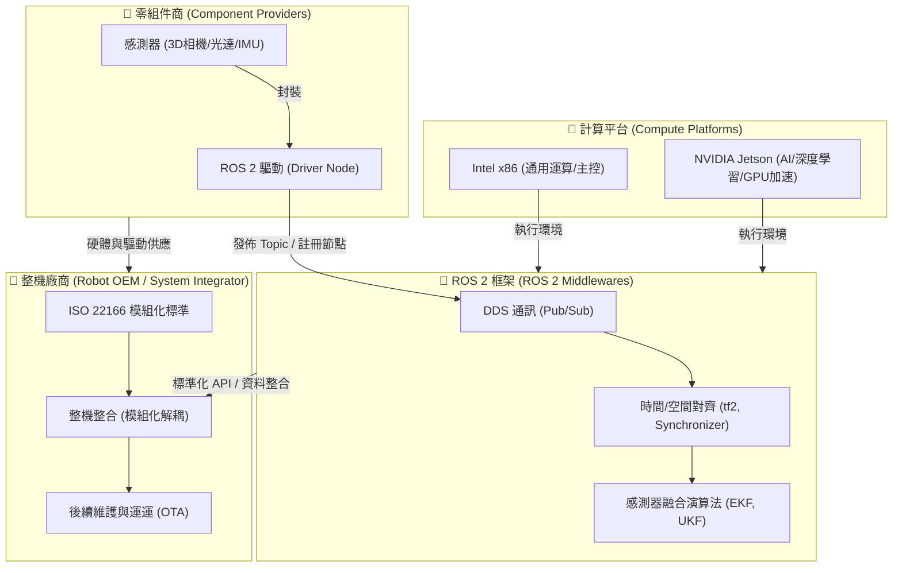
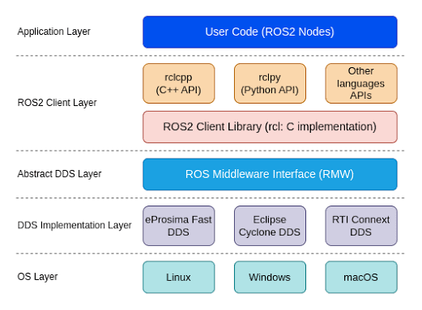

# 為什麼在機器人開發中使用 ROS 2 (Why use ROS 2 for robot development)

機器人開發並非單兵作戰，而是一個由**機載系統**、**開發框架**、**整機廠商**、**零組件商**與**運算平台**構建的共生世界。

---

## 1. ROS 2（Robot Operating System 2）

ROS 2 是目前智慧機器人系統開發中，最被廣泛使用的開源軟體框架，它並非是直接管理硬體的作業系統，而是一種能支援多種作業系統進行機器人開發的軟體框架，從整體架構來看，可分為「作業系統層（OS Layer）」、「中介層（Middleware Layer）」與「應用層（Application Layer）」三層。

首先，在作業系統層，因其支援廣泛，故能讓開發者基於自身熟悉的作業系統進行開發，例如 Linux（Ubuntu 發行版）、Windows、macOS 等；再來的中介層，則是採用 DDS（Data Distribution Service）標準，開發者必須依循 ROS 2 提供的標準化通訊機制，透過節點`Node`、主題`Topic`、發布`Publisher`/訂閱`Subscriber`、服務`Service`、動作`Action`等項目進行設定，讓框架中的任何資料都能以一致且可靠的方式進行交換。

最後的應用層，是開發者實際發展機器人功能的地方，可先透過 C++、Python 或其他程式語言，搭配相對應的官方函式庫（Client Library，C++ 為 `rclcpp`，Python 為 `rclpy`）開發各種 ROS 2 節點，讓不同感測器、演算法或相關套件能串接起來，快速完成機器人設定以因應各種複雜的應用場景。

這種模組化架構，契合開發者打造一台智慧機器人時，對於多種感測器的整合需求，畢竟每個單一感測器皆有其局限性，例如 3D 光達雖然能提供高精度的三維環境點雲資訊，卻難以辨識鏡子或玻璃等透明、反光物體，所以通常會搭配相機取得的影像資訊，提升環境感知可靠性；也正因如此，ROS 2 至今已然是機器人產業裡最為主流的開發框架。

---

## 2. 機器人感知系統（Robotic Perception System）

感知系統是智慧機器人自主行動的基礎，在實務開發上，要讓演算法正確讀懂環境，絕非直接套用程式碼即可，而是需要經歷一段從硬體選擇到視覺化工具檢視的六個步驟：

1.  **第一步：硬體選擇**
    根據智慧機器人的應用場景與任務需求，選擇合適的感測器種類與規格。例如，室內掃地機器人使用 2D 光達即可完成定位與避障，但若是戶外遞送機器人，則需要結合 3D 光達、深度相機，並搭配毫米波輔助偵測，以維持在雨霧、夜間等複雜環境下的能見度。

2.  **第二步：驅動測試**
    選定感測器後，首要動作是連接至開發電腦，確認作業系統可正確辨識裝置（例如於 `/dev` 目錄下出現對應裝置）後進行驅動測試。若該感測器已有現成的 ROS 2 驅動套件，即直接安裝並完成相關參數設定；若無，則需將廠商提供的 SDK 或 Library 封裝為 ROS 2 `Node`，並透過 `ros2 run` 或 `ros2 launch` 啟動節點；啟動後可使用 `ros2 topic list` 檢查該裝置的 `Topic` 是否存在，亦建議搭配 `ros2 topic echo` 或 `ros2 topic hz` 確認資料有正常且穩定發布。

3.  **第三步：機構設計**
    驅動測試無誤後，即可將感測器安裝在智慧機器人本體！然而在機構設計時，除了要確認供電與通訊的線路穩固，也要依據感測器特性選擇適當位置，例如光達宜設置在較高且視野開闊的地方，IMU 則建議裝在接近整機中心點的位置，最後，則要考量感測範圍是否受到其他機載裝置遮擋，以減少感知盲區。此外，若已知未來的工作環境及可能會遭遇的變數，例如雨淋、風沙、不平整路面，則應搭配對應的防護設計(防水、防塵、減震等)，以提升感測資料品質。

4.  **第四步：參數確認**
    硬體安裝完成後，即須確認感測器參數並視需求進行校正（Calibration）。以智慧機器人常用的深度相機為例，需要確認的參數有兩項：
    *   **內參（Intrinsics）**：通常開發者可直接使用相機驅動發布的 `sensor_msgs/msg/CameraInfo` ，取得相機出廠時的焦距（Focal Length）、主點（Principal Point）及鏡頭畸變（Distortion）等以 YAML 格式儲存的參數。除非遇到例如更換鏡頭或使用無出廠校正的相機產品等情形，才需進行內參校正，這時可利用 ROS 2 官方提供的 `camera_calibration` 套件進行處理。
    *   **外參（Extrinsics）**：描述相機座標系與機器人本體（或其他感測器）座標系之間的相對位置與姿態，是機器人感知系統中的必要資訊，這需要透過像是 `Kalibr` 或 ROS 2 `multisensor_calibration` 等工具，計算出平移（Translation）與旋轉（Rotation）參數，再將結果設定至 ROS 2 的 `tf2` 供後續使用。

5.  **第五步：資料前處理**
    在感測資料輸入進演算法之前，建議進行資料的前處理，以降低資料量、減少雜訊干擾，並提升後續演算法的效率和穩定性。開發者可依資料型態選擇對應的處理方法，例如去除離群點（Statistical Outlier Removal）、下採樣（Voxel Grid）及保留指定範圍的資料裁切（PassThrough Filter）等。
    實務上常見的做法，是針對三維點雲資料使用 PCL（C++）或 Open3D（Python）等開源函式庫進行前處理；影像資料則可透過 `cv_bridge` 將 ROS 2 的 `sensor_msgs/msg/Image` 轉換為 OpenCV 可處理格式，再利用其功能進行前處理。由於這些資料前處理工具，都已被普遍使用並擁有完整的開源資源，開發者只要依據機器人任務需求，確定欲採用的資料前處理方法為何，即可進一步搜尋或套用對應的程式碼完成實作。

6.  **第六步：視覺化工具檢視**
    完成各項設定後，可以使用 ROS 2 的三維視覺化工具 (主流如 RViz2) 進行視覺化檢查，但要留意 RViz2 適合顯示點雲、影像或坐標系等空間資料，若需觀察非空間的數值型資料（例如 IMU、GPS、電池電壓等會隨時間變化的數值），則需搭配像是 `rqt_plot` 的插件進行檢視。
    而透過視覺化工具，有助於開發者檢查各個感測器資料，除了確認資料能正常顯示、也檢視各感測器之間的座標轉換都正確，以及感測器安裝位置與量測結果是符合預期的；待所有細節皆確認無誤後，再將感測資料整合至其他演算法，測試機器人在實際環境中的任務功能，就算完成機器人感知系統運作正常且符合需求的最後驗證工作。

此外，建構感知系統包含兩大關鍵要素：**感測器資料**與**處理演算法**（後者將於第二章詳述）。在此我們首先聚焦於資料本身，並將其分為「外感受」與「內感受」兩大類，整理實務上常見的感測數據及其在 ROS 2 中的 Topic 與訊息格式：

#### 外感受 (Exteroceptive) —— 偵測外部環境

| 感測器 | Topic 名稱 | Message | 數據類型 | 說明 |
| :--- | :--- | :--- | :--- | :--- |
| RGB 相機 | `/camera/rgb/image_raw` | `sensor_msgs/msg/Image` | 原始數據 | 2D 彩色畫面。 |
| RGB 相機 | `/camera/rgb/image_rect` | `sensor_msgs/msg/Image` | 計算數據 | 經過相機內參去畸變 (Rectified) 後的彩色影像，通常這才是演算法實際使用的資料。 |
| 2D 光達 (LiDAR) | `/scan` | `sensor_msgs/msg/LaserScan` | 原始數據 | 2D 障礙物水平掃描，計算雷射光束測量到的距離。 |
| 3D 光達 (LiDAR) | `/points_raw` 或 `/points2` | `sensor_msgs/msg/PointCloud2` | 原始數據 | 三維點雲。 |
| 3D 光達 (LiDAR) | `/points_filtered` | `sensor_msgs/msg/PointCloud2` | 計算數據 | 資料前處理後的點雲。 |
| RGB-D 深度相機 | `/camera/depth/image_raw` | `sensor_msgs/msg/Image` | 原始數據 | 結合 ToF 或結構光輸出之深度圖。 |
| 雙目 / 多目視覺 | `/camera/left/image_raw` `/camera/right/image_raw` | `sensor_msgs/msg/Image` | 原始數據 | 輸出雙目左右眼彩色影像。 |
| 毫米波雷達 (Radar) | `/radar/scan` | `radar_msgs/msg/RadarScan` | 原始數據 | 利用多普勒效應測量物體速度與距離。 |

#### 內感受 (Proprioceptive) —— 偵測自身狀態

| 感測器 | Topic 名稱 | Message | 數據類型 | 說明 |
| :--- | :--- | :--- | :--- | :--- |
| 輪式編碼器 (Encoder) | `/odom/wheel` | `nav_msgs/msg/Odometry` | 原始數據 | 靠馬達轉動圈數推算的原始里程計數據。 |
| 慣性測量單元 (IMU) | `/imu/data_raw` | `sensor_msgs/msg/Imu` | 原始數據 | 提供三軸原始角速度與線性加速度。 |
| 慣性測量單元 (IMU) | `/imu/data` | `sensor_msgs/msg/Imu` | 計算數據 | 經資料前處理後的姿態數據。 |
| 輪式編碼器 + IMU | `/odometry/filtered` 或 `/odom` | `nav_msgs/msg/Odometry` | 計算數據 | 融合編碼器里程計與 IMU 資料後的最佳估計位置與姿態。 |
| 力與力矩感測器 | `/wrench/data` | `geometry_msgs/msg/WrenchStamped` | 原始數據 | 量測一維或六維受力，是人型機器人進行精準力控的關鍵。 |
| 全球定位系統 (GNSS/RTK) | `/gps/fix` | `sensor_msgs/msg/NavSatFix` | 原始數據 | 全球絕對定位經緯度。 |

💡 專家觀點：你可能沒注意到或能採用的優化方案
DDS 傳輸瓶頸與零拷貝（Zero-copy）技術 當你在 ROS 2 中傳輸高解析度點雲或 4K 影像時，預設的 DDS 序列化與跨行程通訊（IPC）會佔用極高 CPU。建議在感知節點之間啟用 Shared Memory 通訊（例如 eProsima Fast DDS 的 iceoryx 中介軟體），讓影像與點雲數據透過記憶體指標直接傳遞，實現「零拷貝」，可降低感知系統高達 60% 以上的 CPU 負載。
BEV（Bird's Eye View）空間投影 傳統上我們會分開處理相機與 LiDAR。現在主流做法是將視覺特徵與點雲特徵直接投影到統一的「鳥瞰圖（BEV）」空間中進行融合。這樣能避免在 2D 影像上做物體偵測後再投影回 3D 產生的深度失真問題，顯著提升避障與語意理解的精準度。

---

## 3. 整機廠商

對於整機廠商（System Integrators / OEMs）而言，傳統「煙囪式」的開發模式（將軟體與特定硬體高度綁定）是產品規模化的最大絆腳石。

- **模組化設計精神**：ROS 2 通過強大的 Topic/Service/Action 標準化接口，實現了「軟硬體解耦」。整機廠商在設計時，應將雷射雷達、底盤馬達、機械手臂抽象化為獨立的軟體模組。即使硬體供應商更換（例如從 A 牌光達換成 B 牌），也只需替換底層驅動節點，高層的導航與演算法代碼完全不需更換。
- **ISO 22166 標準的導入**：
  - **ISO 22166-1** 是針對服務型機器人（Service Robots）模組化設計的國際標準。它定義了機器人在軟體、硬體與物理接口上的模組化架構規範。
  - 遵循此標準的整機廠商，能夠大幅簡化**產品的迭代週期**。
  - **有助於售後維運**：當終端客戶的機器人出現故障，運維人員可以針對單一故障模組進行熱插拔更換，或者透過 OTA (Over-the-Air) 僅對特定驅動節點進行線上更新與重啟，避免了整機系統的停機風險。

---

## 4. 零組件商

對於感測器、馬達等零組件製造商而言，硬體規格再強，若沒有良好的軟體接口支援，也很難在機器人市場立足。

* **Intel RealSense 與 ROS 的小故事**：
  在早期 RealSense（如 R200/F200 系列）剛推出時，Intel 雖然提供了不錯的 SDK，但對 Linux 及 ROS 的支援度極低，開發者必須使用社群自行開發的 Wrapper 才能將相機點雲導入 ROS。這導致許多開發者轉向使用相容性更好的 ASUS Xtion 或 Kinect。
  隨後，Intel 意識到機器人學術與工業界對 3D 感知的龐大需求，開始投入大量工程師專職開發與維護官方的 `realsense-ros` 驅動，確保 RealSense 可以完美、開箱即用地在 ROS/ROS 2 中運行。這個決定直接改寫了市場格局，使 RealSense 成為了全球機器人開發者案頭上的「標配」感測器。

* **啟示**：零組件商如果想要打入機器人市場，**提供高品質、開箱即用的 ROS 2 驅動 (Driver Node)** 是不可或缺的敲門磚。缺乏官方驅動的硬體，會大大增加整機廠商的整合研發成本，最終在方案評估階段就被直接淘汰。

---

## 5. 兩大系統：NVIDIA (Jetson) 與 Intel (x86)

目前機器人感知與主控系統的硬體平台，主要被兩大陣營所瓜分，兩者在架構與應用場景上互補：

| 平台陣營 | 代表晶片 / 生態 | 架構特點 | 優勢場景 |
| :--- | :--- | :--- | :--- |
| **NVIDIA 系統** | Jetson Nano / TX2 / Xavier / Orin | ARM CPU + NVIDIA GPU | **邊緣 AI 運算**：特別適合運行深度學習推論（如 YOLO 避障）、即時 3D 重建、VIO（視覺慣性里程計）以及需要大量並行運算的感測器融合。 |
| **Intel 系統** | Core i5/i7/i9 (工控機 IPC) | x86 CPU (多核心高時脈) | **通用與邏輯運算**：極強的單核效能與高時脈，非常適合運行複雜的行為決策樹 (Behavior Tree)、路徑規劃 (Nav2) 以及即時控制 (Real-time Linux 核心下的精準運動控制)。 |

### 🛠️ 實戰工程建議：雙系統協同架構
在許多中大型工業級或商用機器人（如 AMR、配送機器人）中，整機廠商通常會採取**雙主機架構**以達到最優效能：
1. **感知與 AI 側**：使用 **NVIDIA Jetson** 作為感知前級，負責解析高頻點雲、相機影像並執行邊緣端 AI 識別。
2. **決策與控制側**：使用 **Intel x86 工控機** 作為大腦中樞，負責路徑規劃、高可靠度的狀態機管理，並下發控制指令給馬達執行器。兩者透過 ROS 2 的 DDS 進行高頻、低延遲的資料傳輸。
驅動節點，高層的導航與演算法代碼完全不需更換。
- **ISO 22166 標準的導入**：
  - **ISO 22166-1** 是針對服務型機器人（Service Robots）模組化設計的國際標準。它定義了機器人在軟體、硬體與物理接口上的模組化架構規範。
  - 遵循此標準的整機廠商，能夠大幅簡化**產品的迭代週期**。
  - **有助於售後維運**：當終端客戶的機器人出現故障，運維人員可以針對單一故障模組進行熱插拔更換，或者透過 OTA (Over-the-Air) 僅對特定驅動節點進行線上更新與重啟，避免了整機系統的停機風險。

---

## 4. 零組件商

對於感測器、馬達等零組件製造商而言，硬體規格再強，若沒有良好的軟體接口支援，也很難在機器人市場立足。

* **Intel RealSense 與 ROS 的小故事**：
  在早期 RealSense（如 R200/F200 系列）剛推出時，Intel 雖然提供了不錯的 SDK，但對 Linux 及 ROS 的支援度極低，開發者必須使用社群自行開發的 Wrapper 才能將相機點雲導入 ROS。這導致許多開發者轉向使用相容性更好的 ASUS Xtion 或 Kinect。
  隨後，Intel 意識到機器人學術與工業界對 3D 感知的龐大需求，開始投入大量工程師專職開發與維護官方的 `realsense-ros` 驅動，確保 RealSense 可以完美、開箱即用地在 ROS/ROS 2 中運行。這個決定直接改寫了市場格局，使 RealSense 成為了全球機器人開發者案頭上的「標配」感測器。

* **啟示**：零組件商如果想要打入機器人市場，**提供高品質、開箱即用的 ROS 2 驅動 (Driver Node)** 是不可或缺的敲門磚。缺乏官方驅動的硬體，會大大增加整機廠商的整合研發成本，最終在方案評估階段就被直接淘汰。

---

## 5. 兩大系統：NVIDIA (Jetson) 與 Intel (x86)

目前機器人感知與主控系統的硬體平台，主要被兩大陣營所瓜分，兩者在架構與應用場景上互補：

| 平台陣營 | 代表晶片 / 生態 | 架構特點 | 優勢場景 |
| :--- | :--- | :--- | :--- |
| **NVIDIA 系統** | Jetson Nano / TX2 / Xavier / Orin | ARM CPU + NVIDIA GPU | **邊緣 AI 運算**：特別適合運行深度學習推論（如 YOLO 避障）、即時 3D 重建、VIO（視覺慣性里程計）以及需要大量並行運算的感測器融合。 |
| **Intel 系統** | Core i5/i7/i9 (工控機 IPC) | x86 CPU (多核心高時脈) | **通用與邏輯運算**：極強的單核效能與高時脈，非常適合運行複雜的行為決策樹 (Behavior Tree)、路徑規劃 (Nav2) 以及即時控制 (Real-time Linux 核心下的精準運動控制)。 |

### 🛠️ 實戰工程建議：雙系統協同架構
在許多中大型工業級或商用機器人（如 AMR、配送機器人）中，整機廠商通常會採取**雙主機架構**以達到最優效能：
1. **感知與 AI 側**：使用 **NVIDIA Jetson** 作為感知前級，負責解析高頻點雲、相機影像並執行邊緣端 AI 識別。
2. **決策與控制側**：使用 **Intel x86 工控機** 作為大腦中樞，負責路徑規劃、高可靠度的狀態機管理，並下發控制指令給馬達執行器。兩者透過 ROS 2 的 DDS 進行高頻、低延遲的資料傳輸。
