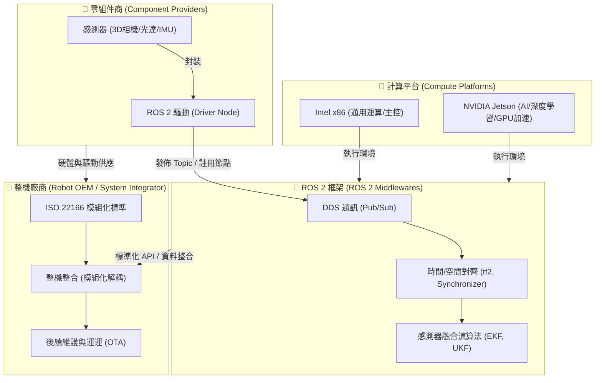
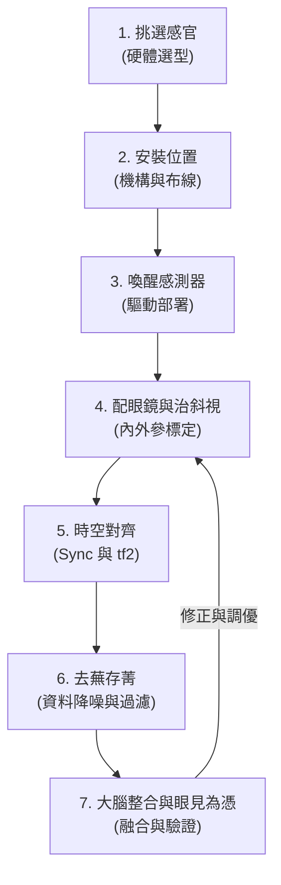

# 為什麼在機器人開發中使用 ROS 2 (Why use ROS 2 for robot development)

機器人開發並非單兵作戰，而是一個由**機載系統**、**開發框架**、**整機廠商**、**零組件商**與**運算平台**構建的共生世界。

---

## 1. 機器人感知系統

為了讓智慧機器人在未知的物理環境中具備行動能力，必須為其建立一個至少「看得到」的感知系統（Perception System），在實務開發上通常通常遵循以下七個步驟：

1.  **第一步：硬體選擇**
    *   根據機器人的應用場景與任務需求，選擇合適的感測器種類與規格。例如，室內掃地機器人通常使用 2D 光達即可完成定位與避障，但若是戶外配送無人車，則會需要結合 3D 光達、毫米波雷達並搭配相機，以提升在雨霧、夜間等複雜環境下的感知能力。
2.  **第二步：物理安裝**
    *   將感測器安裝於適當位置，確保供電與通訊線路穩定，並避免視野受到機器人本體或其他設備遮擋，以減少感知盲區。此外，若機器人工作環境震動較大，則應搭配減震機構，以降低影像模糊或點雲偏移，提升感測資料品質。
3.  **第三步：驅動部署**
    *   於 ROS 2 中啟動各感測器的驅動程式（Driver Node），確認感測資料能正常發布至對應 Topic，並檢查資料更新頻率、Frame ID、時間戳來源（Timestamp），確保後續演算法能即時且穩定取得資料。
4.  **第四步：標定校準**
    *   透過標定程序修正感測器本身的測量誤差，建立各感測器之間的相對位置關係。
        *   內參標定（Intrinsic Calibration）：校正鏡頭焦距、主點位置及鏡頭畸變，使影像能正確反映實際場景。
        *   外參標定（Extrinsic Calibration）：通常以主感測器（如 3D LiDAR）或機器人中心座標（base_link）作為基準座標系。
5.  **第五步：時空對齊**
    *   建立所有感測器共同的時間與空間基準，使不同來源的資料能正確融合。
        *   空間對齊（Spatial Alignment）：依據外參建立各感測器的座標轉換（TF），將影像、點雲等資料轉換至相同座標系。
        *   時間同步（Temporal Synchronization）：同步各感測器的時間戳，確保融合的是同一時刻所量測的資料。
6.  **第六步：資料預處理與過濾**
    *   在感測資料送入定位、建圖或物件辨識演算法之前，先進行資料清理與降噪，例如去除離群點、下採樣（Voxel Grid）、限制感測範圍（ROI Filtering）、地面點移除及雜訊濾波等，以降低運算負擔並提升後續演算法的穩定性與效率。
7.  **第七步：系統融合與 RViz2 驗證**
    *   將處理完成的感測資料整合至定位（Localization）、建圖（SLAM）或導航（Navigation）演算法，並利用 RViz2 檢查影像、點雲、TF 及地圖是否正確對齊，同時測試機器人在實際環境中的定位、避障與導航功能，確認整體感知系統運作正常且符合預期。

*   **1. 多模態感測器輸入與 ROS 2 實務**
    機器人的感知系統依賴「外感受」與「內感受」雙軌輸入，並在 ROS 2 中以特定的訊息格式進行高頻傳輸：
    *   **外感受（Exteroceptive）**：偵測外部環境
        *   *LiDAR (雷射雷達)*：藉由發射雷射並計算 Time-of-Flight (ToF) 測距。ROS 2 常用訊息類型為 `sensor_msgs/msg/LaserScan` (2D) 與 `sensor_msgs/msg/PointCloud2` (3D)。
            *   *物理極限與挑戰*：易受雨霧、粉塵等介質散射干擾；在面對玻璃、鏡面或吸光材質（如黑色吸光材料）時會產生穿透或漏測。在缺乏幾何特徵的對稱環境（如長直走廊）中易發生「幾何特徵退化」(Geometric Degeneracy)。
        *   *RGB-D 深度相機*：結合彩色影像與 ToF 或結構光技術，輸出 `sensor_msgs/msg/PointCloud2` 或 `sensor_msgs/msg/Image` (深度圖)。
            *   *物理極限與挑戰*：有效探測距離較短（通常在 0.5m ~ 6m 之間），且強烈戶外陽光（紅外光雜訊）會嚴重干擾深度估計。
        *   *毫米波雷達 (Radar)*：發射電磁波並利用多普勒效應（Doppler Effect）測量物體速度與距離，使用 `radar_msgs/msg/RadarScan`。
            *   *優勢*：具備全天候抗干擾能力（不怕雨雪、大霧或強光），適合戶外或高速避障。
        *   *RGB 相機*：接收環境光，輸出 2D 影像（`sensor_msgs/msg/Image`）。需要搭配相機內參標定資料（`sensor_msgs/msg/CameraInfo`）進行去畸變（Rectification）。
            *   *物理極限與挑戰*：受環境光照限制（低光度會產生雜訊，逆光會過曝），且缺乏直接的深度資訊。
    *   **內感受（Proprioceptive）**：偵測自身狀態
        *   *慣性測量單元 (IMU)*：包含三軸陀螺儀與三軸加速度計，輸出 `sensor_msgs/msg/Imu`。
            *   *挑戰*：加速度計易受馬達高頻震動干擾；積分計算位移時，零偏白雜訊會導致姿態與位置隨時間產生嚴重的「二次積分漂移」。
        *   *輪式編碼器 (Encoder)*：計算輪子轉速以推估里程計，輸出 `nav_msgs/msg/Odometry`。
            *   *挑戰*：當機器人在地毯、沙地或濕滑地面上發生打滑（Slippage）時，編碼器數據會嚴重失真。
        *   *力與力矩感測器 (F/T Sensor)*：量測一維或六維受力（`geometry_msgs/msg/WrenchStamped`），是人型機器人與機械手臂進行精準力控（Force Control）的核心。

💡 專家觀點：你可能沒注意到或能採用的優化方案
DDS 傳輸瓶頸與零拷貝（Zero-copy）技術 當你在 ROS 2 中傳輸高解析度點雲或 4K 影像時，預設的 DDS 序列化與跨行程通訊（IPC）會佔用極高 CPU。建議在感知節點之間啟用 Shared Memory 通訊（例如 eProsima Fast DDS 的 iceoryx 中介軟體），讓影像與點雲數據透過記憶體指標直接傳遞，實現「零拷貝」，可降低感知系統高達 60% 以上的 CPU 負載。
BEV（Bird's Eye View）空間投影 傳統上我們會分開處理相機與 LiDAR。現在主流做法是將視覺特徵與點雲特徵直接投影到統一的「鳥瞰圖（BEV）」空間中進行融合。這樣能避免在 2D 影像上做物體偵測後再投影回 3D 產生的深度失真問題，顯著提升避障與語意理解的精準度。

---

## 2. ROS 2 

在感知系統建立後，隨之而來面臨的挑戰是「單一感測器的局限性」：
- **相機 (Camera)**：能提供豐富的色彩與紋理資訊，但在暗處或無紋理牆面（如白牆）容易失效。
- **光達 (LiDAR)**：測距精準且不受光照影響，但在雨天、霧天或空曠無特徵環境中容易「迷失」。
- **慣性測量單元 (IMU)**：更新頻率極高且不受外部干擾，但隨時間會產生嚴重的積分漂移。

這正是為什麼目前機器人開發一致選擇 **ROS 2 框架** 的原因：
- **即時通訊中介軟體 (DDS)**：ROS 2 放棄了 ROS 1 的單一 Master 架構，改用工業級的 DDS (Data Distribution Service) 作為通訊底層，保證了數據傳輸的低延遲與高可靠性，這對安全至關重要的感測器融合至關重要。
- **多感測器融合演算法 (Sensor Fusion)**：在 ROS 2 生態中，開發者可以開箱即用如 `robot_localization` 等套件，其中整合了 **擴展卡爾曼濾波器 (EKF)** 與 **無跡卡爾曼濾波器 (UKF)**。
- **時空對齊的標準化**：ROS 2 的 `tf2` 座標變換樹能以極高效率處理多感測器之間的空間外參 (Extrinsics)；同時，ROS 2 的 Message Filters 提供了近似時間同步 (Approximate Time Synchronizer)，將不同頻率（例如 IMU 200Hz、相機 30Hz）的數據在時間軸上對齊，大幅降低了融合演算法的開發難度。

---

## 3. 整機廠商

對於整機廠商（System Integrators / OEMs）而言，傳統「煙囪式」的開發模式（將軟體與特定硬體高度綁定）是產品規模化的最大絆腳石。

- **模組化設計精神**：ROS 2 通過強大的 Topic/Service/Action 標準化接口，實現了「軟硬體解耦」。整機廠商在設計時，應將雷射雷達、底盤馬達、機械手臂抽象化為獨立的軟體模組。即使硬體供應商更換（例如從 A 牌光達換成 B 牌），也只需替換底層驅動節點，高層的導航與演算法代碼完全不需更換。
- **ISO 22166 標準的導入**：
  - **ISO 22166-1** 是針對服務型機器人（Service Robots）模組化設計的國際標準。它定義了機器人在軟體、硬體與物理接口上的模組化架構規範。
  - 遵循此標準的整機廠商，能夠大幅簡化**產品的迭代週期**。
  - **有助於售後維運**：當終端客戶的機器人出現故障，運維人員可以針對單一故障模組進行熱插拔更換，或者透過 OTA (Over-the-Air) 僅對特定驅動節點進行線上更新與重啟，避免了整機系統的停機風險。

---

## 4. 零組件商

對於感測器、馬達等零組件製造商而言，硬體規格再強，若沒有良好的軟體接口支援，也很難在機器人市場立足。

* **Intel RealSense 與 ROS 的小故事**：
  在早期 RealSense（如 R200/F200 系列）剛推出時，Intel 雖然提供了不錯的 SDK，但對 Linux 及 ROS 的支援度極低，開發者必須使用社群自行開發的 Wrapper 才能將相機點雲導入 ROS。這導致許多開發者轉向使用相容性更好的 ASUS Xtion 或 Kinect。
  隨後，Intel 意識到機器人學術與工業界對 3D 感知的龐大需求，開始投入大量工程師專職開發與維護官方的 `realsense-ros` 驅動，確保 RealSense 可以完美、開箱即用地在 ROS/ROS 2 中運行。這個決定直接改寫了市場格局，使 RealSense 成為了全球機器人開發者案頭上的「標配」感測器。

* **啟示**：零組件商如果想要打入機器人市場，**提供高品質、開箱即用的 ROS 2 驅動 (Driver Node)** 是不可或缺的敲門磚。缺乏官方驅動的硬體，會大大增加整機廠商的整合研發成本，最終在方案評估階段就被直接淘汰。

---

## 5. 兩大系統：NVIDIA (Jetson) 與 Intel (x86)

目前機器人感知與主控系統的硬體平台，主要被兩大陣營所瓜分，兩者在架構與應用場景上互補：

| 平台陣營 | 代表晶片 / 生態 | 架構特點 | 優勢場景 |
| :--- | :--- | :--- | :--- |
| **NVIDIA 系統** | Jetson Nano / TX2 / Xavier / Orin | ARM CPU + NVIDIA GPU | **邊緣 AI 運算**：特別適合運行深度學習推論（如 YOLO 避障）、即時 3D 重建、VIO（視覺慣性里程計）以及需要大量並行運算的感測器融合。 |
| **Intel 系統** | Core i5/i7/i9 (工控機 IPC) | x86 CPU (多核心高時脈) | **通用與邏輯運算**：極強的單核效能與高時脈，非常適合運行複雜的行為決策樹 (Behavior Tree)、路徑規劃 (Nav2) 以及即時控制 (Real-time Linux 核心下的精準運動控制)。 |

### 🛠️ 實戰工程建議：雙系統協同架構
在許多中大型工業級或商用機器人（如 AMR、配送機器人）中，整機廠商通常會採取**雙主機架構**以達到最優效能：
1. **感知與 AI 側**：使用 **NVIDIA Jetson** 作為感知前級，負責解析高頻點雲、相機影像並執行邊緣端 AI 識別。
2. **決策與控制側**：使用 **Intel x86 工控機** 作為大腦中樞，負責路徑規劃、高可靠度的狀態機管理，並下發控制指令給馬達執行器。兩者透過 ROS 2 的 DDS 進行高頻、低延遲的資料傳輸。
驅動節點，高層的導航與演算法代碼完全不需更換。
- **ISO 22166 標準的導入**：
  - **ISO 22166-1** 是針對服務型機器人（Service Robots）模組化設計的國際標準。它定義了機器人在軟體、硬體與物理接口上的模組化架構規範。
  - 遵循此標準的整機廠商，能夠大幅簡化**產品的迭代週期**。
  - **有助於售後維運**：當終端客戶的機器人出現故障，運維人員可以針對單一故障模組進行熱插拔更換，或者透過 OTA (Over-the-Air) 僅對特定驅動節點進行線上更新與重啟，避免了整機系統的停機風險。

---

## 4. 零組件商

對於感測器、馬達等零組件製造商而言，硬體規格再強，若沒有良好的軟體接口支援，也很難在機器人市場立足。

* **Intel RealSense 與 ROS 的小故事**：
  在早期 RealSense（如 R200/F200 系列）剛推出時，Intel 雖然提供了不錯的 SDK，但對 Linux 及 ROS 的支援度極低，開發者必須使用社群自行開發的 Wrapper 才能將相機點雲導入 ROS。這導致許多開發者轉向使用相容性更好的 ASUS Xtion 或 Kinect。
  隨後，Intel 意識到機器人學術與工業界對 3D 感知的龐大需求，開始投入大量工程師專職開發與維護官方的 `realsense-ros` 驅動，確保 RealSense 可以完美、開箱即用地在 ROS/ROS 2 中運行。這個決定直接改寫了市場格局，使 RealSense 成為了全球機器人開發者案頭上的「標配」感測器。

* **啟示**：零組件商如果想要打入機器人市場，**提供高品質、開箱即用的 ROS 2 驅動 (Driver Node)** 是不可或缺的敲門磚。缺乏官方驅動的硬體，會大大增加整機廠商的整合研發成本，最終在方案評估階段就被直接淘汰。

---

## 5. 兩大系統：NVIDIA (Jetson) 與 Intel (x86)

目前機器人感知與主控系統的硬體平台，主要被兩大陣營所瓜分，兩者在架構與應用場景上互補：

| 平台陣營 | 代表晶片 / 生態 | 架構特點 | 優勢場景 |
| :--- | :--- | :--- | :--- |
| **NVIDIA 系統** | Jetson Nano / TX2 / Xavier / Orin | ARM CPU + NVIDIA GPU | **邊緣 AI 運算**：特別適合運行深度學習推論（如 YOLO 避障）、即時 3D 重建、VIO（視覺慣性里程計）以及需要大量並行運算的感測器融合。 |
| **Intel 系統** | Core i5/i7/i9 (工控機 IPC) | x86 CPU (多核心高時脈) | **通用與邏輯運算**：極強的單核效能與高時脈，非常適合運行複雜的行為決策樹 (Behavior Tree)、路徑規劃 (Nav2) 以及即時控制 (Real-time Linux 核心下的精準運動控制)。 |

### 🛠️ 實戰工程建議：雙系統協同架構
在許多中大型工業級或商用機器人（如 AMR、配送機器人）中，整機廠商通常會採取**雙主機架構**以達到最優效能：
1. **感知與 AI 側**：使用 **NVIDIA Jetson** 作為感知前級，負責解析高頻點雲、相機影像並執行邊緣端 AI 識別。
2. **決策與控制側**：使用 **Intel x86 工控機** 作為大腦中樞，負責路徑規劃、高可靠度的狀態機管理，並下發控制指令給馬達執行器。兩者透過 ROS 2 的 DDS 進行高頻、低延遲的資料傳輸。
