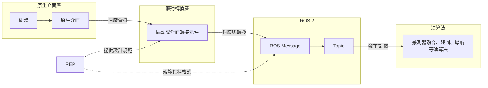

# 多感測器融合的 ROS 2 工程規範 (ROS 2 engineering standards for sensor fusion)

進一步探究機器人感知系統的開發流程，會發現實務上最令人頭痛的往往不是演算法本身，而是各個感測器介面與資料表示方式的不一致，不同感測器通常具有各自的原生介面（Native Interface），其資料格式、通訊方式、欄位定義與操作流程，往往由硬體製造商自行設計，為協助開發者存取與控制硬體，原廠通常也會提供相應的軟體支援，例如感測器的 SDK（Software Development Kit，軟體開發工具包）、工業電腦的 BSP（Board Support Package，板級支援套件）等，裡面包含原廠已處理的程式碼、函式庫、使用說明文件或範例檔，使開發者能夠取得感測器原始資料，或呼叫硬體所提供的特定功能。

然而，感測器資料在進入演算法之前，通常需要經過一系列封裝與轉換流程，此流程多半由驅動程式（Driver）或介面轉接元件（Adapter）負責，將原廠定義的資料格式轉換為開發系統能理解的資料格式，就以 ROS 2 來說，就是將感測器資料封裝為具有一致欄位定義、資料語意與單位規範的 ROS Message，以確保多個感測器與後續演算法能夠順暢對接，這種機制實踐了**硬體抽象化**（Hardware Abstraction）的設計理念，其目的在於透過統一介面隔離底層硬體差異，進而降低後續進行多感測器融合（Sensor Fusion）演算法時，因資料格式不一致所造成的系統不穩定問題。

為提升不同感測器之間的整合效率，會建議開發者在處理資料封裝與轉換時，可參考相關工程規範，例如 REP（ROS Enhancement Proposal）規範文件，或是參考其他產品針對 ROS 2 所提供的 Message 定義，都有助於建立一致且符合 ROS 2 軟體框架的資料格式，故本節將從「既有規範」與「常見實務」兩個面向，提供開發者無論是使用原廠提供或是自寫驅動的情況下，在設計程式架構時的參考，並以下圖說明感測器資料由原生介面轉換至 ROS 2 的流程，以及 REP 在其中所扮演的角色。



---

## 1. 既有開發規範 — ROS Enhancement Proposal (REP) 

以下依開發機器人時的工作順序（確認開發版本 → 統一影像資料格式 → 統一物理量標準）來介紹常見的 REP 開發規範文件，並整理出與機器人感知系統較為相關的內容，供開發者參考。同時也要提醒，REP 所規範的是資料進入 ROS 後應遵循的資料格式，而非感測器原廠本身的原生介面；換言之，REP 不會要求不同廠商在硬體層採用完全相同的通訊協定或資料封包，而是要求各類硬體經由封裝後，應盡可能以一致的方式呈現在開發系統中。

### 1.1. 確認開發版本

開發的首要工作，是先決定這個機器人開發專案要使用哪個版本的 ROS 2，或依據既有的作業系統選擇相容的 ROS 2 版本，這是因為不同的 ROS 2 版本，其支援的作業系統、編譯工具及套件皆有所不同，因此就需要透過 REP-2000 查閱，以確認各版本的支援資訊。

* **REP-2000 ROS 2 Releases and Target Platforms**（ [文件連結](https://www.ros.org/reps/rep-2000.html)）

    REP-2000 除了說明 ROS 2 的發行策略（一年一版，並分為長期支援 LTS 版本與非長期支援 Non-LTS 版本），也定義每個 ROS 2 版本對應支援的作業系統有哪些，同時將各個作業系統被支援的程度分為三個等級，Tier 1 代表完全支援，Tier 2 次之，Tier 3 則是最少支援，僅提供基本相容性。
    
    因此，為避免因版本問題而收到錯誤訊息，導致無法順利啟動 ROS 2，建議先使用這份文件做版本查詢，檢索方法如下：
    
    假設已決定要使用 ROS 2 的 Humble Hawksbill 作為開發版本，先在 REP-2000 找到該版本名稱，並可從中看到對應支援的作業系統（Target Platform）表格，而此版本Tier 1（也就是完全支援）作業系統有：
    * Ubuntu Jammy (22.04) 的 64 位元版本
    * Windows 10 (VS2019)
    
    接著查看 Ubuntu 官方的 Python 版本對照表 (Available Python versions)，就能得知 Ubuntu 22.04 對應 Python 3.10 版本，也就是說，要用 Python 3.10 才能完整安裝及執行 ROS 2 Humble Hawksbill。

### 1.2. 統一影像資料格式

不同感測器隨著廠牌和類型，會有不同形式的距離或影像資料，若缺乏一致的資料格式，容易造成後續演算法的相容性問題；因此就需要參考 REP-117 與 REP-118 來確保軟體層面輸出的資料符合 ROS 2 官方標準。

* **REP-117 Informational Distance Measurements**（ [文件連結](https://www.ros.org/reps/rep-0117.html)）

    REP-117 規範 ROS 與 PCL (Point Cloud Library，專門處理 3D 點雲資料的開源 C++ 函式庫)中，物理距離(Physical Distance)測量值的表示方式，此規範適用於各種距離感測資料，例如 `sensor_msgs/Range.msg`、`sensor_msgs/LaserScan.msg`、`sensor_msgs/PointCloud2.msg` 三種格式，並強調當感測器無法取得有效距離時，應使用特殊數值（`-Inf`、`+Inf`、`NaN`）來表示不同的測量狀態，避免不同廠商或驅動使用不同的表示方式，造成後續演算法誤判。
    
    舉例來說，傳統開發可能會使用自訂數值，來表示超出量測範圍或量測異常，這種資料語意的不一致，容易導致演算法解讀錯誤，進而造成機器人緊急煞車或路徑規劃出錯，故建議遵循 REP-117 以下形式：
    
     - 當測量值**低於感測器最小偵測距離**時，數據應設為 **`-Inf`**（Negative Infinity），表示物體距離太近，已超出感測器可量測範圍最小值，而非量測失敗。
     - 當測量值**高於感測器最大偵測距離**或**未偵測到任何物體**時，數據應設為 **`+Inf`**（Positive Infinity），表示目標超出感測器的量測範圍，或該方向沒有接收到有效回波。
     - 當感測器發生錯誤、資料遺失或量測結果無效時，數據應設為 **`NaN`**（Not a Number），表示此筆量測資料不可用，請演算法視為無效資料並直接忽略。

* **REP-118 Depth Images**（ [文件連結](https://www.ros.org/reps/rep-0118.html)）

    REP-118 規範 ROS 中深度影像（Depth Image）的表示方式，包含輸出的資料格式、單位、Topic，使不同廠商或不同技術的深度相機（如 Stereo Camera、Structured Light、Time-of-Flight）都能輸出相同格式的深度影像，方便後續演算法直接使用。
    
    舉例來說，感測器應使用 `sensor_msgs/Image` 來表示深度影像，而非 `sensor_msgs/DisparityImage`，其中每個像素沿相機 Z 軸的深度值應為 32-bit float（單位為公尺）格式，若使用 16-bit unsigned integer（單位為毫米）格式，則必須在說明文件中明確聲明並進行轉換，最後則是搭配 `camera_info` Topic 進行發布，演算法對接後就能基於此建立三維點雲。

### 1.3. 統一物理量標準

在寫多感測器融合演算法時，數據的空間與時間對齊是核心，若不同感測器使用不同的度量單位、座標系或座標框架，即使取得的是同一個物體的資訊，也可能因解讀方式不同而產生融合誤差，因此開發前就需參考 REP-103 與 REP-105，確保不同感測器能在 ROS 中正確地交換與整合資料。

* **REP-103 Standard Units of Measure and Coordinate Conventions**（ [文件連結](https://www.ros.org/reps/rep-0103.html)）

  REP-103 定義 ROS 中的單位與座標系，確保不同軟體在處理物理量時能保持一致，避免因單位不同導致的計算錯誤。各項目規範如下：

  * **度量單位**：全面使用國際單位制 (International System of Units，簡稱SI)

    | 物理量                    | 單位           |
    | --------------------- | ----------------- |
    | 長度（Length）            | meter          |
    | 質量（Mass）              | kilogram       |
    | 時間（Time）              | second         |
    | 電流（Current）           | ampere         |
    | 角度（Angle）             | radian         |
    | 頻率（Frequency）         | hertz          |
    | 力（Force）               | newton         |
    | 功率（power）             | watt           |
    | 電壓（voltage）           | volt           |
    | 溫度（temperature）       | celsius        |
    | 磁場（magnetism）         | tesla          |

  * **座標系**：採用右手座標系 (Right-Handed Coordinate System)
    - X 軸：Forward（指向機器人前方）
    - Y 軸：Left（指向機器人左方）
    - Z 軸：Up（垂直向上）
      
  * **大地座標系**：採用 ENU (East-North-Up) 座標系
    - X 軸：East（東方）
    - Y 軸：North（北方）
    - Z 軸：Up（垂直向上）
      
  * **具有`_optical`後綴的座標系**：相機使用的座標系與機器人本體不同
    - X 軸：Right（右方）
    - Y 軸：Down（下方）
    - Z 軸：Forward（向前）
      
  * **旋轉表示方式**：逆時針方向為正
    1. Quaternion：最建議使用，用四個數值表示旋轉，表示方式相對緊湊且無奇異點(singularities) 。
    2. Rotation Matrix：無奇異點。
    3. Fixed-axis Roll-Pitch-Yaw：依序繞 Y、X、Z 軸的角速度。
    4. Euler Angles：最不建議使用，因其存在 24 種旋轉慣例，容易造成姿態解讀不一致。
      
  * **協方差矩陣**（Covariance Representation）：各種感測器的協方差矩陣必須依照固定順序排序，例如 IMU 的線性加速度協方差矩陣，採用 x、y、z 的 Row-major（以列為主） 順序儲存。

* **REP-105 Coordinate Frames for Mobile Platforms**（ [文件連結](https://www.ros.org/reps/rep-0105.html)）

    REP-105 建立移動平台的座標系命名規範，使驅動、模型、函式庫及應用程式能共享相同的座標框架，不需因不同機器人而修改程式；文件中定義了四個主要座標系：**`base_link`機器人本體座標系**、**`odom`里程計座標系**、**`map`地圖座標系** 與 **`earth`地球座標系**，彼此的關係架構如下，其中單一室內用機器人通常只會使用 `base_link`、`odom` 與 `map` 三個座標系，`earth` 則主要應用在戶外場景。


---

## 2. 常見產品規格 — 從驅動觀察主流設計

在實務上，可以透過觀察常見產品提供的官方 ROS Package 之 Launch 檔結構，回推出 Node 類別架構設計，這能成為開發者在自行撰寫感測器驅動或整合系統時可參考的內容：

### 案例 A：RealSense (D400系列) — 影像與深度感測器
- **官方 Package**：`realsense2_camera`
- **官方 Launch 檔範例**：
  ```python
  from launch import LaunchDescription
  from launch_ros.actions import Node
  
  def generate_launch_description():
  # 宣告感測器的驅動節點 (建議置於官方引導文件中)
    sensor_driver_node = Node(
        package='vendor_sensor_camera',
        # 廠商專屬功能包名稱 (全小寫、底線分隔)
        executable='vendor_sensor_node',
        # 驅動執行檔名稱
        name='sensor_camera',
        # 預設節點名稱
        namespace='sensor',
        # 預設命名空間 (便於多感測器拓撲延伸)
        output='screen',
        # 輸出日誌至終端機 (便於開發者除錯)
        parameters=[{
        # 硬體控制參數
            'enable_color': True,
            # 是否啟用色彩串流
            'enable_depth': True,
            # 是否啟用深度串流
            'depth_module.profile': '640x480x30',
            # 支援的硬體組態：解析度與幀率 (Width x Height x FPS)
            'pointcloud.enable': True
            # 是否由內建演算法直接計算並發布 3D 點雲
        }]
    )
    
    return LaunchDescription([sensor_driver_node])

  ```

- **節點 Node 觀察**：採 Driver Node 模式，原廠不建議使用自訂資料格式，主要發布 `sensor_msgs/msg/Image`、`sensor_msgs/msg/PointCloud2`、`sensor_msgs/msg/Imu`、`sensor_msgs/msg/Temperature` 與 `sensor_msgs/msg/CameraInfo`。

### 案例 B：RPLIDAR (Slamtec) — 2D 機械旋轉式光達
- **官方 Package**：`rplidar_ros`
- **官方 Launch 檔範例**：
  ```python
  from launch import LaunchDescription
  from launch_ros.actions import Node

  def generate_launch_description():
    # 宣告廠商光達的驅動節點
  lidar_driver_node = Node(
      package='vendor_lidar_ros',
      # 廠商專屬功能包名稱 (全小寫、底線分隔)
      executable='vendor_lidar_node',
      # 驅動執行檔名稱
      name='lidar_node',
      # 預設節點名稱
      output='screen',
      # 輸出日誌至終端機
      parameters=[{
      # 硬體通訊配置
          'channel_type': 'serial',
          # 通訊型態：serial 或 udp/tcp
          'serial_port': '/dev/vendor_lidar',
          # 建議帶入 udev 綁定後的固定設備名稱
          'serial_baudrate': 115200,
          # 實體 UART 的鮑率 (Baud rate)
          'frame_id': 'laser_frame',      
          # 該光達數據在 TF 樹中的座標系名稱
          'inverted': False,
          # 倒置安裝模式 (若機構設計將光達反著裝，可由驅動自動反轉)
          'angle_compensate': True,
          # 角度補償，確保馬達轉速波動時，點雲角度依然均勻分佈
          'scan_mode': 'Standard'
          # 掃描模式選擇 (例如：高精確度、長距離、高頻率模式)
        }]
    )
    
    return LaunchDescription([lidar_driver_node])

  ```

- **節點 Node 觀察**：採 Sensor Data Publisher Node 模式，原廠驅動會將硬體當下的旋轉角度與探測距離，打包並發布 `sensor_msgs/msg/LaserScan`。