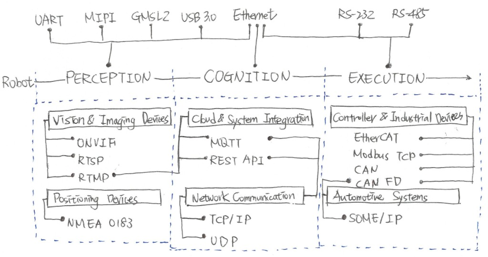

# 資料傳輸機制 (How Data Transmission Works)

當開發者選用相機、光達、控制器或零組件時，原廠通常會提供其支援的原生介面，主要包含**硬體介面**與**通訊協定**兩個層面，簡單來說：
- 插什麼線？ → 硬體介面 Hardware Interface
- 資料如何交換？ → 通訊協定 Communication Protocol

因此，了解兩者差異，以及背後對應的介面規格和通訊方式，將有助於開發者選擇合適的零組件，並有效率地建立穩定且具擴充性的系統架構。

架構示意如下：

## 1. 硬體介面（Hardware Interfaces）

硬體介面是不同零組件間進行實體連接與資料傳輸的方式，提供裝置間電氣訊號與實體連接的基礎，不同介面具有不同的傳輸速度、資料頻寬、傳輸距離及抗干擾能力；而在機器人開發實務中，會依據機構設計需求、傳輸資料量、資料類型等因素，選擇或要求供應商提供特定的硬體介面，以下從開發者視角，依硬體類型整理常用硬體介面：

| 介面名稱 | 傳輸速率 / 距離 | 主要傳輸資料類型 | 主要特點 | 典型對接硬體 |
| :--- | :--- | :--- | :--- | :--- |
| **MIPI** *(Mobile Industry Processor Interface)* | 數個 Gbps   < 30 cm | 未壓縮 Raw 影像、深度影像 | 晶片級高速介面，適合與 SoC 直接連接，不需額外轉換，具極低延遲、低功耗等優勢 | • RGB 相機 • 深度相機 • 全景相機 |
| **GMSL2** *(Gigabit Multimedia Serial Link 2)* | 6 Gbps   < 15 m | 高解析 Raw 影像、三維點雲資料、控制訊號 | 單一同軸纜線可同時傳輸高速影像、控制訊號與 PoC（Power over Coax）供電，具長距離、高頻寬及抗干擾等優勢 | • RGB 相機（車用等級） • 全景相機 • 3D 光達 |
| **Ethernet** | 1 Gbps - 10 Gbps   ≤ 100 m | 影像串流、點雲、控制封包、IP 網路資料 | 目前最普遍的有線乙太網路介面，不僅可作為一般網路通訊，也能直接連接高速感測器，具高頻寬、長距離、標準化網路架構等優勢，並支援 PoE （Power over Ethernet）供電 | • 3D 光達 • RGB 相機 • 邊緣運算平台 |
| **USB 3.0** | 5 Gbps   < 3 m | RGB 影像、深度影像、點雲、批次資料 | 機器人開發中最常見的高速介面，即插即用（Plug & Play），支援熱插拔並可同時提供 5V 供電 | • 深度相機 • RGB 相機 • 邊緣運算平台 |
| **UART** *(Universal Asynchronous Receiver/Transmitter)* | 9.6 kbps - 921.6 kbps  （部分可達數個 Mbps）  < 2 m | ASCII 字串、二進位序列資料 | 最常見的非同步序列通訊介面，採用點對點傳輸方式，通常只需設定鮑率（Baud Rate）即可進行資料交換，具有架構簡單、成本低、易於嵌入式系統整合等優勢 | • GNSS / RTK • IMU • 2D 光達 |
| **RS-232** | 115.2 kbps   < 15 m | ASCII 字串、控制命令、序列資料 | 傳統短距離點對點傳輸，常見於工業設備 | • 2D 光達 • 控制器 (舊型) |
| **RS-485** | 10 Mbps   < 1200 m | Modbus RTU、控制封包、力/力矩感測資料 | 差動訊號傳輸，具長距離、抗干擾等優勢 | • 控制器 • 三維/六維力感測器 • 末端執行器 |

## 2. 通訊協定（Communication Protocol）

通訊協定是不同軟硬體間交換資料所應共同遵循的規範，建立於硬體介面之上並定義封包結構，通常包含資料格式、傳輸流程、錯誤處理及連線方式等；而在機器人開發實務中，會依零組件類型與應用情境會採用不同的協定，以下從開發者視角，依應用需求整理常用通訊協定：

- **視覺與影像裝置（Vision & Imaging Devices）**：當機器人需要管理外部網路攝影機（IP Camera）並取得即時影像，或是進行影音串流傳輸時，就會使用這類通訊協定。
- **雲端與系統整合（Cloud & System Integration）**：當機器人要連接雲端平台、車隊管理系統（Fleet Management）或 Web 系統時，會需要透過這類通訊協定交換設備狀態、任務資訊及系統資料。
- **網路傳輸（Network Communication）**：涵蓋網路層與傳輸層的基礎通訊協定，負責裝置間的資料傳輸、定址及連線管理，許多應用層通訊協定（如 MQTT、REST API、RTSP 等）都是建立在此之上。
- **定位裝置（Positioning Devices）**：當機器人在戶外環境，需要透過 GNSS 接收器取得衛星定位資訊時，通常會使用這類通訊協定，主要傳輸位置、時間、速度及航向等資料。
- **控制器或工業設備（Controller & Industrial Devices）**：機器人本體內的控制器、馬達驅動器等零組件需要交換控制命令與設備狀態時，皆使用此類通訊協定；此外，若機器人要與外部工業設備進行資料交換，例如與產線輸送帶連動，也是使用這類通訊協定。
- **車用系統（Automotive Systems）**：主要應用於智慧車輛與自駕系統，若機器人在設計上採用車載電子架構，例如車廠開發高階人型機器人時，沿用既有的車用技術與系統架構，便可能使用這類通訊協定，讓各個控制單元能交換服務與資料。

| 協定名稱 | 應用分類標籤 | 運作模式 | 主要特點 | 典型應用場景 |
| :--- | :--- | :--- | :--- | :--- |
| **ONVIF** *(Open Network Video Interface Forum)* | `Vision & Imaging Devices` | IP 網路   (HTTP / SOAP Web Services) | 提供不同品牌網路攝影機的互通標準，著重設備搜尋、設定、控制、影音串流與事件管理 | • 串接網路攝影機 |
| **RTSP** *(Real-Time Streaming Protocol)* | `Vision & Imaging Devices` | 影音串流控制   (搭配 RTP 傳輸資料) | 建立、控制與管理即時影音串流，可控制播放、暫停及停止等操作 | • 即時取得網路攝影機的影音 |
| **RTMP** *(Real-Time Messaging Protocol)* | `Vision & Imaging Devices` `Cloud & System Integration` | 影音推流  (Streaming) | 用於將影音推送至直播平台或雲端伺服器，提供低延遲的即時影音串流 | • 將機器人影音即時推送至雲端 |
| **MQTT** *(Message Queuing Telemetry Transport)* | `Cloud & System Integration` `Network Communication` | 發布/訂閱  （Publish / Subscribe） | 輕量級訊息傳輸協定，無需裝置間直接連線，具有封包小、頻寬需求低等特性 | • 機器人與雲端平台資料交換 • IoT 感測器資料蒐集 |
| **REST API** *(Representational State Transfer)* | `Cloud & System Integration` `Network Communication` | HTTP / HTTPS   (Client / Server 資源請求) | 基於 HTTP/HTTPS 的 Web API 設計風格，可存取與管理系統資源，支援度高且易於跨平台系統整合 | • 機器人與雲端服務整合 • Web 系統資料交換 |
| **TCP/IP** *(Transmission Control Protocol / Internet Protocol)* | `Network Communication` | 可靠網路傳輸 | IP 負責封包定址與路由，TCP 提供可靠的資料傳輸機制，包括封包重傳、流量控制及錯誤檢查 | • 機器人需要雲端服務或與網路設備進行通訊 |
| **UDP** *(User Datagram Protocol)* | `Network Communication` | 非連接傳輸 | 提供無連線、低延遲的資料傳輸方式，不保證封包送達或傳輸順序，因此傳輸效率高 | • 即時性要求高且允許少量丟包的應用，如 3D 光達的點雲資料傳輸 |
| **NMEA 0183** *(National Marine Electronics Association 0183)* | `Positioning Devices` | UART / RS-232 | GNSS 與導航設備的資料交換標準，以 ASCII 文字串列傳輸經緯度、速度、航向、時間等定位資訊 | • 讀取 GNSS / RTK 定位資訊 |
| **EtherCAT** *(Ethernet for Control Automation Technology)* | `Controller & Industrial Devices` | Ethernet   (Master / Slave) | 建立於 Ethernet 的工業乙太網路協定，著重即時控制通訊與高精度時間同步，具低延遲、高同步的優勢 | • 機器人本體內多軸馬達控制 |
| **Modbus TCP** | `Controller & Industrial Devices` | Ethernet TCP/IP   (Client / Server) | 建立於 Ethernet 的工業通訊協定，可讀寫裝置的暫存器資料 | • 機器人與工業設備資料交換 |
| **CAN** *(Controller Area Network)* | `Controller & Industrial Devices` | 匯流排架構   (Multi-master Bus) | 基於 ISO 11898 的多主機即時通訊，因訊息仲裁、錯誤偵測、自動重傳等機制，具有高可靠性與抗干擾能力 | • 機器人本體內控制器與馬達驅動器通訊 • 廣泛應用於工業設備的即時通訊 |
| **CAN FD** *(CAN with Flexible Data-Rate)* | `Controller & Industrial Devices` `Automotive Systems` | 匯流排架構   (Multi-master Bus) | CAN 的擴充版本，維持相同的仲裁機制，但將每個資料框的資料長度提升至 64 Bytes（傳統 CAN 最多為 8 Bytes），同時允許資料階段採用更高的傳輸速率 | • 機器人本體內控制器與馬達驅動器通訊 • AMR 底盤控制 • 採用車載電子架構 |
| **SOME/IP** *(Scalable service-Oriented Middleware over IP)* | `Automotive Systems` | Ethernet UDP/TCP   (Service-Oriented / RPC) | 建立於 Ethernet 的車載服務導向通訊協定，以 Service 為中心進行通訊，並支援服務搜尋、遠端程序呼叫及事件通知 | • 採用車載電子架構 • 車用電子間通訊 |