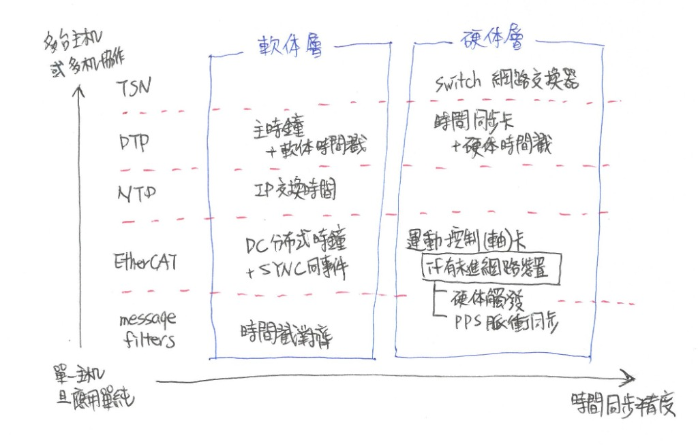

# 座標與時間同步 (Getting Space and Time in Sync)

多感測器資料融合的前提，是先建立一致的空間與時間基準。其中，空間建立，負責定義機器人的座標系架構、機構模型及運動學關係，使各座標系之間的空間關係得以描述，並將不同來源的量測資料轉換至共同的座標系；時間同步，則負責統一各感測器的時間基準，確保不同來源的資料代表的是同一時刻的環境狀態。唯有完成這兩項前置作業，才能有效降低資料不一致所造成的影響，進而提升後續演算法運作的可靠性。

## 1. 空間建立（Spatial Setup）

機器人系統中各感測器通常都有各自的座標系，例如相機以光學中心作為原點、光達以掃描中心作為原點、機械手臂則以基座、關節或末端執行器作為參考基準，即使這些裝置都安裝於同一台機器人上，其量測資料仍不能直接互相使用，加上機器人實際機構與理論模型之間，仍可能因加工公差、組裝誤差或機構磨耗而產生幾何誤差，且隨著連桿數量增加或機械手臂向外伸展，這些誤差也可能逐步累積。

在前文已概要說明外參（CH 1-2），也建議依據 REP-103 與 REP-105 建立 ROS 2 座標系架構（CH 1-3），因此本節將進一步聚焦機器人的機構描述檔與運動學模型，建議開發者依序完成後再進行感測器外參校正、手眼協調等標定，才能確保後續感測資料具有一致且正確的空間意義。

| 四大重點     | 建立內容                          | 目的             |
| -------- | ----------------------------- | -------------- |
| **機器人描述檔** | Link、Joint、TCP、TF Tree        | 建立機器人幾何模型      |
| **運動學模型**  | FK、IK                         | 建立關節與末端位姿關係    |
| **外參校正** | Camera（或 LiDAR、IMU） ↔ Robot | 建立感測器共同座標系     |
| **手眼協調** | Camera ↔ End Effector（或 Base） | 建立視覺與末端執行器的座標關係 |

### 1.1. 建立機器人描述檔

機器人的機構通常由多個連桿（Link）與關節（Joint）組成，各連桿與關節之間的幾何及運動關係，可透過機器人描述檔（Unified Robot Description Format，簡稱 URDF）建立模型。URDF 中所設定的尺寸、位置、軸向及關節限制，應盡可能與實體機構一致；若模型參數定義錯誤，即使感測器的外方位參數本身正確，經過機器人運動學模型轉換後的結果，仍可能與實際位置或姿態不一致。通常需要定義的資訊如下：

* **連桿尺寸與相對位置**：包含連桿長度、幾何外型、偏移量，以及相鄰連桿之間的安裝關係。
* **關節類型與運動軸**：定義關節為旋轉關節、直線關節、固定關節或其他類型，並確認其旋轉軸或移動方向。
* **關節零點與正方向**：定義關節位置為零時的機構姿態，以及角度或位移增加時的運動方向。
* **基座、末端法蘭與工具關係**：定義機器人基座、各連桿、末端法蘭（Flange）及末端工具（如夾爪或相機）之間的固定幾何關係，並建立工具中心點（Tool Center Point）相對於法蘭的位姿。
* **輪型機構參數**：輪型機器人需定義車輪半徑或直徑、輪距、輪軸位置、車輪旋轉軸及車體參考點。

### 1.2. 建立運動學模型

接著，還必須建立順向運動學（Forward Kinematics，簡稱 FK）與逆向運動學（Inverse Kinematics，簡稱 IK）的定義與模型，以此作為機器人運動控制的重要基礎，尤其是人型機器人、機器狗或其他具有多個關節的機器人，皆須透過運動學模型建立關節狀態與末端執行器位姿之間的對應關係，才能將感測器量測結果、定位資訊或任務目標轉換為實際的控制命令。

* **順向運動學（Forward Kinematics）**：依據已建立的機構模型，將各連桿之間的座標轉換依序串接，用於計算機器人目前姿態、產生末端運動軌跡、驗證機構模型，以及提供感測器座標轉換使用；例如，若相機安裝於機械手臂末端，其相對於機器人基座的位置會隨關節運動而改變，因此需結合順向運動學與已知的感測器外參，才能持續取得相機在機器人基座座標系中的位姿。

* **逆向運動學（Inverse Kinematics）**：根據指定的末端位姿，反向求解各關節應到達的角度或位移；例如，若為移動式機器人搭載機械手臂，當視覺系統辨識出待抓取物體的位置後，系統會先將其轉換至機械手臂基座座標系，再利用逆向運動學求得各關節的目標值（若是旋轉關節，目標值通常是角度，若是直線關節，目標值則是位移），使機械手臂移動至指定的末端位姿完成抓取、組裝或加工等作業。

相較於順向運動學，逆向運動學的求解較為複雜，因為同一個末端位姿可能存在多組關節解，也可能因為超過關節運動範圍等因素，無法找到符合條件的關節值。故在實務開發上，建議先利用多組已知關節角度驗證順向運動學，接著再測試逆向運動學，並將求得的關節值重新代入順向運動學，確認計算出的末端執行器位姿是否與原始目標相符，透過此方式可及早發現問題，避免後續感測器校正或視覺導引時將機構誤差誤判為外參誤差。

而在 ROS 2 中，可利用既有套件建立順向與逆向運動學功能，例如`robot_state_publisher`，可根據 URDF 所描述的機構模型與各關節狀態，再加上`/joint_states`提供的各關節角度或位移，計算順向運動學並發布各座標系之間的轉換關係。若同時需要順向與逆向運動學，則可使用 MoveIt 2 、 Orocos KDL 或 Robotics Toolbox for Python，MoveIt 2 內建順向運動學計算介面`RobotState`，並能透過運動學外掛求解目標末端位姿所對應的關節值；Orocos KDL 則是提供較底層的運動學演算法，可直接整合至 C++ ；至於 Robotics Toolbox for Python ，則提供在 Python 環境下快速進行運動學分析與演算法驗證，適合教學、研究及快速原型開發。

### 1.3. 感測器外參校正

在完成機器人描述檔與運動學模型後，接著需建立感測器與機器人之間的空間關係，也就是感測器外參，而感測器外參通常要透過外參校正（Extrinsics Calibration）取得，就以智慧機器人常用的相機來說，若相機固定安裝於機器人本體（即相機座標系與`base_link`保持固定關係），可透過像是 ROS 2 的`multisensor_calibration`套件完成標定。

另外，也能利用具有已知幾何尺寸的標定板（Calibration Target）進行估測，其中又以棋盤格（Checkerboard）最為常見，近年亦常出現使用具備識別碼標定板的方式，例如 ChArUco Board 或 AprilTag，以提升特徵點偵測的穩定性。在校正時，需於不同距離、角度及姿態下拍攝多張影像，並透過角點或特徵點對應關係估測相機相對於標定板的位姿，再結合已知的標定板位置或機器人座標系，建立相機與機器人之間的外參。

### 1.4. 進行手眼協調

承上所述，若相機是裝在末端執行器（例如夾爪）或其他可動式機構（能左右轉動的頭部等），則還需進一步進行手眼協調（Hand-Eye Calibration）技術處理，手眼協調的目的，在於建立相機座標系與其所安裝機構之間的固定座標轉換關係，使系統能結合運動學，即時計算相機在機器人座標系中的位姿，進而將視覺量測結果正確轉換至機器人座標系。

在 ROS 2 中，可利用 MoveIt 2 的`moveit_calibration`套件完成手眼協調流程，若是自行開發校正程式，也能透過 OpenCV 提供的`calibrateHandEye()`函式，同樣搭配棋盤格、ChArUco Board 或 AprilTag 等標定板，以及多組末端執行器位姿與相機觀測資料，估測相機與末端執行器之間的固定座標轉換關係。

並要提醒，由於手眼協調十分仰賴運動學模型及外參數值的正確性，建議完成手眼協調後，再利用多組未參與校正的姿態進行驗證，若驗證結果於不同姿態皆能維持一致誤差，表示具有良好的可靠性；反之，則應重新檢查 URDF、運動學模型、感測器外參，以避免將機構誤差誤判為手眼協調誤差。

最後，將結果更新至 URDF，再由 `robot_state_publisher` 建立各座標系之間的轉換關係，並發布至 `/tf` 或 `/tf_static`（訊息型別：`tf2_msgs/msg/TFMessage`），以方便後續演算法使用。

---

## 2. 時間同步（Time Synchronization）

機器人身上的各個感測器在蒐集資料時，都有各自的採樣頻率或內部時鐘（Local Clock），雖然多以世界協調時間（Coordinated Universal Time，簡稱 UTC）為時間基準，但各裝置仍可能因時鐘漂移、傳輸延遲或硬體特性而產生時間誤差；同時，隨著系統整合的硬體數量增加、架構愈趨複雜，這些誤差也將逐漸累積，進而影響資料融合與控制精度。因此，對於追求高精度表現的人型機器人、機器狗與 AMR 的應用來說，時間同步已是開發上不可忽視的重要課題，故建議開發者依據系統架構與應用需求，選擇適當的時間同步機制，以建立一致且可靠的時間基準。

而在討論時間同步機制前，先說明系統開發中常見的兩種時間來源：
1. **系統時間（System Time）**：由作業系統的系統時鐘提供，通常作為系統目前的標準時間，並可對應至 UTC 時間，而系統時間是可以因人工校時向前或向後調整的。
2. **ROS 時間（ROS Time）**：ROS 2 提供的時間機制，預設跟隨系統時間，也可切換為其他時間來源，例如當節點的`use_sim_time`設為`true`時，ROS Time 會改成`/clock` Topic 提供時間，以此在像是 Gazebo 的模擬器中模擬時間流逝。

<!--  -->

### 2.1. 單一主機且應用相對單純

若在系統建置時，就已確定所有 ROS 2 節點都運行在同一台主機，且共用同一個系統時鐘，就不需要額外建立跨裝置的時間同步機制，後續可依 Message 中的`header.stamp`作為時間配對依據，再搭配`message_filters`套件（`ExactTime`或`ApproximateTime`）完成資料對齊。

* **ExactTime 精確時間匹配**：適用於時間戳高度一致的多感測器資料，或已透過其他時間同步機制建立共同時間基準的多感測器系統，當不同 Topic 所接收到的 Message，其`header.stamp`完全一致時，才會完成資料配對並交由後續演算法處理。
* **ApproximateTime 近似時間匹配**：允許定義可接受的時間戳差距（Python API 中以 `slop` 參數指定，單位為秒，例如 0.01 代表 10 ms；C++ API 則透過呼叫 `setMaxIntervalDuration()` 做設定），同步器會在訊息佇列中尋找時間最接近的一組資料進行配對，適用於時間戳無法完全一致，或不同感測器採樣頻率不一致的情境，例如 10 Hz 光達與 30 Hz 相機的資料融合。

實務操作上，若尚未確認不同感測器的時間戳是否能完全一致，可先使用`ApproximateTime`，觀察配對成功率與實際時間差，再逐步縮小差距，待不同 Topic 所接收到的 Message，其`header.stamp`確實完全一致時，再改用`ExactTime`；最後也要提醒，`message_filters`僅負責依據時間戳進行資料配對，並不會同步各感測器的系統時鐘，若各感測器內部時鐘本身就存在偏差，仍需透過其他機制建立共同的時間基準，同時軟體層的同步容易受到作業系統排程、通訊或網路延遲所影響，精度通常不如硬體層同步。

### 2.2. 採用 EtherCAT 控制網路

若系統採用 EtherCAT 作為主要控制網路時，工業電腦（IPC）通常擔任 EtherCAT Master，透過內建的**分布式時鐘（Distributed Clocks，簡稱 DC）**機制，持續校正各 EtherCAT Slave（指支援 EtherCAT 通訊協定的裝置）之內部時鐘，使所有網路內硬體維持一致的時間基準，並提供亞微秒級（通常遠小於 1 μs）甚至更高精度的同步能力，因此特別適合高速與即時需求的控制應用。

在 DC 建立一致的時間基準後， EtherCAT Master 還可進一步設定 **SYNC 同步事件**，依據預先設定的時間點，觸發 EtherCAT Slave 的控制執行或資料取樣，簡單來說就是為其調鬧鐘，當鬧鐘一響時即同步執行指定動作，例如，人型機器人的多個關節模組就可利用 SYNC 同步執行馬達控制，在精確對齊的時間點進行一樣的動作。

另外，為提升系統整體控制的即時性與穩定性，通常會再加裝專用的 **EtherCAT 運動控制（軸）卡**，從硬體層協助 Master 執行通訊與即時控制，有效降低可能因軟體層處理問題所帶來的延遲；但由於 DC 僅針對 EtherCAT 網路內裝置做同步，若系統中仍有未加入 EtherCAT 網路的感測器（例如相機或光達），就需透過其他同步方式，使其與 EtherCAT 控制系統維持一致的時間基準，目前常見的方式有硬體觸發及 PPS 脈衝同步兩種。

* **硬體觸發 (Hardware Trigger)**：由主控器（如 MCU、FPGA 或其他控制器）輸出觸發訊號，直接觸發相機曝光、光達掃描或其他感測器開始取樣，使多個感測器於同一物理時刻產生資料，此方式同步的是資料擷取時刻，而非各裝置的內部時鐘，但可有效降低感測器之間因曝光、掃描或取樣時機不同所造成的時間誤差。

* **PPS 脈衝同步 (Pulse Per Second)**：由 GNSS 接收器每秒輸出一個高精度脈衝，各感測器收到 PPS 後即可校正自身的內部時鐘，同時搭配 NMEA 0183 通訊協定內的資料格式傳送 UTC 時間，使 EtherCAT Master 能確認每個 PPS 脈衝所代表的實際時間，但要留意 PPS 對應的是 UTC 時間，若 EtherCAT Master 維持的時間基準並非 UTC 時間，那就會出現兩邊不一致的問題。

### 2.3. 多台主機或多機協作

若系統由多台主機或多個透過 Ethernet 連線的裝置共同運作，且需要建立跨裝置的共同時間基準時，通常會採用**NTP 網路時間協定（Network Time Protocol）**或 **PTP 精確時間協定（Precision Time Protocol）**，兩者主要差異在於同步精度及硬體需求，簡單來說，NTP 著重於讓多台主機的「系統時間大致相同」，PTP 則適用於建立更高精度的「共同時間基準」，端看系統需求而可自行選擇。

* **NTP**：透過 IP 網路交換時間資訊，透過網路傳輸延遲與兩端時間差的估算，持續校正各主機的系統時間；NTP 為軟體層時間同步，不需額外特殊硬體，因部署相對簡單，適合多台主機皆使用 ROS 2 的系統，以及對同步精度要求不高的應用。

* **PTP**：透過 Ethernet 交換時間同步封包，並以主時鐘（Grandmaster Clock）作為共同的時間基準，持續校正各裝置的內部時鐘；PTP 本質上是由 IEEE 1588 定義的網路時間同步協定，可在軟體層以軟體時間戳（Software Timestamping）進行同步；但若硬體本身支援硬體時間戳（Hardware Timestamp），或藉由加裝時間同步卡（Time Synchronization Card）提供硬體時間戳功能，則能將同步精度提升到微秒甚至亞微秒等級，因此廣泛應用於大型的多機協作或分散式系統。

若想在高精度時間同步之外，進一步要求資料能在可預期的時間內完成傳輸，則可採用**時效性網路（Time-Sensitive Networking，簡稱 TSN）**，這也是近年來工業級時間同步的主流，它一樣建立於 Ethernet 之上，先透過 PTP 建立共同時間，再藉由流量排程與傳輸優先權等機制，提供低延遲、高可靠性與確定性的資料傳輸；而實際建置 TSN 時，會需要搭配網路交換器（TSN Switch），以確保重要的控制封包能依排程傳輸，故歸類為硬體層時間同步。

以上述方法進行時間同步處理，已能讓大多數機器人系統滿足多感測器資料融合需求；然而，若應用需求對精度要求極高，想盡可能補償感測器因曝光或傳輸等延遲所造成的固定時間偏移（Time Offset），則可利用 `Kalibr`、`LI-Calib` 等工具進行時間外參校正，將時間偏移與空間外參一併估測，以更進一步提升感測器融合精度，不過，此類校正需要大量資料與穩定環境，且其適用性會受到感測器特性的限制，因此目前僅多應用於學術研究或單一高精度定位，在一般機器人系統整合中並非必要流程。