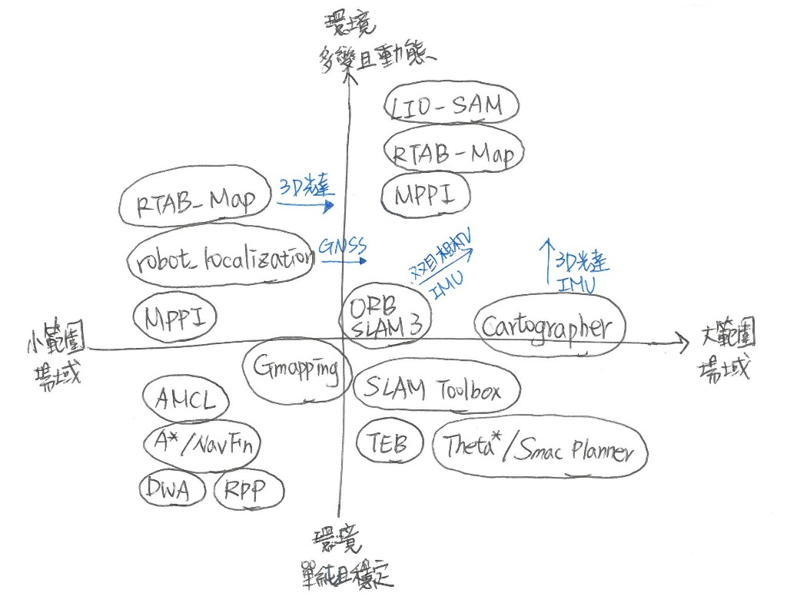

# 主流演算法 (What Algorithms Do Robots Use)

在智慧機器人的開發中，「感測器」負責蒐集環境與自身狀態數據，而「演算法」則是將這些龐雜數據轉換為定位、路徑規劃及控制命令等資訊，機器人自主移動中的每個階段，都依賴不同特性與架構的演算法相互配合。對開發者來說，關鍵往往不在於從頭撰寫演算法，而是精準掌握各演算法的**適用場景與既存限制**，以及對應所需的感測器硬體、輸入 Topic 和輸出 Message，本節將盤點目前機器人系統中最主流的演算法（或對應套件），協助開發者能依據實際應用需求，快速選擇合適的解決方案。

【待畫圖】架構示意如下
<!--  -->

## 1. 建圖（SLAM）

| 演算法 / 套件 | 特點 / 優缺點 | 對接硬體與輸入 Topic (說明) | 主要輸出 Message |
| :--- | :--- | :--- | :--- |
| **Gmapping** | **說明**：基於粒子濾波器（Particle Filter）架構，是早期經典的 2D 光達建圖演算法，多用於室內小型輪式機器人（如掃地機器人）。  **優點**： 1. 結構簡單，計算資源消耗低 2. 在小範圍室內環境中，建圖精度高且具穩定性  **缺點**： 1. 較不適合大範圍或長距離環境，地圖容易受到累積誤差影響 2. 主要針對 2D 光達與里程計設計，不支援原生 3D 建圖 | • 2D / 3D 光達 ➔ `/scan` (只接收 2D 掃描數據) • 編碼器 ➔ `/odom` •  `/tf` | • `nav_msgs/msg/OccupancyGrid` • `nav_msgs/msg/MapMetaData` • `tf2_msgs/msg/TFMessage` |
| **SLAM Toolbox** | **說明**：基於圖優化（Graph-based）架構，是 ROS 2 官方預設的 2D 光達建圖演算法，被視為 Cartographer 的輕量化替代方案。  **優點**： 1. 跟 Cartographer 相比，除了計算資源較省，建圖速度也較快 2. 支援地圖序列化（Lifelong Mapping）及非同步建圖（Asynchronous Mapping），前者可進行地圖儲存與載入後的持續更新，後者能降低處理延遲並提升大範圍建圖效率  **缺點**： 1. 不支援原生 3D 建圖 2. 不內建處理 IMU，需另用套件融合`/odom`後再輸入 | • 2D / 3D 光達 ➔ `/scan` (只接收 2D 掃描數據) • 編碼器 ➔ `/odom` • `/tf` | • `nav_msgs/msg/OccupancyGrid` • `nav_msgs/msg/MapMetaData` • `visualization_msgs/msg/MarkerArray` • `tf2_msgs/msg/TFMessage` |
| **RTAB-Map** | **說明**：基於圖優化架構的定位建圖演算法，以記憶體管理機制聞名。  **優點**： 1. 支援多種感測器，包含相機、2D / 3D 光達、IMU 及 GPS 2. 可同時建立三維點雲地圖與二維佔據網格地圖，並具備回環偵測（Loop Closure）與重定位能力  **缺點**： 1. 也因支援多種感測器，導致其設定極其複雜 2. 隨地圖規模增加，記憶體與運算資源需求也顯著提升 | • RGB-D 相機 ➔ `/Camera/RGBD` • 2D / 3D 光達 ➔ `/LiDAR` (修正視覺深度誤差) • 編碼器 ➔ `/odom` • IMU ➔ `/imu` | • `nav_msgs/msg/OccupancyGrid` • `sensor_msgs/msg/PointCloud2` • `geometry_msgs/msg/PoseWithCovarianceStamped` • `tf2_msgs/msg/TFMessage` |
| **Cartographer** | **說明**：基於圖優化架構，是工業界主流的 2D / 3D 光達建圖演算法，多用於工廠運行的 AGV 或 AMR 。  **優點**： 1. 強大回環偵測能力，可利用重訪區域的資訊修正累積誤差 2. 適合大範圍與複雜的室內環境，可直接融合 IMU 數據即時校正機器人的重力方向  **缺點**： 1. 為了能隨時校正，計算資源消耗高 2. 遇到低特徵環境，容易產生誤判或建圖錯位 | • 2D 光達 ➔ `/scan`  • 3D 光達 ➔ `/points2`  • IMU ➔ `/imu`（2D 模式選配；3D 模式必要） • 編碼器 ➔ `/odom` (選配) | • `cartographer_ros_msgs/msg/SubmapList` • `tf2_msgs/msg/TFMessage` |
| **LIO-SAM** | **說明**：基於光達慣性里程計（LiDAR-Inertial Odometry）架構的 3D 光達建圖演算法，並可搭配 GPS 降低長距離移動產生的累積誤差。  **優點**： 1. 同時利用光達與 IMU 資訊，即使機器人移動速度較快或行經顛簸路面，仍能維持高精度定位 2. 因 GPS 整合與回環偵測能力，使其在大範圍場景也能表現穩定  **缺點**： 1. 硬體要求高，感測器品質及參數校正皆直接影響地圖品質 2. 遇到狹窄、人多的場景，定位穩定性可能下降 | • 3D 光達 ➔ `/points_raw` (可接收原始 3D 點雲) • IMU ➔ `/imu/data` (建議使用高頻率[>200Hz]及高精度[九軸]的 IMU 原始數據) • GPS ➔ `odometry/gps` (選配) | • `nav_msgs/msg/Odometry` • `sensor_msgs/msg/PointCloud2` • `nav_msgs/msg/Path` |
| **FAST-LIO2** | **說明**：基於光達慣性里程計架構的 3D 光達建圖演算法，以快速運算與即時更新為特色。  **優點**： 1. 同樣利用光達與 IMU 資訊，但較 LIO-SAM 運算速度快 2. 可直接處理光達取得的點雲資料，並能搭配不同類型的 3D 光達，應用彈性較高  **缺點**： 1. 光達與 IMU 的資料時間需同步，否則會影響定位準確度 2. 著重快速定位與建圖，通常需要再搭配其他模組才能有完整的功能 | • 3D 光達 ➔ `/points_raw` (可接收原始 3D 點雲) • IMU ➔ `/imu/data` | • `nav_msgs/msg/Odometry` • `sensor_msgs/msg/PointCloud2` |
| **ORB-SLAM3** | **說明**：基於特徵點法（Feature-based Method）的視覺定位建圖演算法。  **優點**： 1. 以視覺為核心，並可直接利用 IMU 數據即時優化定位 2. 在無 GPS 環境下的輕量化定位表現極佳  **缺點**： 1. 遇到低光源、反光或低特徵環境，定位穩定性可能下降 2. 非支援所有相機，且產出的地圖為稀疏點雲（Sparse Point Cloud），不適合直接作為一般導航所需的障礙物地圖 | • RGB 相機 ➔ `/camera/rgb/image_raw` • 深度相機 ➔ `/camera/depth/image_raw`、 • 雙目相機 ➔ `/camera/left/image_raw`、 `/camera/right/image_raw` • IMU ➔ `/imu` (選配，並建議接收高頻率[>100Hz]的 IMU 原始數據) | • `geometry_msgs/msg/PoseStamped`、 • `sensor_msgs/msg/PointCloud2` • `tf2_msgs/msg/TFMessage` |

## 2. 定位與感測器融合 (Localization & Sensor Fusion)

| 演算法 / 套件 | 特點 / 優缺點 | 對接硬體與輸入 Topic (說明) | 主要輸出 Message |
| :--- | :--- | :--- | :--- |
| **AMCL** *(Adaptive Monte Carlo Localization)* | **說明**：基於粒子濾波器架構，是 Monte Carlo Localization（MCL） 自適應版本，也是 ROS 2 導航內建的經典 2D 定位演算法。  **優點**： 1. 在地圖中灑出大量「可能位置的粒子」，結合里程計的移動資訊與光達掃描和地圖的比對結果，以估計機器人位姿 2. 計算資源消耗較低  **缺點**： 1. 屬於已知地圖定位方法，必須先具備可供比對的地圖 2. 若環境變動太大時（例如預設的地圖是空的，但現實中被貨物堆滿）就容易失準 | • `/map` (可自建也可匯入的靜態黑白地圖) • 2D 光達 ➔ `/scan` • `/tf` | • `geometry_msgs/msg/PoseWithCovarianceStamped` • `geometry_msgs/msg/PoseArray` • `tf2_msgs/msg/TFMessage` |
| **EKF / UKF** *(Extended Kalman Filter / Unscented Kalman Filter)* | **說明**：常見的多感測器融合演算法，可將編碼器、IMU、GPS 等不同來源的移動與位置資訊整合，持續估算機器人的位姿，在 ROS 2 中可透過`robot_localization`套件實作。  **優點**： 1. 整合多種感測器資訊，降低只依賴單一感測器造成的定位誤差 2. 可依不同感測器的可信程度進行融合，使位置估算更加穩定  **缺點**： 1. 若輸入資料誤差過大，也可能影響融合結果 2. 需要正確設定各感測器的誤差與參數，設定不當可能造成定位漂移或不穩定 | • 編碼器 ➔ `/odom` • IMU ➔ `/imu` • GPS ➔ `/gps/fix` (選配) | • `nav_msgs/msg/Odometry` • `tf2_msgs/msg/TFMessage` |

## 3. 規劃 (Planning)

| 演算法 / 套件 | 特點 / 優缺點 | 對接硬體與輸入 Topic (說明) | 主要輸出 Message |
| :--- | :--- | :--- | :--- |
| **Dijkstra / A* ** *(全域規劃)* | **說明**：常見的網格式全域規劃演算法，在 Nav2 中通常搭配 NavFn Planner 實作，預設採用 Dijkstra，亦可透過`use_astar`參數切換為 A* 演算法，其中 A* 會加入啟發式（Heuristic）函數提高搜尋效率。  **優點**： 1. 將地圖視為網格，透過比較不同路徑的移動成本，找出最短或最低成本路徑 2. 技術成熟且執行穩定，並可依需求選擇 Dijkstra 或 A*，減少不必要的搜尋範圍  **缺點**： 1. 受網格解析度影響，產生的路徑較生硬（直角多） 2. 地圖太大時，搜尋會變慢 | • `/goal_pose` • `/global_costmap/costmap` • `/tf` | • `nav_msgs/msg/Path` |
| **Theta* ** *(全域規劃)* | **說明**：為 A* 的延伸演算法，會進一步判斷兩點之間是否能直接通行，使路徑不受固定網格方向限制，在 Nav2 中由 Theta Star Planner 實作。  **優點**： 1. 可規劃任意角度路徑 2. 產生的路徑較平順，降低額外平滑處理的需求  **缺點**： 1. 運算複雜度比 A* 高 2. 在障礙物密集或高解析度地圖下，規劃時間可能增加 | • `/goal_pose` • `/global_costmap/costmap` • `/tf` | • `nav_msgs/msg/Path` |
| **Hybrid-A* ** *(全域規劃)* | **說明**：為 A* 的延伸演算法，著重考量車體朝向與轉彎限制，在 Nav2 中由 Smac Hybrid-A* Planner 實作。  **優點**： 1. 產生的路徑更符合實際車輛可行駛的方式 2. 適合具轉彎半徑限制的機器人，並可依運動模型支援前進或倒車規劃  **缺點**： 1. 運算複雜度比 A* 高 2. 需要依車體特性設定最小轉彎半徑與運動模型，參數設定較複雜 | • `/goal_pose` • `/global_costmap/costmap` • `/tf` | • `nav_msgs/msg/Path` |

## 4. 控制 (Control)
| 演算法 / 套件 | 特點 / 優缺點 | 對接硬體與輸入 Topic (說明) | 主要輸出 Message |
| :--- | :--- | :--- | :--- |
| **DWA** *(Dynamic Window Approach)* *(局部控制)* | **說明**：傳統 2D 避障與局部跟隨演算法。  **優點**： 1. 在機器人可執行的速度範圍內進行「模擬試車」，再依障礙物、目標與全域路徑等條件找出適合的移動方式 2. 計算量低且反應快速，適合室內差速驅動機器人  **缺點**： 1. 易陷入局部最優解（例如在狹窄通道卡死） 2. 較不適合車身很長，並像汽車一樣有迴轉半徑限制的機器人 | • `/local_costmap/costmap` • `/plan` • 編碼器 ➔ `/odom` • `/tf` | • `geometry_msgs/msg/TwistStamped` |
| **RPP** *(Regulated Pure Pursuit)* *(局部控制)* | **說明**：基於純追隨（Pure Pursuit）的路徑追蹤演算法，多用於工業級 AGV、大型搬運車。  **優點**： 1. 計算量較低，並可在接近轉角或障礙物時自動調整速度，提高穩定性 2. 適合讓機器人嚴格沿著既定軌道（像是地上畫的線或虛擬軌道）走的場景  **缺點**： 1. 不具備主動繞障能力，高度依賴全域路徑引導 2. 若全域路徑品質不佳或環境變化劇烈，追蹤效果容易受到影響 | • `/plan` • 編碼器 ➔ `/odom` • `/tf` | • `geometry_msgs/msg/TwistStamped` |
| **TEB** *(Timed Elastic Band)* *(局部控制)* | **說明**：彈性帶式時空（時間與空間）優化的避障演算法。  **優點**： 1. 將路徑視為可伸縮的彈性帶，透過最佳化方式同時調整路徑形狀與移動速度，以產生平順且可行的局部軌跡（Local Trajectory） 2. 支援非圓形車體（如長方形 AGV 或 AMR），能實現流暢的前進、後退與繞行  **缺點**： 1. 演算法較複雜，在動態障礙物密集的環境下可能產生較高 CPU 負載 2. 可能出現路徑震盪或反覆切換繞行策略的狀況 | • `/plan` • `/local_costmap/costmap` • 編碼器 ➔ `/odom` • `/tf` | • `geometry_msgs/msg/TwistStamped` |
| **MPPI** *(Model Predictive Path Integral)* *(局部控制)* | **說明**：結合模型預測控制（Model Predictive Control）與路徑積分採樣（Path Integral Sampling）方法的局部控制演算法。  **優點**： 1. 可同時考量路徑追蹤、避障及機器人運動特性，適合較複雜的移動環境 2. 支援多種移動平台及運動模型  **缺點**： 1. 每次移動前都需要進行大量軌跡模擬，運算需求較高 2. 參數較多且調校難度高，並需要根據車體模型與應用場景進行優化 | • `/plan` • `/local_costmap/costmap` • 編碼器 ➔ `/odom` • `/tf` | • `geometry_msgs/msg/TwistStamped` |
