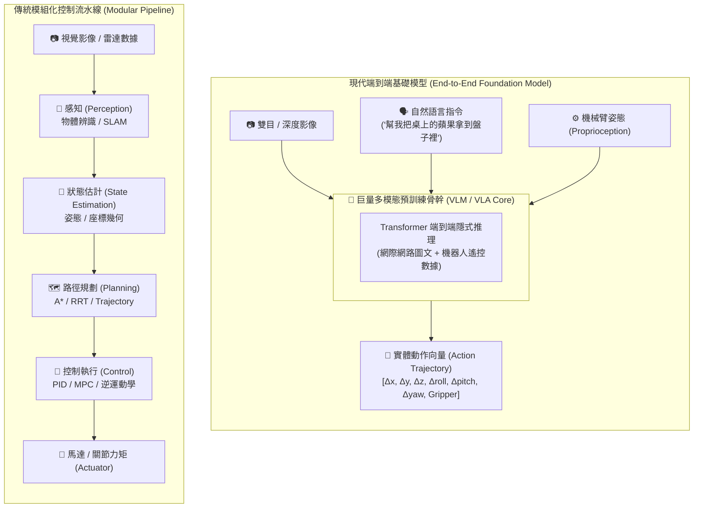

# 機器人基礎模型 (Foundation Models for Robotics)

隨著 AI 從純粹的文本與影像生成，逐步演進成能感知、推理並控制實體世界的實體 AI，智慧機器人的開發模式也正發生明顯改變，預計將從至今仍普遍採用的**模組化分層流水線（Modular Pipeline）**架構，朝向資料驅動的**端到端學習（End-to-End Learning）**架構發展。

前者是將複雜任務先拆分為定位、建圖、路徑規劃等子任務，各自再使用特定演算法處理，最後透過預先設計的介面與規則串接，此架構可控性較高，但面對複雜或未知環境時，往往需要大量人工設計及調校；後者則透過大量資料訓練模型，使其能直接整合視覺影像、自然語言及機器人狀態等多模態資訊，進行環境理解、路徑規劃與任務推理，最後輸出可執行的機器人動作，此方法可減少人工設計規則與中間處理流程的需求，但通常需要大量且多樣化的訓練資料。

而在學習式機器人技術中，**VLA 模型**（Vision-Language-Action）與**強化學習**（Reinforcement Learning，簡稱 RL）是目前兩項重點方向。VLA 模型著重視覺、自然語言與動作之整合，使機器人能理解環境及任務指令，並產生相對應的操作行為，目前廣泛應用在具備機械手臂的機器人上；而 RL 則是透過環境互動及獎勵機制的學習控制策略，特別適合行走、動態平衡等需要連續控制的任務，因此普遍應用在具備雙足或四足的機器人上。

這兩者並非互斥，推測未來機器人架構可能朝向兩者整合，例如由 VLA 負責上層機械手臂的物件操作與任務決策，搭配 RL 負責下層雙足／四足載具的穩定運動。

在機器人基礎模型的發展脈絡中，**VLA (Vision-Language-Action)** 模型是最核心的研究焦點。VLA 將傳統視覺語言模型 (VLM) 的文本生成能力延伸至物理動作空間，並將機器人的連續運動軌跡（如關節角度、末端位姿）離散化或透過擴散／流匹配生成為**動作 Token (Action Tokens)**，藉由預訓練 VLM 賦予機器人強大的物理常識與視覺空間語義理解能力，同時透過機器人遙控（Teleoperation）示範數據進行微調，實現端到端的文字指令到低階馬達控制。



---

目前國際產學界已推出多款針對不同應用情境、架構與開源程度的 VLA 基礎模型。以下盤點最具代表性的主流模型：

| 演算法 / 框架名稱 | 發表時間 | 核心技術架構 | 核心定位與開源狀態 | 主要優點（Pros） | 主要缺點（Cons） | 最佳適用情境（Use Cases） |
| :--- | :--- | :--- | :--- | :--- | :--- | :--- |
| **π0 (π0.5)**<br>*(Physical Intelligence)* | 2024.10 (π0)<br>2025.04 (π0.5) | • PaliGemma 骨幹 + 流匹配（Flow Matching）<br>• 全圖形端到端（End-to-End）架構，利用 FAST 標記器進行高頻關節訊號輸出。 | • 通用具身智能基座模型<br>• 提供開放式軟體層（OpenPi 生態），主打解決物理世界泛化難題。 | • 靈巧操作與變形物體處理能力極強。<br>• 跨不同機械手臂硬體的調適泛化力好。 | • 陌生或極端環境的安全邊界控制具挑戰性。<br>• 對高動態反應需要大量示範數據。 | 家庭自動化（如摺衣服、洗碗）、跨廠牌多關節手臂的通用技能部署。 |
| **OpenVLA**<br>*(Stanford, UCB, Google)* | 2024 年底 | • Llama-2 (7B) 骨幹 + 雙視覺編碼器 (DINOv2 & SigLIP)<br>• 將視覺與文字輸入直接對齊並輸出離散動作 Token。 | • 開源通用具身智能標竿模型<br>• 完全開源（Apache 2.0），專為學術界與開發者設計的跨實體（Cross-embodiment）底座。 | • 常識推理能力與視覺語義感知極強。<br>• 跨機型運動遷移好，支援 Consumer GPU 微調（LoRA）。 | • 7B 參數體積大，在端側即時高頻（如百 Hz 級）控制對算力要求極高。 | 學術界機器人基礎研究、物流倉庫中跨機型的通用多目標物體抓取與長程規劃。 |
| **Gemini Robotics**<br>*(Google DeepMind)* | 2025.03 (首發)<br>2026 年初 (ER 1.6) | • 雙模型架構 / 思維鏈動作（Thinking VLA）<br>• Gemini 1.5 負責實時大腦控制 + Gemini-ER 1.6 負責長程因果推理。 | • 商業級語義推理與具身控制系統<br>• 半閉源（優先釋出給特約硬體夥伴），雲端/邊緣高效協同生態。 | • 具備頂尖的空間與時間因果推理，動手前能「內部模擬」。<br>• 整合 Live API 支援流暢語音即時互動。 | • 生態較為閉源，依賴 Google 商業授權。<br>• 對網路頻寬與邊緣運算硬體依賴度高。 | 頂級雙足/多足人形機器人（如新 Atlas, Digit）的複雜室內導航與高階人機協作。 |
| **Helix**<br>*(Figure AI)* | 2025.02 (Helix 01)<br>2026.01 (Helix 02) | • System 0（大腦控制）+ System 1（全肢體反射）融合<br>• 全神經網路驅動，完全拋棄傳統手寫 C++ 運動學控制代碼。 | • 工業人形機器人垂直整合演算法<br>• 閉源，專為 Figure 自研硬體打造的商業落地作業系統。 | • 完美實現全肢體（Whole-body）動態平衡與控速。<br>• 首創雙機無感視覺協同（靠相機觀察同伴力道）。 | • 與 Figure 硬體高度綁定，第三方硬體適配性差。<br>• 專注於工業場景，開源社群無法自由客製。 | 汽車工廠製造產線（如 BMW 產線）、智慧倉儲重物搬運、雙人/雙機高精度協同作業。 |
| **GR00T / Isaac GR00T**<br>*(NVIDIA)* | 2024.03 (概念)<br>2025.03 (N1 基礎模型) | • 直覺反射（System 1） + 緩慢思考（System 2）雙系統<br>• 背靠 Isaac 物理模擬器與 Omniverse 生態。 | • 開放式通用人形機器人基礎模型藍圖<br>• 開放權重與藍圖，綁定 NVIDIA Jetson Thor 硬體平台。 | • 跨機體（Cross-embodiment）能力極強。<br>• 依賴模擬器（Sim-to-Real），可在數小時內生成巨量訓練數據。 | • 極度綁定 NVIDIA 的硬體晶片與 Isaac 軟體生態鏈。<br>• 對模擬與真實世界的精確建模（Gap）要求高。 | 人形機器人製造商的通用大腦快速適配、工業級精細雙手操作（Dexterous Manipulation）。 |

---

## LeRobot：資料、訓練與部署工具鏈 (Hugging Face LeRobot Ecosystem)

為降低具身智能的開發門檻，Hugging Face 推出了 **LeRobot** 開源專案。LeRobot 之於具身 AI，正如 `transformers` 與 `diffusers` 之於大語言模型與影像生成，旨在建構一套標準化、低成本且跨硬體的機器人資料集、模型訓練與實體部署生態系。

```mermaid
graph LR
    subgraph Teleop["1. 低成本遙控與數據採集"]
    SO100["🤖 SO-100 / Koch 1.1 / Aloha<br>3D 列印遙控手臂"] --> Dataset["📦 LeRobotDataset<br>(Hugging Face Hub)"]
    end

    subgraph Train["2. 模型訓練與微調"]
    Dataset --> Policies["🧠 政策模型庫 (Policies)<br>ACT / Diffusion Policy / OpenVLA"]
    Policies --> Checkpoint["💾 權重檔 (.safetensors)"]
    end

    subgraph Deploy["3. 邊緣部署與推論"]
    Checkpoint --> Inference Engine["⚡ ONNX / TensorRT / PyTorch"]
    Inference Engine --> ROS2["🤖 ROS 2 Controller<br>(/joint_states /cmd_vel)"]
    end

    classDef Teleop fill:#1e1e2e,stroke:#f9e2af,stroke-width:2px,color:#cdd6f4;
    classDef Train fill:#1e1e2e,stroke:#a6e3a1,stroke-width:2px,color:#cdd6f4;
    classDef Deploy fill:#1e1e2e,stroke:#89b4fa,stroke-width:2px,color:#cdd6f4;
```

### 5.1 硬體生態與遙控採集 (Teleoperation)
LeRobot 極力推動低成本開源硬體，讓開發者無需百萬級工業手臂即可進行數據集錄製：
* **SO-100 & Koch v1.1**：基於 3D 列印與串列匯流排伺服馬達（Serial Bus Servos）打造的 6DoF 雙臂 Master-Slave 系統。
* **遙控數據錄製**：人類操作 Master 手臂，Slave 手臂跟隨運動，系統同步以 30~60Hz 錄製多路 RGB 相機影像與關節角度。

### 5.2 標準化數據格式 (`LeRobotDataset`)
LeRobot 規範了統一且高效的機器人數據格式，並與 Hugging Face Hub 無縫整合：
* **多模態對齊**：自動將 `.mp4` 視覺影像流與 `.parquet` 姿態／動作數值時間軸進行對齊。
* **串流加載與雲端共享**：支援像下載 LLM 數據集般，透過單行指令下載全球開發者分享的操作軌跡：

```python
from lerobot.common.datasets.lerobot_dataset import LeRobotDataset

# 直接從 Hugging Face Hub 載入開源機器人操作數據集
dataset = LeRobotDataset("lerobot/pusht")
print(f"Total episodes: {dataset.num_episodes}")
print(f"Features: {dataset.features}")
```

### 5.3 模型庫與主流策略 (Policies)
LeRobot 內建了當前最頂尖的模仿學習（Imitation Learning）與 VLA 策略演算法：
1. **ACT (Action Chunking with Transformers)**：
   基於 CVAE 與 Transformer 解碼器，將連續動作分割為短塊（Action Chunks），能有效克服累積漂移，適合高精度的微操抓取。
2. **Diffusion Policy**：
   將動作生成表達為條件擴散過程（Conditional Diffusion），在處理人類遙控數據中的多峰分布（如「避開障礙物左繞或右繞皆可」）時表現優異。
3. **VQ-BeT (Vector Quantized Behavior Transformer)**：
   透過向量量化離散化動作空間，將動作預測轉化為高效率的類語言 Token 預測。

### 5.4 訓練與實體邊緣部署工作流
從採集數據到將模型掛載至 ROS 2 實體機器人的完整步驟如下：

```
+-------------------+      +-------------------+      +-------------------+      +-------------------+
| 1. 遙控數據採集   | ───> | 2. 數據上傳與評估 | ───> | 3. 模型訓練微調   | ───> | 4. ROS 2 邊緣控制  |
| lerobot-record    |      | lerobot-visualize |      | lerobot-train     |      | ROS 2 Policy Node |
+-------------------+      +-------------------+      +-------------------+      +-------------------+
```

#### 步驟 1：採集遙控軌跡
```bash
python lerobot/scripts/control_robot.py record \
    --robot-path lerobot/configs/robot/so100.yaml \
    --fps 30 \
    --repo-id <your-hf-username>/so100_pick_apple \
    --num-episodes 50
```

#### 步驟 2：訓練 Diffusion / ACT 策略模型
```bash
python lerobot/scripts/train.py \
    --policy.type=diffusion \
    --dataset.repo_id=<your-hf-username>/so100_pick_apple \
    --env.type=so100 \
    --output_dir=outputs/train/so100_diffusion \
    --batch_size=8 \
    --steps=100000
```

#### 步驟 3：整合至 ROS 2 實體控制節點
在邊緣運算平台（如 NVIDIA Jetson AGX Orin）上，將 LeRobot 預測策略封裝為 ROS 2 節點，實現低延遲閉環控制：

```python
import rclpy
from rclpy.node import Node
from sensor_msgs.msg import Image, JointState
from trajectory_msgs.msg import JointTrajectory
import torch

class LeRobotControlNode(Node):
    def __init__(self, policy_checkpoint_path):
        super().__init__('lerobot_control_node')
        # 載入訓練好的 LeRobot 策略權重
        self.policy = torch.load(policy_checkpoint_path).eval().cuda()
        
        # 訂閱相機影像與當前關節狀態
        self.create_subscription(Image, '/camera/color/image_raw', self.image_cb, 10)
        self.create_subscription(JointState, '/joint_states', self.joint_cb, 10)
        
        # 發布控制指令給機械臂驅動器
        self.cmd_pub = self.create_publisher(JointTrajectory, '/arm_controller/joint_trajectory', 10)

    def control_loop(self):
        # 將最新影像與姿態傳入 LeRobot Policy，產出下一個 Action Chunk
        with torch.no_grad():
            action_chunk = self.policy.select_action(self.current_obs)
        
        # 發送馬達控制命令
        self.publish_trajectory(action_chunk)
```