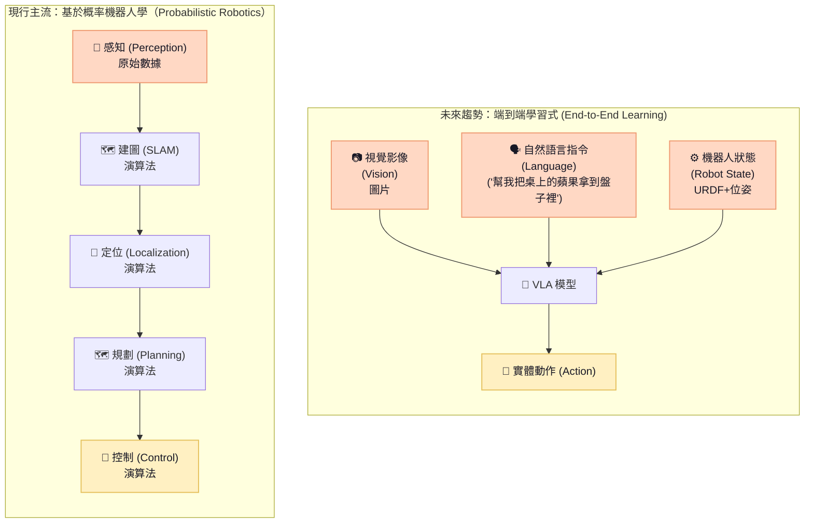

# 機器人基礎模型 (Foundation Models for Robotics)

隨著 AI 從純粹的文本與影像生成，逐步演進成能感知、推理並控制實體世界的實體 AI，智慧機器人的開發模式也正發生明顯改變，預計將從現今仍普遍採用的 **基於概率機器人學（Probabilistic Robotics）** 架構，朝向資料驅動的 **端到端學習式（End-to-End Learning）** 架構發展。

前者是將複雜任務先拆分為建圖、定位、路徑規劃與控制等子任務，各自再使用特定演算法處理，最後透過預先設計的規則串接，雖然此架構可控性較高，但面對複雜任務或未知環境時，往往需要大量人工設計及參數調校；相較之下，後者則是透過大量資料訓練模型，使模型能直接整合視覺影像、自然語言及機器人狀態等多模態資訊，進行環境理解、路徑規劃與任務推理，最後輸出可執行的機器人動作，此方法能顯著減少人工設計需求，但極度依賴多樣且高品質的訓練資料，是目前實務使用上最主要瓶頸。

其中在用於機器人訓練的學習式技術領域，**VLA 模型**（Vision-Language-Action Model）與**強化學習**（Reinforcement Learning，簡稱 RL）是目前兩個重點方向。VLA 模型可視為 VLM（Vision-Language Model）往機器人世界的延伸，著重於視覺、自然語言與動作之整合，使機器人能理解環境及任務指令，並產生相對應的操作行為，目前廣泛應用在具備機械手臂的機器人上；而 RL 則是透過環境互動及獎勵機制的學習控制策略，特別適合行走、動態平衡等需要連續控制的任務，因此普遍應用在具備雙足或四足的機器人上。

這兩者並非互斥，推測未來機器人系統架構，將朝向兩者整合的分層協作發展，例如由 VLA 模型負責上層機械手臂之物件操作與任務決策，搭配 RL 執行下層雙足（或四足）載具的平衡及全身控制，至於特定零組件（例如關節馬達）的速度、扭矩等高頻控制，則依然交由低階控制器以確保穩定性。有鑑於已發展多年的 RL，VLA 模型是近年才快速興起的技術項目，相關資源仍在快速演進，因此以下聚焦**開源**領域，盤點目前具代表性的主流 VLA 模型，供開發者在模型選擇、測試與導入時參考：

| 模型名稱 | 發表時間 | 核心技術架構 | 核心定位與開源狀態 | 優點 | 缺點 | 最佳適用情境（Use Cases） |
| :--- | :--- | :--- | :--- | :--- | :--- | :--- |
| **GR00T** *(NVIDIA)* | 2024.03 (概念) 2025.03 (N1 基礎模型) | • 採用「高階理解 + 低階動作生成」雙系統架構 • 上層 VLM 負責理解影像、文字與任務，下層 Action Model 再產生機器人的連續動作 | • 人型機器人基礎模型 • 開放權重與藍圖，綁定 NVIDIA Jetson Thor 硬體平台 | • 支援不同機器人本體 • 可大量合成資料，減少對真實數據的需求 | • 極度綁定 NVIDIA 硬體晶片與 Isaac 軟體生態鏈 • 對模擬與真實世界的精確建模要求高 | 人型機器人、雙臂操作 |
| **OpenPI 系列** *(Physical Intelligence/openpi)* | 2024.10 (π0) 2025.04 (π0.5) | • 以視覺語言模型（VLM）理解影像與文字指令，再由 Action Expert 產生機器人動作 • π₀／π₀.₅ 主要透過 Flow Matching 一次產生一段連續動作（Action Chunk）；另有 π₀-FAST 將動作轉成 Token 後逐步預測 | • 通用 VLA 模型 • 開源（Apache 2.0），並提供基礎模型 checkpoints | • 靈巧操作與變形物體處理能力強 • 可使用不同機械手臂與機器人 | • 換硬體仍需再微調 • 表現效果深受資料數量和品質的影響 | 家用雙臂機器人（如摺衣服、洗碗）、需要跨機器人學習的應用 |
| **OpenVLA** *(Stanford, UCB, Google等)* | 2024.06 | • 以視覺編碼器 + 大型語言模型（LLM）理解影像與文字指令 • 將機器人動作轉換成 Action Token，像語言模型預測文字 Token 一樣，逐步預測機器人下一步動作 | • 7B 參數 VLA 模型 • 開放權重與訓練程式 | • 視覺與語言理解能力強 • 可用 LoRA 等方式在消費級 GPU 上微調 | • 7B 參數體積大，在端側即時高頻（如百 Hz 級）控制對算力要求極高 | 學術研究、物件操作與二次開發 |
| **SmolVLA** *(Hugging Face/LeRobot)* | 2025.06 | • 採用輕量化 VLM 理解影像與文字，再由 Action Expert 產生機器人動作 • 透過 Flow Matching 一次產生一段連續動作（Action Chunk），並支援非同步推論 | • 450M 參數 VLA 模型 • 開源（Apache 2.0） | • 模型參數小，可直接在消費級 GPU 上執行 • 訓練門檻低 | • 在複雜語義理解與長程任務上弱於大型模型 • 現有成果主要集中於機械手臂操作 | 消費級教育機器人、個人開發實驗 |

---

除了模型本身，如何建立可重複使用的資料蒐集、模型訓練與實機部署流程，才是機器人基礎模型落地的重要環節，這同樣考驗著嘗試使用 VLA 模型的開發者，若各家模型都有自己的一套資料格式與開發流程，那等於開發者在新模型的嘗試上，都必須重新確認格式並進行資料轉換與整理；對此，Hugging Face 推出的 **LeRobot**，除了將 Teleoperation（遙控操作）、Dataset（資料集）、Policy Training（策略訓練）到 Deployment（實機部署）串成較標準化的開發流程，更重要的是建立 **LeRobotDataset 資料格式**。

不論資料原先來自哪一種機器人系統或開發框架，只要轉換成 LeRobotDataset 後，即可進一步銜接 LeRobot 所支援的 VLA 模型，例如當開發者預計從 OpenPI 系列模型切換至 GR00T 進行實驗時，便不必從頭開始，而是可以沿用相同的資料架構，再依模型需求進行必要的資料前處理；它某種程度扮演了 VLA 生態系的資料轉接層（Adapter）：向上承接不同機器人硬體產生的異質資料，向下則銜接不同 VLA 模型，進而降低切換模型時的轉換成本與使用門檻，建議開發者在規劃將 VLA 模型運用在機器人系統之前，LeRobot 會是那個應當優先接觸的工具。

---

最後，當機器人基礎模型逐漸成形後，下一階段的瓶頸將會從「模型能不能完成任務」，逐漸轉向「模型能不能部署至不同機器人」，這涉及 CPU、GPU、NPU 等各項算力配置，目前已可預想，未來機器人的 AI 運算架構將走向**混合式 AI（Hybrid AI）**發展，在這脈絡下三點值得思考的議題：

  1. **不應追求極致算力，而是在於「最佳分配」**：機器人本體的運算能力，主要來自於邊緣運算平台（不管是工業電腦亦或是控制板形式）中的 CPU、GPU 及 NPU 三項異質運算單元，三者各有不同特性，因此理想的算力配置應依據硬體特性與工作需求進行分工；例如 CPU 核心為快速反應（Fast response），就讓其負責系統控制、任務邏輯與一般運算，GPU 專注高吞吐量（High Throughput），適合處理大量圖資和 AI 模型推論，至於 NPU 則強調低功耗（Low power），能有效執行裝置端的 AI 推論任務。但是，如何在效能、即時性與功耗之間取得最佳平衡，「什麼才是最佳化分配？」，依然是大哉問，現今產業仍無定論及最佳解。
  
  2. **硬體發展的同時，也應注重「軟體工具鏈」**：過去運算類硬體往往以單一控制晶片或晶片組為主，這讓開發者有較高的自由度，但當 CPU、GPU、NPU 等同時存在後，如何讓 AI 模型在上面做最佳化配置，就讓硬體設計上變得更加複雜，也因此對應發展軟體工具鏈（從模型最佳化、硬體加速到推論執行）就顯得格外重要；目前業界主要以類似建議清單（Suggestion List）的軟體包形式出現，主流就兩個：NVIDIA 的 TensorRT 及 Intel 的 OpenVINO，它們會依據模型規模、即時性及網路條件做**自動分配**，開發者亦可依實際需求，進一步指定硬體優先順序或設定效能條件，不過，目前這類工具仍不是一套能完全自動在 CPU、GPU、NPU 之間進行最佳化調度的通用機制，不同硬體與模型仍需要個別測試與調校。
  
  3. **零組件競爭將從「硬體規格」延伸至「整合能力」**：一旦機器人走向混合式 AI，零組件商的市場競爭力也將隨之改變。對運算類零組件來說，未來競爭重點除了晶片本身的算力與功耗，更在於能否建立成熟的異質運算調度工具，讓軟體根據模型規模、即時性、功耗及硬體負載等條件，自動提出最佳部署方案，以降低開發者實務開發上的算力限制；至於對感知類零組件而言，除了持續提供高穩定性的資料傳輸能力，也需要思考直接與晶片更緊密整合的可能性，讓資料能在感測端就做完前處理甚至是 AI 推論，從既有單純感測資料提供，走向具備「感測＋初步分析」能力的 Edge AI 產品。