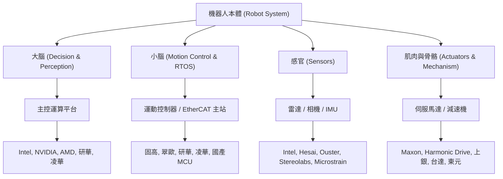

# 第一章 基礎 Foundation

## 1. 解構機器人 The robot anatomy

在進入軟體開發前，必須先理解機器人的物理本體與硬體架構。機器人是一個高度複雜的機電整合系統，由成百上千個感測器與致動器緊密配合而成。

### 1.1 機器人零組件與供應鏈關係

機器人從上層決策到最底層驅動，其零組件與供應商的關係可以透過以下拓撲圖進行解構：

---

### 1.2 機器人的生理分層：以人型機器人為例

為了讓機器人的硬體架構更容易理解，我們常將機器人與人類的生理構造進行類比：

| 生理分層 | 機器人組件 | 負責任務 | 技術關鍵字 |
| :--- | :--- | :--- | :--- |
| **大腦**  (Cerebrum) | 高階邊緣運算電腦  (Edge AI IPC) | 負責環境三維建圖、高精度定位、障礙物辨識、路徑規劃與行為決策。 | NVIDIA Jetson, Intel x86, ROS 2, SLAM, TensorRT, OpenVINO |
| **小腦**  (Cerebellum) | 實時運動控制器 / MCU  (Real-time Controller) | 負責多軸運動協調、步態控制、動態平衡（Self-balancing）、逆向運動學（IK）計算，強調極低的抖動（Jitter）與高度實時性。 | EtherCAT, RT-Preempt, CANopen, Freertos, STM32 |
| **感官**  (Sensory) | 智慧感知硬體  (Smart Sensors) | 收集外界物理資訊（距離、影像、角速度、加速度、觸覺）。 | 3D Lidar, Depth Camera, IMU, ToF, Ultrasonic |
| **骨骼與肌肉**  (Muscles & Bones) | 伺服關節 / 驅動器 / 減速機  (Actuators & Drives) | 將電能轉化為機械能，驅動關節旋轉或移動，並支撐起整個身體。 | BLDC Motor, Harmonic Drive, Frameless Motor, FOC |

---

### 1.3 國際主流產品與台灣供應鏈名單

在感知與控制領域，市場上已形成了穩固的軟硬體供應鏈：

1. **主控運算（大腦）**：
   - **國際主流**：NVIDIA Jetson Orin 系列（適合邊緣端 AI 與影像辨識）、Intel Core i7/i9 處理器、AMD Ryzen 系列。
   - **國內供應商**：凌華科技（ADLINK）、研華科技（Advantech）、新漢（NexCOBOT）。這些廠商提供工業級的 ROS 2 邊緣運算平台，具備抗震、寬溫與豐富的 I/O。
2. **感知感測（感官）**：
   - **3D 光達 (3D Lidar)**：Hesai (禾賽科技)、Ouster、Velodyne。
   - **2D 光達 (2D Lidar)**：RPLIDAR (思嵐科技)、Hokuyo (北陽)、Sick。
   - **深度相機 (Depth Camera)**：Intel RealSense (D435i/D455)、Orbbec (奧比中光)、Stereolabs ZED。
   - **慣性測量單元 (IMU)**：Microstrain、Xsens；在國內市場，常使用整合了九軸 MPU9250 或 BMI088 的國產模組。
3. **運動控制與馬達（小腦與肌肉）**：
   - **國際主流**：Maxon Motor、Harmonic Drive（減速機）、Elmo Motion Control（伺服驅動器）。
   - **國內供應商**：上銀科技（HIWIN，提供諧波減速機與關節模組）、台達電子（Delta，提供伺服驅動與馬達）、東元電機（TECO）。

---

### 1.4 本書聚焦：感知區塊的智慧硬體

在上述龐大的供應鏈中，本書將**主要談「感知」區塊的智慧硬體**。

為什麼？因為在現今的移動機器人（AGV/AMR）與人型機器人應用中，「感知」是限制其走入複雜、動態環境的最大瓶頸。如何挑選合適的 3D/2D 光達、如何配置多台深度相機、如何將感測器數據高畫質、無延遲地送入大腦，是決定 SLAM 建圖精準度與避障安全性的關鍵首要步驟。
