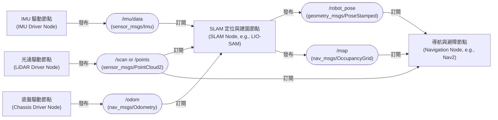

# 第二章 對接 Integration

## 1. 主流演算法 What Algorithms Do Robots Use?

在完成感測器的選型與基礎驅動後，下一步便是將感測器資料與上層建圖（SLAM）、定位、以及避障演算法進行對接。不同應用場景對機器人的定位精度、即時性與硬體成本有著截然不同的要求。

---

### 2.1 機器人感知與演算法應用的「技術四象限」

我們可以利用一個技術四象限，將目前主流的機器人應用、演算法與感測器配置進行分類：

```
                              高精度 / 高資訊量 (3D 空間)
                                          ▲
                                          │
                  【第 Ⅱ 象限】            │            【第 Ⅰ 象限】
             * 技術：視覺 / 語意 SLAM      │       * 技術：3D 激光 SLAM / 多感測器融合
             * 場景：人型機器人、服務機器人│       * 場景：自動駕駛、大型戶外 AMR
             * 特點：高資訊量、注重豐富語意│       * 特點：極致定位精度、強調高點雲品質
                                          │
低運算量 / 低成本 ◄───────────────────────┼───────────────────────► 高運算量 / 高成本 (即時同步)
                                          │
                  【第 Ⅲ 象限】            │            【第 Ⅳ 象限】
             * 技術：2D 激光 SLAM         │       * 技術：高精度點雲地圖重建
             * 場景：室內掃地機、倉儲 AGV  │       * 場景：高精地圖測繪、地形掃描
             * 特點：低成本、成熟穩定、   │       * 特點：離線/半即時處理、重資料品質
                     高即時性             │
                                          │
                                          ▼
                              低維度 / 幾何資訊 (2D/局部)
```

---

### 2.2 演算法兩大類別與其感測器配置

根據上述四象限的物理與商業特性，我們在工業界主要將感知對接演算法分為以下兩大流派：

#### 2.2.1 第一類：輕量、低成本的 2D 幾何與視覺感知 (第 Ⅱ、Ⅲ 象限)
*   **核心目標**：在有限的運算平台與硬體成本下，實現高可靠性的室內建圖、定位與基礎避障。
*   **適用場景**：掃地機器人、室內餐飲配送機器人、工廠/倉儲 Kiva-like AGV。
*   **感測器典型配置**：
    *   **〔2D 光達 (2D LiDAR) 或 RGB 相機〕**：作為核心觀測，2D 光達提供極為精準的 2D 平面距離資訊；RGB 相機則提供低成本的視覺特徵。
    *   **IMU (慣性測量單元)**：用於推算極短時間內的角速度與線速度變化。
    *   **里程計 (Wheel Odometry)**：內建於底盤馬達內，記錄輪子旋轉圈數。
    *   **超音波 (Ultrasonic Sensors)**：用於近距離、高透明介面（如玻璃、鏡面）的防撞輔助。
*   **主流演算法**：
    *   `Cartographer (2D)`：基於分支限界法（Branch and Bound）的掃描匹配（Scan Matching），是目前室內 2D SLAM 的工業標準。
    *   `ORB-SLAM3`：頂尖的視覺 SLAM 演算法，支援單目、雙目與 RGB-D 相機搭配 IMU。

#### 2.2.2 第二類：高精度、強即時的 3D 空間感知 (第 Ⅰ、Ⅳ 象限)
*   **核心目標**：在動存、高速或複雜的戶外環境下，重建極致品質的 3D 點雲圖，並要求在極短時間（微秒級）內完成高頻率、大圖資的融合定位。
*   **適用場景**：自動駕駛乘用車、戶外巡檢機器人、大型港口貨運 AMR、極端地貌探勘。
*   **感測器典型配置**：
    *   **〔3D 光達 (3D LiDAR) 或 深度/雙目相機〕**：獲取豐富的三維空間點雲。
    *   **高規格 IMU**：具備低零偏穩定性（Bias Instability），提供高頻率的狀態估計。
    *   **GNSS RTK**：提供公分級（cm-level）的絕對地理位置定位，解決累計漂移問題。
    *   **里程計**：馬達內置，提供車輛本體運動約束。
    *   **毫米波雷達 (Radar)**：在雨、雪、霧等惡劣天氣下，提供穿透性強的障礙物測距與測速。
*   **主流演算法**：
    *   `LIO-SAM`：緊耦合的雷達慣性里程計（Tightly-coupled Lidar Inertial Odometry），利用因子圖（Factor Graph）進行狀態優化。
    *   `FAST-LIO2`：基於流形上擴展卡爾曼濾波（IEKF）的超高效 3D SLAM，運算速度極快。

---

### 2.3 演算法對接的 ROS 2 標準 Message 與 Topic Graph

要與上述演算法對接，感測器驅動必須將資料打包為 ROS 2 的標準介面格式。以下是主流演算法要求訂閱的 Message 清單與其資料流拓撲圖。

#### 2.3.1 核心 Message 對照表

| 感測器種類 | 標準 ROS 2 Message 類型 | 關鍵欄位說明 |
| :--- | :--- | :--- |
| **2D 光達** | `sensor_msgs/msg/LaserScan` | `ranges` (距離數組), `angle_min` (起始角), `angle_max` (結束角) |
| **3D 光達** | `sensor_msgs/msg/PointCloud2` | `data` (二進位點雲數據), `fields` (欄位定義: x, y, z, intensity, ring) |
| **IMU** | `sensor_msgs/msg/Imu` | `linear_acceleration` (加速度), `angular_velocity` (角速度) |
| **里程計** | `nav_msgs/msg/Odometry` | `pose` (機器人位置與姿態), `twist` (線速度與角速度) |
| **相機影像** | `sensor_msgs/msg/Image` | `data` (影像陣列), `encoding` (編碼格式如 rgb8, bgr8) |

#### 2.3.2 資料流動拓撲圖 (Topic Graph)


