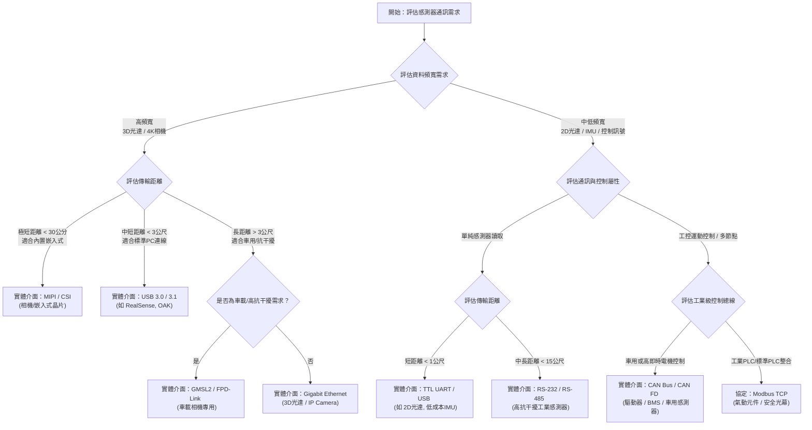

# 第二章 對接 Integration

## 2. 資料傳輸機制 How Data Transmission Works?

在機器人架構中，感測器產生的海量數據必須透過高效、穩定的物理通道與傳輸協定送達運算主機（大腦）。選擇錯誤的傳輸通道或協定會導致頻寬不足、掉幀、或嚴重的系統延遲。

---

### 2.1 感測器傳輸技術「決策樹」

開發團隊在設計機器人的硬體通訊架構時，可以依據資料頻寬、傳輸距離與硬體成本，參考以下決策樹進行傳輸方案的選型：

---

### 2.2 傳輸機制的三個核心面向

設計高效的機器人感知傳輸架構，必須從「通訊協定」、「實體介面」與「網路傳輸」三個面向進行全面規劃：

#### 2.2.1 通訊協定 (Communication Protocols)

不同的應用場景與系統整合需求，對應著不同的軟體通訊協定：

*   **IoT / AIoT 資料交換 ── MQTT (Message Queuing Telemetry Transport)**：
    *   **特性**：極輕量、基於發布/訂閱（Pub/Sub）模式，適用於頻寬受限或網路不穩定的環境。
    *   **應用**：機器人定時向上層雲端車隊管理系統（Fleet Management）回報電池電量、GPS 座標或基本運作狀態。
*   **Web / Cloud 系統整合 ── REST API**：
    *   **特性**：基於 HTTP 的無狀態（Stateless）請求/回應機制，技術極為成熟、易於對接。
    *   **應用**：機器人呼叫電梯控制系統、或是請求通過自動門時的跨系統整合。
*   **遠端即時視訊監控 ── RTSP (Real-Time Streaming Protocol)**：
    *   **特性**：專為流媒體設計，通常基於 UDP 傳輸，延遲極低。
    *   **應用**：遠端安防機器人（Security Robot）或遠端操作（Teleoperation）時，將板載相機影像壓縮後即時推流至中控室。
*   **雲端廣播推流 ── RTMP (Real-Time Messaging Protocol)**：
    *   **特性**：常用於將音視訊串流推送至雲端平台（如 YouTube, Twitch）。
    *   **應用**：機器人進行展示或需要大規模公開直播其視野的場景。
*   **串接 IP 攝影機標準 ── ONVIF (Open Network Video Interface Forum)**：
    *   **特性**：全球安防影像產品的通用通訊協定標準。
    *   **應用**：安防機器人直接整合市售標準 IP Camera，實現動態鏡頭控制（PTZ）、變焦與警報讀取。
*   **傳統工業控制總線 ── Modbus TCP、CAN Bus / CANopen**：
    *   **特性**：硬體成本低、確定性高、抗干擾能力極強。
    *   **應用**：Modbus TCP 用於讀取工業感測器（如安全光幕）；CAN Bus 則是目前 AMR 電機驅動器、電池管理系統（BMS）與控制面板之間的通訊主力。
*   **車用骨幹通訊 ── SOME/IP (Scalable service-Oriented MiddlewarE over IP)**：
    *   **特性**：針對車載乙太網設計的面向服務的通訊中間件，具備高擴充性。
    *   **應用**：高階自動駕駛 AMR 內，各子系統與整車域控制器（Domain Controller）之間的資料對接。

#### 2.2.2 實體介面 (Hardware Interfaces)

實體接線與物理介面決定了訊號傳輸的物理極限（頻寬與距離）：

*   **高頻寬需求（3D 光達、高解析影像、多相機融合）**：
    *   **MIPI / CSI**：通常用於嵌入式系統（如 Jetson Nano/Orin），直連晶片影像處理單元（ISP），延遲極低、CPU 消耗最少，但傳輸線長度通常限制在 30 公分內。
    *   **GMSL2 / FPD-Link**：車載相機黃金標準。透過一根同軸電纜（Coaxial Cable）同時傳輸電源、高頻寬影像與控制訊號，傳輸距離可達 15 公尺，具備極強的電磁相容性（EMC）。
    *   **Ethernet (Gigabit)**：3D 光達與工業 IP Camera 的首選。具備變壓器隔離抗干擾，傳輸距離達 100 公尺，架構易於透過 Switch 擴充。
    *   **USB 3.0 / 3.1**：消費級深度相機（如 RealSense D435i）最愛。插拔方便、隨插即用，但容易受到強烈震動影響而鬆脫，且傳輸距離通常不建議超過 3 公尺。
*   **中低頻寬需求（2D 光達、低頻 IMU、控制訊號、除錯）**：
    *   **UART (TTL)**：微控制器（MCU）與低成本感測器直接通訊的最基本方式。
    *   **RS-232 / RS-485**：工業級串口通訊。RS-485 採用差動訊號（Differential Signaling），具備極佳的抗電磁干擾能力，適合中長距離的多節點感測器掛載。
    *   **USB (Virtual COM)**：常作為除錯與中低階感測器的對接介面。

#### 2.2.3 網路傳輸 (Network Communication)

不論實體介面為何，在作業系統層級，所有資料皆透過網際網路通訊協定（TCP/IP 堆疊）進行處理：

*   **TCP/IP (Transmission Control Protocol)**：
    *   **特點**：連線導向、保證順序與資料不遺失（丟包會自動重傳），但可能引入難以預測的延遲（Head-of-Line Blocking）。
    *   **感知應用**：適用於建圖地圖發送、單次重大命令、或是設定參數讀取。
*   **UDP (User Datagram Protocol)**：
    *   **特點**：無連線導向、不保證順序與送達，只管以最快速度發送，無任何重傳機制。
    *   **感知應用**：適用於高頻率、大頻寬的感測器資料流（如光達點雲、即時相機影像）。對於演算法而言，丟失一幀 100ms 前的舊點雲，遠比為了等待那一幀而導致整個系統卡頓來得好。ROS 2 底層 DDS 的實時資料流，主要即是基於 UDP 進行傳輸。
