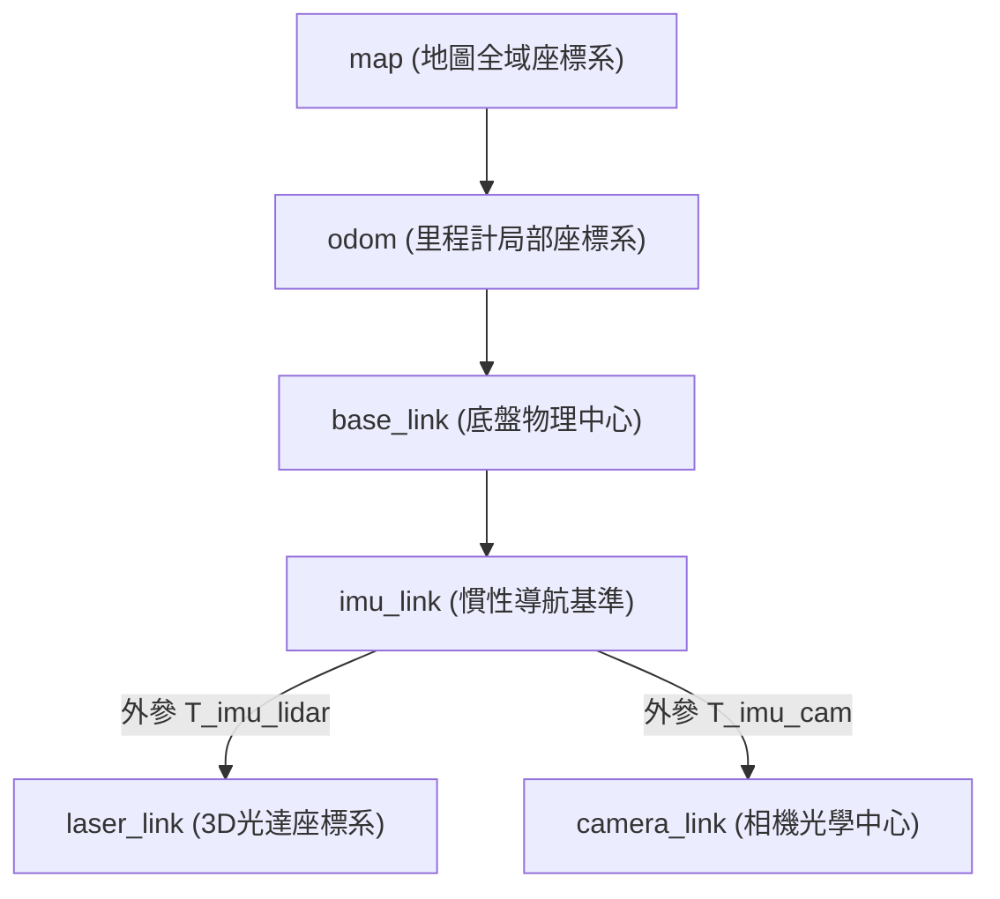

# 第二章 對接 Integration

## 3. 融合前處理 Sensor Fusion Preprocessing

在多感測器融合系統中，來自不同物理設備（如相機、光達、IMU）的數據在直接送入核心融合演算法之前，必須先解決兩個靈魂課題：**「它們在空間中是對齊的嗎？」** 與 **「它們在時間上是同步的嗎？」**。本節探討 ROS 2 架構下常見的前處理實務。

---

### 3.1 空間校準 Extrinsic Calibration

空間校準的目的在於求出不同感測器座標系（Sensor Frames）之間的相對旋轉矩陣（Rotation Matrix）與平移向量（Translation Vector），即**外參 (Extrinsics)**。

#### 3.1.1 座標轉換樹 (TF Tree)
在 ROS 2 中，我們利用 `tf2` 函式庫管理並動態維護一個階層式的座標轉換樹（TF Tree）。

*   **以 IMU 為建議基準**：
    在多數緊耦合（Tightly-coupled）雷達慣性（LIO）或視覺慣性（VIO）融合演算法中，IMU 測量的是本體最純粹的角速度與加速度。因此，在進行多感測器外參校準時，**強烈建議以 IMU 座標系 (`imu_link`) 為空間變換的根原點（基準）**。
    其他感測器的位置（例如光達與相機）皆相對於 `imu_link` 進行靜態變換（Static TF）發布。這能大幅簡化動態狀態估計（如預積分 IMU Preintegration）時的矩陣運算。

#### 3.1.2 機器人描述模型 (URDF)
*   **物理結構描述**：**URDF (Unified Robot Description Format)** 是一個 XML 格式的文件，用以描述機器人的物理結構，包括關節（Joints）、連桿（Links）以及各感測器的物理掛載位置（外參）。
*   **視覺化與驗證**：撰寫正確的 URDF 檔案後，ROS 2 系統中的 `robot_state_publisher` 節點會自動讀取並將這些靜態外參轉化為靜態 TF 發布。開發者可以在 3D 視覺化工具 **RViz 2** 中直觀地檢視各個感測器的空間指向是否與實體機器人一致，進而驗證外參標定（Calibration）的正確性。

---

### 3.2 時間同步 Time Synchronization

如果兩個感測器數據的時間戳（Timestamps）對不上有時間差，在機器人高速運動時，就會產生嚴重的「鬼影」或定位發散。

#### 3.2.1 硬體時間同步 (Hardware Sync / Trigger)
*   **硬體接線觸發**：這是最完美的同步方式。利用硬體同步卡（如基於 MCU 或 FPGA 的同步板）向多個感測器發送物理方波脈衝訊號（Sync Trigger）。相機與光達在收到脈衝訊號的瞬間同時進行曝光與雷達掃描，達成硬體層級的絕對同步（誤差通常在微秒 $\mu s$ 級）。
*   **PPS 脈衝**：結合 GPS / GNSS 接收器輸出的一秒一脈衝（PPS, Pulse Per Second），向光達與相機授時，讓所有感測器在讀取資料時皆擁有與全域 GPS 時間同步的絕對時間戳。

#### 3.2.2 ROS 2 軟體時間同步 (message_filters)
若硬體上無法拉實體線進行同步，開發者必須在運算處理器上利用軟體進行時間對齊。ROS 2 提供了一個強大的套件 **`message_filters`**：

1.  **精確時間同步 (ExactTime Policy)**：
    *   **原理**：只有當訂閱的多個話題（Topics）之 Message Header 中的 `stamp` **完全一模一樣**時，才會觸發回呼函式（Callback）。
    *   **適用場景**：硬體已實作硬體同步，或多台相機經由同一個驅動發布且已在驅動內打上相同時間戳的場景。
2.  **近似時間同步 (ApproximateTime Policy)**：
    *   **原理**：基於一定的時間窗（Time Window），尋找多個話題中**時間戳最接近**的一組 Message，並在回呼函式中將它們成對傳出。
    *   **適用場景**：光達與相機各自獨立工作（各自有其頻率），演算法需要將最靠近的雷達點雲與相機影像進行對齊融合。

#### 3.2.3 網路與系統時間同步協定
在多台邊緣電腦或感測器透過網路連線時，系統時鐘的對齊至關重要：
*   **NTP (Network Time Protocol)**：
    *   **特點**：基於軟體層級的網路時間對齊。
    *   **應用**：機器人大腦與雲端伺服器對時。精度通常在毫秒（ms）級，容易受到網路抖動影響，不適合用於感測器資料同步。
*   **PTP (Precision Time Protocol, IEEE 1588)**：
    *   **特點**：基於地端區網、要求網卡（NIC）晶片支援硬體時間戳。
    *   **應用**：3D 光達與邊緣主控對時的黃金標準。透過 PTP 授時，網路交換機下的各個感測器時鐘誤差可被壓縮至 1 微秒（$\mu s$）以內。

---

### 3.3 自定義 Message 的重要性與需求

雖然 ROS 2 官方提供了內容詳盡的標準 `sensor_msgs` 套件，但在高度客製化的多感測器融合或特定的深度學習演算法中，開發者常需要**自定義 `.msg` 文件**。

#### 3.3.1 為什麼需要自定義 Message？
1.  **封裝時間同步元數據**：例如自定義一個 `SyncedSensorBundle.msg`，將同一時刻同步好的 `PointCloud2`、`Image` 與 `Imu` 數據打包在同一個訊息中，避免下游演算法重複使用 `message_filters` 消耗 CPU。
2.  **減少頻寬消耗**：標準的 `sensor_msgs/msg/PointCloud2` 欄位非常多且佔頻寬。若自研的 2D 避障演算法只需要極少數的角度與距離資訊，可自定義輕量化的數據格式。
3.  **記錄硬體診斷資訊**：在自定義 Message 中額外加入感測器的硬體溫度、鏡頭污損狀態標記（Status Flag）或訊號雜訊比（SNR），利於系統進行主動容錯控制（Fault-tolerant Control）。
